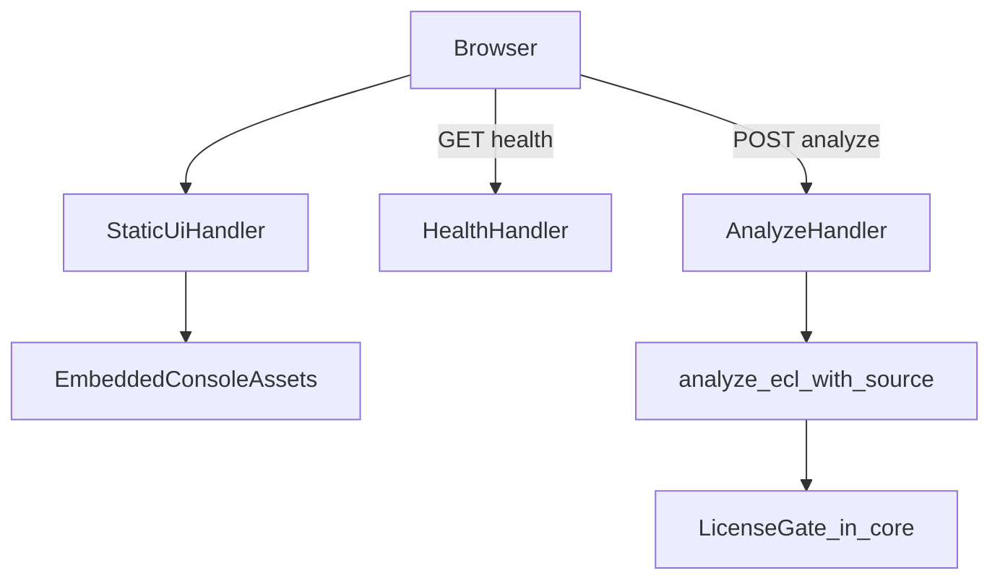
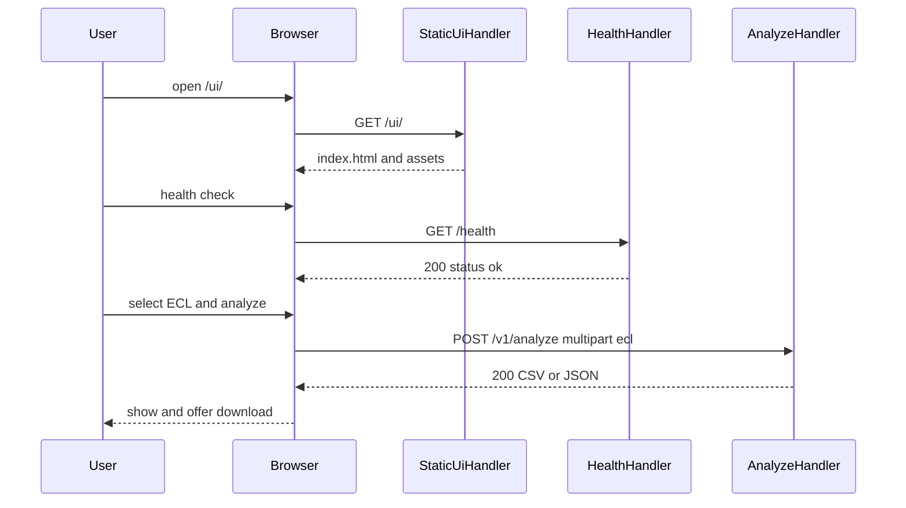

# Design Document: api-console-ui

## Overview

本機能は、検査会社の導入・運用担当者がブラウザから疎通確認と単発 ECL 解析を行える簡易コンソール UI を、既存 `holter-http-api` と**同一バイナリ／同一プロセス**で提供する。利用者は追加のフロントエンドサーバーや SPA ビルドなしに、日本語の最小画面からヘルス確認・アップロード・結果表示／ダウンロードを行う。

**Purpose**: curl／専用クライアントなしの導入検証と簡易運用を可能にする。  
**Users**: 検査会社の導入担当者・運用オペレータ。  
**Impact**: Axum ルータに静的配信ルートを追加し、ビルド時に HTML／最小 CSS／JS を埋め込む。解析・ライセンス・HTTP API 契約は上流のまま消費する。

### Goals
- `/ui/` 配下で操作可能な日本語コンソールを配信する
- ブラウザから既存 `GET /health` と `POST /v1/analyze` のみを呼ぶ
- UI／配信層でのライセンス追加計上を行わない
- packaging が同一バイナリ前提でコンソール利用を文書化できる契約を定義する

### Non-Goals
- 臨床最終判定 UI・波形エディタ・帳票
- React／Vue／Node 等の SPA または別 UI サーバー
- `/health`・`/v1/analyze` 契約の再定義、ライセンスゲート実装
- Docker／インストーラ本体の再設計（docs 追記は下流 Existing Spec Update）

## Boundary Commitments

### This Spec Owns
- コンソール静的アセット（HTML + 最小 CSS/JS、日本語文言）
- ビルド時埋め込み（`rust-embed`）と静的配信ハンドラ
- UI 配信ルート（正本 `/ui/`、任意で `/` → `/ui/` リダイレクト）
- ブラウザ側からの既存 API 呼び出しロジック（クライアントのみ）
- packaging 向けの「UI は同一バイナリに含まれる／URL は `/ui/`」受け渡し定義

### Out of Boundary
- 解析コア・`analyze_ecl_with_source`・モデル埋め込み
- `LicenseGate`／meter／`[license]` キー
- `/health`・`/v1/analyze` のリクエスト／レスポンススキーマ変更
- `[http]` キー意味の変更
- packaging の Docker／Inno／fpm／CI ジョブ本体（追記のみ下流）
- IAM／OAuth／課金管理 UI

### Allowed Dependencies
- 上流 `http-api`: Axum `build_router`、`HealthHandler`、`AnalyzeHandler`、AppState／limits
- 上流（間接）`license-client`／`model-embedding`: 解析時計上は正本入口内のみ（UI は触れない）
- 新規依存: `rust-embed`（必須）、任意で `mime_guess`
- 下流 `packaging-distribution`: 埋め込み済み `holter-http-api` を消費し、導入 docs に `/ui/` を追記

### Revalidation Triggers
- UI 配信パスの変更（`/ui/` 以外への移動）
- 解析／ヘルス呼び出しパスまたは multipart フィールド名の変更
- 埋め込みアセット構成の大幅変更（別プロセス配信への移行等）
- packaging が別 UI アーティファクトを必須化する方針変更

## Architecture

### Existing Architecture Analysis
- 現状: `src/http/routes.rs` が `/health` と `/v1/analyze` のみを公開
- 制約: HTTP アダプタは薄い層。解析は正本入口、meter は入口内
- 統合点: `build_router` への静的ルート追加、および `Cargo.toml` への embed 依存

### Architecture Pattern & Boundary Map



**Architecture Integration**:
- Selected pattern: Embedded static console + same-origin API client
- Domain boundaries: 静的配信／クライアント UX は本仕様。API 契約・計上は上流
- Existing patterns preserved: Axum handlers、正本解析入口、二重計上禁止
- New components: EmbeddedConsoleAssets、StaticUiHandler、ConsoleClient（JS）
- Steering compliance: library-first／thin binary、日本語製品文言、Windows／Linux 同一成果物

### Technology Stack

| Layer | Choice / Version | Role in Feature | Notes |
|-------|------------------|-----------------|-------|
| UI | HTML + 最小 CSS/JS（フレームワークなし） | コンソール画面 | SPA／Node ビルドなし |
| Embed | rust-embed 8.x | アセットをバイナリへ同梱 | 開発時は fs 読取可 |
| MIME | mime_guess（任意） | Content-Type | 公式例と同型 |
| HTTP | Axum 0.7.9（既存） | ルート配信 | 契約変更なし |
| Client I/O | fetch + FormData | `/health`, `/v1/analyze` | 同一オリジン |

**Dependency direction**: Embedded assets → StaticUiHandler → routes →（既存）Health/Analyze → core。Console JS はブラウザから既存 API のみ（サーバー側 UI 層は meter を呼ばない）。

## File Structure Plan

### Directory Structure
```
static/console/
├── index.html          # 日本語コンソール（案内・フォーム・結果領域）
├── console.css         # 最小スタイル
└── console.js          # health / analyze / 表示・DL・エラー・処理中

src/http/
├── assets.rs           # rust-embed: folder = "static/console"
├── handlers/
│   ├── mod.rs          # StaticUiHandler を公開
│   └── static_ui.rs    # GET /ui, /ui/*, 任意 GET / リダイレクト
└── routes.rs           # 静的ルートを既存 health/analyze と共存させるよう改修

Cargo.toml              # rust-embed (+ mime_guess) 依存追加
```

### Modified Files
- `src/http/routes.rs` — `/ui` 系（および任意 `/` リダイレクト）をマウント。`/health`・`/v1/analyze` 契約は変更しない
- `src/http/handlers/mod.rs` — static_ui モジュール公開
- `Cargo.toml` — `rust-embed` 等を追加
- `.kiro/specs/packaging-distribution/*` — Existing Spec Update（docs／スモークに `/ui/`）。本仕様タスクから触接点を明示

### Non-owned（変更禁止）
- `handlers/analyze.rs` / `handlers/health.rs` の API 契約
- ライセンス／埋め込み／packaging ビルダー本体

## System Flows

### コンソール利用（成功）



**Key decisions**: UI サーバー側は analyze 前後で meter を呼ばない。計上は既存 AnalyzeHandler → 正本入口のみ。

### 失敗表示
- 未選択ファイル: リクエスト送信前に日本語メッセージ
- 4xx/5xx・ネットワーク／タイムアウト: 日本語で失敗表示。可能なら上流 JSON の `error` / 種別を併記

## Requirements Traceability

| Requirement | Summary | Components | Interfaces | Flows |
|-------------|---------|------------|------------|-------|
| 1.1 | コンソール配信 | StaticUiHandler, Assets | GET `/ui/` | open UI |
| 1.2 | 同一プロセス配信 | Assets, routes | embed | — |
| 1.3 | 経路の区別 | routes | `/ui/` vs `/health` `/v1/analyze` | — |
| 2.1–2.3 | ヘルス確認 | ConsoleClient, HealthHandler | GET `/health` | health |
| 3.1–3.4 | アップロード／解析 | ConsoleClient, AnalyzeHandler | POST `/v1/analyze` | analyze |
| 4.1–4.4 | 結果表示／DL | ConsoleClient | blob download | analyze success |
| 5.1–5.3 | エラー表示 | ConsoleClient | error UI | analyze fail |
| 6.1–6.3 | 二重計上禁止 | StaticUiHandler, ConsoleClient | no meter | — |
| 7.1–7.2 | 日本語文言 | index.html, ConsoleClient | copy | — |
| 8.1–8.2 | 上限は上流準拠 | ConsoleClient | http-api limits | — |
| 9.1–9.3 | packaging 受け渡し | PackagingTouchpoint | docs contract | — |
| 10.1–10.3 | 範囲外非提供 | Non-goals | — | — |

## Components and Interfaces

| Component | Domain/Layer | Intent | Req Coverage | Key Dependencies (P0/P1) | Contracts |
|-----------|--------------|--------|--------------|--------------------------|-----------|
| EmbeddedConsoleAssets | Embed | 静的ファイル埋め込み | 1.2, 9.1 | rust-embed (P0) | State |
| StaticUiHandler | HTTP | UI 配信・リダイレクト | 1.1–1.3, 6.2, 9.3 | Assets (P0), Axum (P0) | API |
| ConsoleClient | Browser | API 呼出と UX | 2–8, 7 | fetch (P0), Health/Analyze (P0) | API |
| RouterIntegration | HTTP | ルート合成 | 1.3, 6.3 | build_router (P0) | API |
| PackagingTouchpoint | Docs/Contract | 下流追従定義 | 9.1–9.3 | packaging-distribution (P1) | State |

### Embed / HTTP

#### EmbeddedConsoleAssets

| Field | Detail |
|-------|--------|
| Intent | `static/console` をビルド時埋め込み |
| Requirements | 1.2, 9.1, 9.3 |

**Responsibilities & Constraints**
- `#[folder = "static/console"]`（パスは実装で固定し文書化）
- release ではバイナリ内、debug では crate 既定の開発時読取でよい
- SPA バンドルや node_modules を含めない

**Dependencies**
- External: rust-embed (P0)

**Contracts**: State [x]

##### State Management
- アセット集合はコンパイル成果。実行時に外部 UI ディレクトリを必須としない

#### StaticUiHandler

| Field | Detail |
|-------|--------|
| Intent | 埋め込みアセットを HTTP で返す |
| Requirements | 1.1, 1.2, 1.3, 6.2, 9.3 |

**Responsibilities & Constraints**
- `GET /ui` および `GET /ui/` → `index.html`
- `GET /ui/*` → 対応アセット（欠落は 404）
- 任意: `GET /` → `/ui/` へリダイレクト
- meter／analyze を呼び出さない
- Content-Type をパスから設定

**Dependencies**
- Outbound: EmbeddedConsoleAssets (P0)
- External: Axum (P0), mime_guess (P1)

**Contracts**: API [x]

##### API Contract
| Method | Endpoint | Request | Response | Errors |
|--------|----------|---------|----------|--------|
| GET | `/ui/` | なし | 200 `text/html`（index） | — |
| GET | `/ui/{path}` | なし | 200 アセット | 404 missing |
| GET | `/`（任意） | なし | 3xx → `/ui/` | — |

- Invariants: ライセンス計上なし。解析契約を変更しない

#### RouterIntegration

| Field | Detail |
|-------|--------|
| Intent | 静的ルートを既存 API と共存 |
| Requirements | 1.3, 6.3 |

**Responsibilities & Constraints**
- `/health`・`/v1/analyze` のメソッド／パス／ハンドラ契約を維持
- 静的ルート追加が API テストの期待を壊さない

**Contracts**: API [x]

### Browser

#### ConsoleClient

| Field | Detail |
|-------|--------|
| Intent | 日本語 UI からの API 操作 |
| Requirements | 2.1–2.3, 3.1–3.4, 4.1–4.4, 5.1–5.3, 6.1, 7.1–7.2, 8.1–8.2, 10.x |

**Responsibilities & Constraints**
- ヘルス: `GET /health`。成功／失敗を日本語表示。計上なし
- 解析: `POST /v1/analyze`、multipart フィールド名 `ecl`（必須）。任意で `format=json|csv`（上流契約。既定は上流に従う）
- 未選択時は送信しない
- 処理中表示を出す
- 成功時: 本文を画面表示し、ダウンロード（Blob + `a[download]`）を提供
- 失敗時: 日本語メッセージ。可能なら応答本文の識別情報を併記
- 臨床 UI／認証／課金画面を持たない

**Dependencies**
- Outbound: HealthHandler, AnalyzeHandler via same-origin HTTP (P0)

**Contracts**: API [x]

##### API Contract（消費・再定義禁止）
| Method | Endpoint | Request | Response | Notes |
|--------|----------|---------|----------|-------|
| GET | `/health` | なし | `{ "status": "ok" }` | http-api OWN |
| POST | `/v1/analyze` | multipart `ecl`; optional `format` | CSV or JSON | http-api OWN |

##### Implementation Notes
- Integration: 相対 URL のみ（別オリジン想定なし）
- Validation: クライアント側はファイル有無の最小チェックのみ。サイズ／タイムアウトは上流
- Risks: 巨大 JSON の DOM 表示が重い → 表示は要約／先頭制限してよいがダウンロードは全文

### Packaging touchpoint

#### PackagingTouchpoint

| Field | Detail |
|-------|--------|
| Intent | 下流が UI 込みバイナリを文書化できる契約 |
| Requirements | 9.1–9.3 |

**Responsibilities & Constraints**
- 追加のフロントエンド成果物を必須としない
- 導入ドキュメントにコンソール URL（`/ui/`）と「同一バイナリ配信」を記載するよう packaging に追従依頼
- Windows／Linux で同一経路

**Contracts**: State [x]

**Cross-spec**: Extends `packaging-distribution`（Existing Spec Update）

## Data Models

本仕様は永続ドメインモデルを追加しない。ブラウザ一時状態のみ。

### Client ephemeral state
- selectedFile: File | null
- busy: boolean
- lastResult: { kind: "json" \| "csv" \| "text", body: string } | null
- lastError: string | null
- healthStatus: "unknown" \| "ok" \| "error"

### Data Contracts & Integration
- 解析／ヘルスのペイロードは http-api 正本。本仕様はスキーマを複製定義しない

## Error Handling

### Error Strategy
- クライアント前置: 入力不足は送信前に日本語で停止
- 転送／HTTP 失敗: fetch 例外および非 2xx を日本語表示
- サーバー静的欠落: 404（運用上アセット欠落はビルド欠陥）

### Error Categories and Responses
| 状況 | UI 表示 |
|------|---------|
| ファイル未選択 | 日本語の入力不足 |
| `/health` 失敗 | 疎通失敗（詳細任意） |
| analyze 4xx/5xx | 解析失敗＋可能なら error コード／メッセージ |
| タイムアウト／ネットワーク | 到達不可／タイムアウト |

### Monitoring
- 追加のサーバメトリクスは必須としない（既存 HTTP 運用に委譲）

## Testing Strategy

### Unit Tests
- StaticUiHandler: `/ui/` が 200 HTML、既知アセットが正しい Content-Type、欠落 404、meter 非呼び出し
- RouterIntegration: `/health`・`/v1/analyze` が従来どおり到達し、静的追加後も analyze 1 回で meter 1 回

### Integration Tests
- 埋め込みアセットが release/debug ビルドで取得できる
- `/` リダイレクト（採用時）が `/ui/` を指す

### E2E / Manual
- ブラウザでヘルス成功表示
- 小 ECL（またはフィクスチャ）で解析成功→表示→ダウンロード
- 故意の失敗（空ファイル／未選択）で日本語エラー

### Non-goals for tests
- SPA e2e フレームワーク必須化なし
- ライセンスサーバー実機必須は初期 CI に含めない（http-api と同様）

## Security Considerations
- 同一オリジンのみ想定。CORS 緩和は行わない
- アップロードは既存 analyze 経路のみ。UI はファイルを永続保存しない
- XSS: 結果表示は textContent／安全な挿入。必要なら `<pre>` へテキストのみ
- 認証製品化はしない（公開 LAN 前提は上流運用に従う）

## Performance & Scalability
- アセットは数ファイル・小サイズ。CDN 不要
- 巨大解析結果の画面描画は制限してよいが DL は全文
- 上限・タイムアウトは `[http]` に委譲（8.1）

## Migration Strategy
- 既存クライアント（curl／連携システム）に破壊的変更なし
- packaging docs 更新後、オペレータは `/ui/` を利用開始

## Supporting References
- 上流契約: `.kiro/specs/http-api/design.md`（`/health`, `/v1/analyze`）
- 調査詳細: `.kiro/specs/api-console-ui/research.md`
