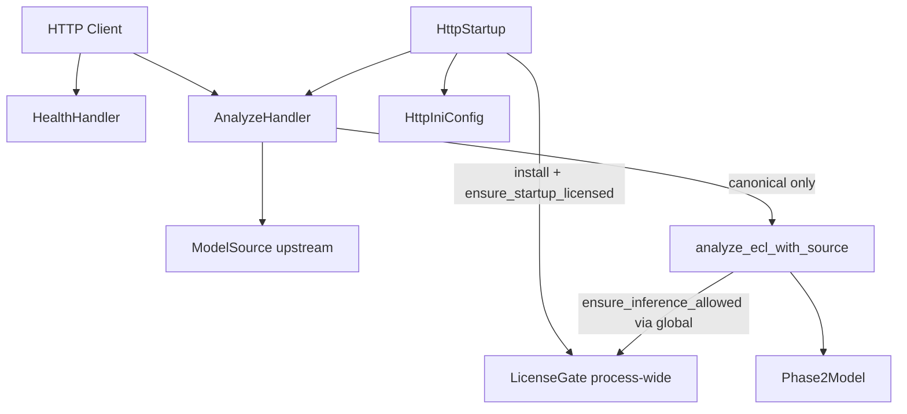
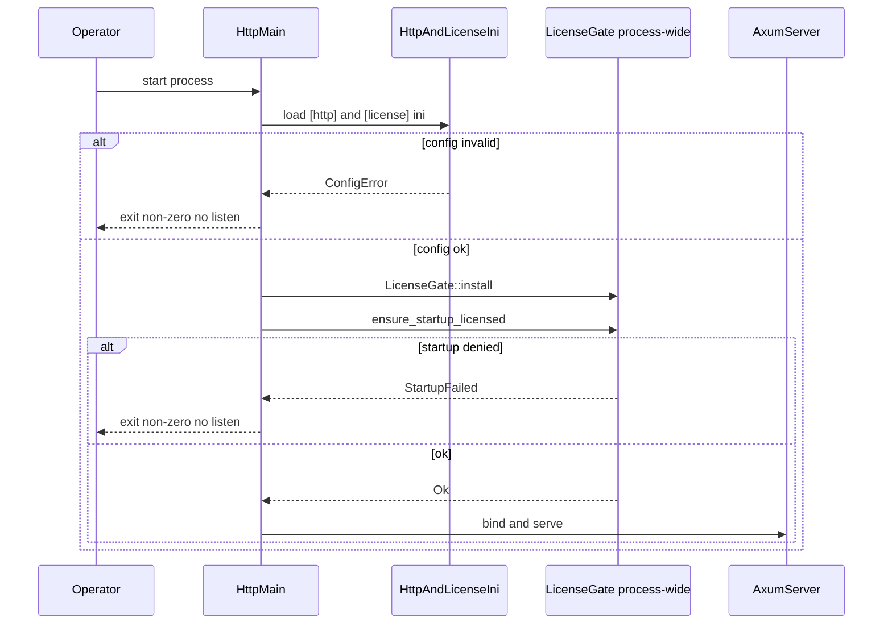
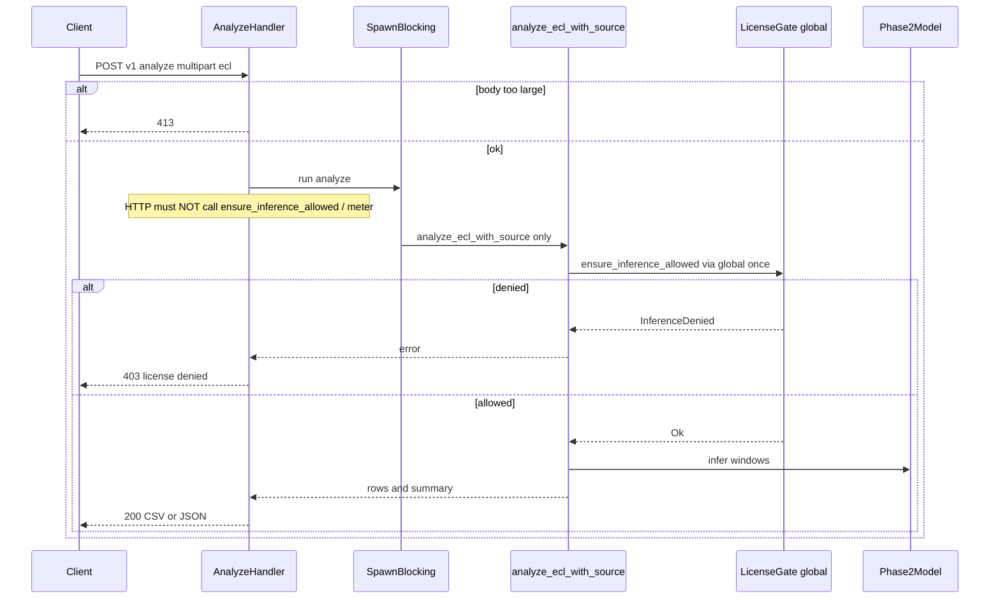

# Design Document: http-api

## Overview

本機能は、Holter Analysis Assist に薄い HTTP サーバーバイナリを追加し、連携システムが ECL を送信して CLI と同一コアの解析結果を受け取れるようにする。運用オペレータは ini でリッスンとライセンスを設定し、起動時ライセンス失敗時はポートを開かない。各解析リクエストは正本入口 `analyze_ecl_with_source` 内の上流ゲート経由で 1 回だけ計上される（HTTP は meter を直接呼ばない）。

**Purpose**: CLI と共有する解析面を HTTP で提供する。  
**Users**: 連携システム開発者、クラウド／ローカル運用オペレータ。  
**Impact**: 第二の起動面（HTTP）が加わる。ドメインロジックは lib に留まり、ライセンスサーバー／配布パッケージは所有しない。

### Goals
- ECL 解析の HTTP エンドポイント（CSV / JSON）
- 起動時: `LicenseGate::install` + `ensure_startup_licensed` 後にのみリッスン（失敗で非リッスン）
- 解析は正本 `analyze_ecl_with_source` のみ呼び出し。計上は入口内（HTTP は `ensure_inference_allowed` / meter を呼ばない）
- 埋め込みモデル消費と ini（本仕様 OWN の `[http]` + 上流 OWN の `[license]`）
- 埋め込み `holter-http-api` の CI 成果物（`release-embedded-http-api`）を packaging が消費できること
- Windows / Linux x86_64 での同一契約

### Non-Goals
- ライセンスサーバー・課金 UI
- Docker / インストーラ / Linux パッケージ本体（下流 `packaging-distribution`）
- 本格 IAM / OAuth
- `ModelSource` / `LicenseGate` / `[license]` キーの再定義
- モデル埋め込み実装そのもの（`model-embedding`）。CLI 埋め込みジョブ `release-embedded-cli` も非所有
- 並列の gated 解析入口の発明（正本以外での meter）

## Boundary Commitments

### This Spec Owns
- HTTP バイナリ（`holter-http-api`）の起動ライフサイクルとリッスン
- HTTP main での process-wide `LicenseGate::install` と `ensure_startup_licensed` の**呼び出し**（ゲート実装は上流）
- ルーティング、リクエスト検証、レスポンスシリアライズ、HTTP エラー区分
- `[http]` ini スキーマ（bind、body 上限、タイムアウト、任意 model_path / provider）と `[http]` の example 文書化
- ヘルスチェック（非計上）
- async ランタイムと同期解析の橋渡し（`spawn_blocking` → 正本入口のみ）
- CI ジョブ **`release-embedded-http-api`**（`embedded-model` 付き `holter-http-api` 成果物。下流 packaging の入力）
- HTTP 面の自動テスト（モックゲート install／一時 ECL）

### Out of Boundary
- ライセンスサーバー実装と `[license]` キー意味の変更（正本は `config/license.ini.example`、`license-client` OWN）
- `LicenseGate` / `LicenseClient` / `ReqwestLicenseClient` の実装、および `analyze_ecl_with_source` 内の meter 挿入
- `ModelSource` / 埋め込みバイト／`build.rs` の実装、および `release-embedded-cli`（`model-embedding` OWN）
- 解析前処理・ONNX・後処理アルゴリズム
- 配布成果物のパッケージ形式（下流 `packaging-distribution`）
- エンドユーザー向け IAM
- AppState 所有の別 Gate による analyze 用 meter（禁止。解析は global gate）

### Allowed Dependencies
- 上流: `model-embedding`（`ModelSource`, 正本 `analyze_ecl_with_source`）
- 上流: `license-client`（`LicenseConfig`, `LicenseGate::{install,ensure_startup_licensed,global/try_global}`、`[license]` 正本）
- 既存: `analyze` / `phase2` / `BeatResultRow` / `AnalyzeSummary` / `thiserror` / `serde`
- 新規: Axum 0.7.9、Tokio（multi-thread）、tower-http（limit/timeout）、ini 読取（`[http]` は本仕様、`[license]` は上流 loader）
- 禁止: ライセンスサーバーコード取り込み、HTTP 層への解析ロジック複製、`[license]` キー再定義、HTTP からの `ensure_inference_allowed` / meter 直接呼出、並列 gated 入口

### Revalidation Triggers
- 解析エンドポイントのパス・メソッド・入出力スキーマ変更
- `[http]` 必須キーまたは既定値（512 MiB / 1800s）の変更
- 起動ゲート失敗時の「非リッスン」意味、または `install` 契約の変更
- 計上回数契約（正本入口内 1 リクエスト 1 回。HTTP 非直接呼出）の変更
- `release-embedded-http-api` ジョブ／アーティファクト契約の変更
- Axum major または MSRV 引き上げに伴う依存方針変更
- 上流 `LicenseGate` / `ModelSource` / `analyze_ecl_with_source` シグネチャ破壊

## Architecture

### Existing Architecture Analysis
- Library-first: ドメインは `src/analyze.rs` 等、CLI は薄い `main`
- HTTP 層なし。ライセンス／埋め込みは上流仕様が lib に追加する前提
- エラーは `thiserror`、結果行は `BeatResultRow`

### Architecture Pattern & Boundary Map



**Architecture Integration**:
- Selected pattern: Thin HTTP adapter over shared lib（Ports 消費のみ）
- Domain boundaries: HTTP 所有は I/O・ライフサイクル・`[http]`・埋め込み HTTP CI。計上は正本 `analyze_ecl_with_source` 内（global gate）。HTTP main は CLI と同一の process-wide install
- Existing patterns preserved: library-first、CLI / API 相互非依存、fail-closed、二重計上禁止
- Steering compliance: tech.md / structure.md の第二面、roadmap の依存順

**Dependency direction**（左のみ依存可）:  
`HttpTypes` → `HttpIniConfig` → `AppState`（config / ModelSource / limits）→ Handlers → 正本 Analyze →（内部）global LicenseGate / Phase2 → Tokio/Axum runtime  
起動: HttpStartup → `LicenseGate::install` + `ensure_startup_licensed`（AppState に Gate を持たせて analyze 用に分岐させない）

### Technology Stack

| Layer | Choice / Version | Role in Feature | Notes |
|-------|------------------|-----------------|-------|
| HTTP binary | Axum 0.7.9 | ルーティング・抽出 | MSRV 1.74 適合。0.8 は不採用 |
| Runtime | Tokio 1.x multi-thread | async サーバー | 解析は spawn_blocking |
| Middleware | tower-http 0.5/0.6（0.7 系互換） | body limit / timeout | 既定 512 MiB / 1800s |
| Config | `[http]`（本仕様）+ `[license]`（上流正本） | bind / 上限 / ライセンス | `[license]` キー再定義禁止 |
| Serialization | serde_json / csv | 応答形式 | CLI ラベルと同等 |
| Upstream | LicenseGate, ModelSource, analyze_ecl_with_source | install / 正本解析 | 再定義・並列入口禁止 |
| CI | GitHub Actions | `release-embedded-http-api` | packaging 入力。`release-embedded-cli` は非所有 |

## File Structure Plan

### Directory Structure
```
src/
├── http/
│   ├── mod.rs           # モジュール公開
│   ├── config.rs        # [http] ini 読取と既定値
│   ├── state.rs         # AppState（ModelSource, limits, HTTP 設定。Gate 非所有）
│   ├── error.rs         # HTTP エラー区分 → ステータス / JSON
│   ├── routes.rs        # Router 組み立て
│   ├── handlers/
│   │   ├── mod.rs
│   │   ├── health.rs    # GET /health
│   │   └── analyze.rs   # POST /v1/analyze → analyze_ecl_with_source のみ
│   └── response.rs      # CSV / JSON シリアライズ
├── bin/
│   └── holter_http_api.rs  # 起動: ini → LicenseGate::install → ensure_startup_licensed → bind
src/lib.rs               # pub mod http（ハンドラ検証用に公開してよい）
Cargo.toml               # bin + axum/tokio/tower-http 依存
config/
├── license.ini.example  # [license] 正本は license-client OWN（本仕様は再定義しない）
└── http.ini.example     # [http] 正本（本仕様 OWN）。同一ファイルへ [http] 追記、
                         # または本ファイルで [license] を参照／マージ手順を文書化
.github/workflows/ci.yml # release-embedded-http-api（埋め込み holter-http-api）
```

### Modified Files
- `Cargo.toml` — `[[bin]] name = "holter-http-api"`、Axum/Tokio/tower-http 追加。ライセンス／埋め込み依存は上流成果を前提
- `src/lib.rs` — `pub mod http`（テスト容易性のため。バイナリからも利用）
- `.github/workflows/ci.yml` — **OWN**: `release-embedded-http-api`（`embedded-model` 付き `holter-http-api`）。`release-embedded-cli` は触らない
- `config/http.ini.example` — **OWN `[http]`**。`[license]` は上流 example の参照／同一ファイル追記のみ（キー再定義禁止）
- 解析・ライセンス・埋め込み本体ファイルは**変更しない**（消費のみ）。署名不足時は上流完了を前提とし、本仕様タスクでアダプタ結合のみ行う
## System Flows

### 起動



### 解析リクエスト



**Key Decisions**:
- 解析は正本 `analyze_ecl_with_source` **のみ**。並列の gated 入口を発明しない
- HTTP 層は `ensure_inference_allowed` / meter を直接呼ばない（二重計上防止。計上は正本入口内）
- Gate は process-wide install。AppState 所有の別 Gate で analyze を分岐させない
- ヘルスチェックは Gate meter を呼ばない
- タイムアウト超過はリクエスト失敗として表面化
## Requirements Traceability

| Requirement | Summary | Components | Interfaces | Flows |
|-------------|---------|------------|------------|-------|
| 1.1 | 有効 ECL で同一コア解析 | AnalyzeHandler | `POST /v1/analyze` | 解析リクエスト |
| 1.2 | CSV および JSON 結果 | ResponseCodec, AnalyzeHandler | 成功応答 | 解析リクエスト |
| 1.3 | 不正入力はクライアントエラー | AnalyzeHandler, HttpError | 400 | 解析リクエスト |
| 1.4 | ラベル体系 CLI 同等 | ResponseCodec | BeatResultRow | 解析リクエスト |
| 2.1 | ビジネスロジック非重複 | AnalyzeHandler | analyze 委譲 | 解析リクエスト |
| 2.2 | 埋め込みモデルで推論可 | AppState, ModelSource | Embedded | 解析リクエスト |
| 2.3 | 開発用パス指定可 | HttpIniConfig, AppState | model_path | 解析リクエスト |
| 2.4 | 上流契約を再定義しない | Boundary Commitments | ModelSource, LicenseGate | — |
| 3.1 | 起動時 install + 有効性確認 1 回 | HttpStartup | `LicenseGate::install`, `ensure_startup_licensed` | 起動 |
| 3.2 | 成功時リッスン開始 | HttpStartup | bind | 起動 |
| 3.3 | 失敗時非リッスン | HttpStartup | exit non-zero | 起動 |
| 3.4 | 起動失敗の識別可能提示 | HttpStartup, HttpError | stderr | 起動 |
| 4.1 | 解析前に許可+計上 1 回（正本内） | AnalyzeHandler → 正本入口 | `analyze_ecl_with_source` のみ | 解析リクエスト |
| 4.2 | 計上成功で解析許可 | 正本入口 upstream | Ok | 解析リクエスト |
| 4.3 | 計上失敗で結果非返却 | AnalyzeHandler, HttpError | 403 | 解析リクエスト |
| 4.4 | window 追加計上なし／HTTP 非直接呼出 | AnalyzeHandler | 非二重呼び出し | 解析リクエスト |
| 4.5 | 1 推論 = 1 API リクエスト | AnalyzeHandler | ジョブ単位 | 解析リクエスト |
| 5.1 | ヘルス成功応答 | HealthHandler | `GET /health` | — |
| 5.2 | ヘルスで meter なし | HealthHandler | 非計上 | — |
| 5.3 | 解析と区別可能な経路 | HealthHandler, routes | `/health` | — |
| 6.1 | bind を ini から読取 | HttpIniConfig | `[http] bind` | 起動 |
| 6.2 | `[license]` 同一キー消費（再定義なし） | HttpIniConfig / LicenseConfig | 上流 `license.ini.example` | 起動 |
| 6.3 | Win/Linux 同一キー | HttpIniConfig | ini | 起動 |
| 6.4 | 必須欠落で起動拒否 | HttpIniConfig, HttpStartup | fail-closed | 起動 |
| 6.5 | `[http]` キー意味の文書化 | http.ini.example | docs | — |
| 7.1 | 既定 512 MiB | HttpIniConfig | max_body_bytes | 解析リクエスト |
| 7.2 | 超過でクライアントエラー | Middleware, HttpError | 413 | 解析リクエスト |
| 7.3 | 既定 1800 秒 | HttpIniConfig | request_timeout | 解析リクエスト |
| 7.4 | タイムアウト失敗表面化 | Middleware, HttpError | 504/408 | 解析リクエスト |
| 7.5 | 上限の ini 上書き | HttpIniConfig | optional keys | 起動 |
| 8.1 | 入力エラー区分 | HttpError | 400 | 解析リクエスト |
| 8.2 | 推論拒否区分 | HttpError | 403 | 解析リクエスト |
| 8.3 | サーバーエラー区分 | HttpError | 500 | 解析リクエスト |
| 8.4 | 区分と概要、秘密非露出 | HttpError | error JSON | 両フロー |
| 9.1 | Win/Linux 同一契約 | HttpStartup, HttpIniConfig | — | — |
| 9.2 | 薄いアダプタ、ロジックは lib | AnalyzeHandler | library-first | — |
| 9.3 | CLI と相互非依存 | HttpStartup | 別バイナリ | — |
| 10.1 | ライセンスサーバー非所有 | Boundary Commitments | — | — |
| 10.2 | 配布パッケージ非所有 | Boundary Commitments | — | — |
| 10.3 | IAM/OAuth 非所有 | Boundary Commitments | — | — |
| 10.4 | 埋め込み・ゲート実装非所有 | Boundary Commitments | 上流消費 | — |
| 11.1 | 埋め込み HTTP 成果物 | CiEmbedHttpRelease | `release-embedded-http-api` | CI |
| 11.2 | packaging が消費可能な artifact | CiEmbedHttpRelease | `holter-http-api` + embedded-model | CI |

## Components and Interfaces

| Component | Domain/Layer | Intent | Req Coverage | Key Dependencies | Contracts |
|-----------|--------------|--------|--------------|------------------|-----------|
| HttpIniConfig | Config | `[http]` 読取と既定値 | 6.x, 7.x | rust-ini (P0); `[license]` は上流 loader | Service |
| HttpStartup | Binary | install・起動ゲート・bind | 3.x, 6.4, 9.x | LicenseGate::install (P0), Axum (P0) | Service |
| AppState | HTTP state | HTTP 用共有依存（Gate 非所有） | 2.x | ModelSource, limits, HttpConfig (P0) | State |
| HealthHandler | HTTP | 生存確認 | 5.x | — | API |
| AnalyzeHandler | HTTP | ECL → 正本入口のみ | 1.x, 2.x, 4.x, 7.x, 8.x | `analyze_ecl_with_source` (P0) | API |
| ResponseCodec | HTTP | CSV/JSON 出力 | 1.2, 1.4 | BeatResultRow (P0) | Service |
| HttpError | HTTP | 失敗区分マッピング | 8.x | LicenseError 識別 (P0) | State |
| CiEmbedHttpRelease | CI | 埋め込み HTTP 成果物 | 11.x, 2.2 | embedded-model, secrets (P0) | Batch |

### Config / Startup

#### HttpIniConfig

| Field | Detail |
|-------|--------|
| Intent | HTTP 固有設定を ini から構築する |
| Requirements | 6.1, 6.3, 6.4, 6.5, 7.1, 7.3, 7.5 |

**Responsibilities & Constraints**
- セクション `[http]`（本仕様 OWN）
- 必須: `bind`（例: `0.0.0.0:8080`）
- 任意: `max_body_bytes`（既定 `536870912` = 512 MiB）、`request_timeout_secs`（既定 `1800`）、`model_path`（未指定かつ埋め込みビルドなら Embedded）、`provider`（既定 `auto`）
- `[license]` は上流 `LicenseConfig::load_from_path` で同一ファイルまたは合意パスから読む。**キー意味の正本は `config/license.ini.example`（license-client OWN）。本仕様は再定義しない**
- example 方針（いずれか）:
  1. `config/license.ini.example` に `[http]` セクションを追記する（`[license]` キーは触らない）、または
  2. `config/http.ini.example` に `[http]` を置き、`[license]` との同一ファイルマージ／併読手順を文書化する
- Win/Linux 同一キー

**Contracts**: Service [x]

##### Service Interface
```rust
pub struct HttpConfig {
    pub bind: String, // host:port
    pub max_body_bytes: usize, // default 512 MiB
    pub request_timeout: Duration, // default 1800s
    pub model_path: Option<PathBuf>,
    pub provider: ExecutionProviderKind,
}

impl HttpConfig {
    pub fn load_from_path(path: &Path) -> Result<Self, HttpConfigError>;
}
```

#### HttpStartup

| Field | Detail |
|-------|--------|
| Intent | fail-closed で設定読取・process-wide Gate install・起動ゲート・リッスンを順序付けする |
| Requirements | 3.1, 3.2, 3.3, 3.4, 6.4, 9.1 |

**Responsibilities & Constraints**
- 順序: load ini → 構築 `LicenseGate` → **`LicenseGate::install`** → **`ensure_startup_licensed`** → build AppState → `axum::serve`
- CLI と同一の process-wide install 契約（license-client Cross-spec）。別経路の Gate を再発明しない
- いずれかの失敗で listen せず非 0 終了
- CLI main とは別バイナリ。相互 import しない

**Contracts**: Service [x]

#### AppState

| Field | Detail |
|-------|--------|
| Intent | HTTP ハンドラが共有する設定・ModelSource・制限値を保持する |
| Requirements | 2.2, 2.3 |

**Responsibilities & Constraints**
- 保持してよいもの: `HttpConfig`（または bind 以外の制限値）、`ModelSource`、任意の実行時ハンドル
- **保持してはならないもの**: analyze 用に分岐した独自 `LicenseGate` 所有／DI。解析の meter は正本入口が `LicenseGate::global()` / `try_global()` を参照する
- テストでは起動時に Mock 付き Gate を `install` して結合する（AppState 経由の別 Gate ではない）

**Contracts**: State [x]

### HTTP Handlers

#### HealthHandler

| Field | Detail |
|-------|--------|
| Intent | プロセス受付可否を返す |
| Requirements | 5.1, 5.2, 5.3 |

**Contracts**: API [x]

##### API Contract
| Method | Endpoint | Request | Response | Errors |
|--------|----------|---------|----------|--------|
| GET | `/health` | なし | `200` + `{ "status": "ok" }` | サービス未起動時は到達不可 |

- Invariants: meter / analyze を呼び出さない

#### AnalyzeHandler

| Field | Detail |
|-------|--------|
| Intent | multipart ECL を正本解析入口へ渡し、結果を返す |
| Requirements | 1.1–1.4, 2.1–2.4, 4.1–4.5, 7.2, 7.4, 8.1–8.4 |

**Responsibilities & Constraints**
- `POST /v1/analyze`、multipart フィールド名 `ecl`（必須）
- 任意: `format`=`csv`|`json`（既定 csv）、`provider`、`max_windows`
- 一時ファイルへ保存し、**正本 `analyze_ecl_with_source` のみ**を `spawn_blocking` で実行する
- 並列の gated 入口・ラッパ経由の追加 meter・HTTP 独自ゲートを発明しない
- HTTP 層で `ensure_inference_allowed` / `authorize_and_meter` を**呼ばない**（二重計上防止）
- 本文サイズは middleware + 設定で制限

**Dependencies**
- Outbound: `analyze_ecl_with_source` — 解析と入口内 1 回計上 (P0)
- Outbound: ModelSource — 埋め込みまたは Path (P0)
- External: Axum multipart — アップロード (P0)

**Contracts**: API [x]

##### API Contract
| Method | Endpoint | Request | Response | Errors |
|--------|----------|---------|----------|--------|
| POST | `/v1/analyze` | multipart: `ecl` file; optional `format`, `provider`, `max_windows` | `200` CSV (`text/csv`) or JSON（行配列 + summary） | 400 入力, 403 推論拒否, 413 過大, 408/504 タイムアウト, 500 内部 |

##### JSON 成功例（概念）
```json
{
  "summary": { "beats": 0, "unknown_ones": 0, "short_run_ones": 0, "windows": 0 },
  "rows": [ { "record_id": "...", "beat_idx": 0, "beat_time": "...", "Unknown": 0, "beat_class": "...", "rhythm_class": "...", "short_run_flag": 0 } ]
}
```

#### ResponseCodec / HttpError

| Field | Detail |
|-------|--------|
| Intent | CLI 同等ラベルでの出力と失敗区分の HTTP マッピング |
| Requirements | 1.2, 1.4, 8.1–8.4 |

**Error mapping（規範）**
| 区分 | HTTP | `error.code` 例 |
|------|------|-----------------|
| 入力不正 | 400 | `invalid_input` |
| ボディ過大 | 413 | `payload_too_large` |
| ライセンス推論拒否 | 403 | `license_inference_denied` |
| タイムアウト | 504（または 408） | `request_timeout` |
| 内部 | 500 | `internal_error` |

エラーボディ: `{ "error": { "code": "...", "message": "..." } }`。秘密情報平文禁止。

**Contracts**: Service [x] / API [x]

### Build / CI

#### CiEmbedHttpRelease

| Field | Detail |
|-------|--------|
| Intent | ジョブ `release-embedded-http-api` で埋め込み `holter-http-api` をビルドし、packaging-distribution の入力とする |
| Requirements | 11.1, 11.2, 2.2 |

**Contracts**: Batch [x]

##### Batch / Job Contract
- Job / artifact 名: **`release-embedded-http-api`**
- Trigger: CI（既存マトリクス拡張または専用ジョブ）
- Input: 秘密ストア／CI secret から配置したモデル（`HOLTER_EMBEDDED_MODEL_PATH` 等。`embedded-model` feature）
- Output: `holter-http-api`（+ `.exe`）artifact。生 `.onnx` 非同梱
- Consumer: `packaging-distribution` が本成果物を消費する
- **非所有**: `release-embedded-cli`（`model-embedding` OWN）、Docker／インストーラ／deb/rpm（`packaging-distribution` OWN）

## Data Models

### Domain Model
- **HttpConfig**: bind と制限の値オブジェクト
- **AnalyzeHttpRequest**: 一時 ECL パス + format + 任意 provider/max_windows
- **AnalyzeHttpResponse**: `Vec<BeatResultRow>` + `AnalyzeSummary`（既存型を再利用）
- Invariant: 成功応答のラベル体系は CLI と同一

### Data Contracts & Integration
- 入力: ECL バイナリ（既存ファイル名規約は lib preprocess が検証）
- 出力: CSV は CLI `beat_results` と同列。JSON は同一フィールドを serde で公開
- ライセンス meter リクエスト形状は上流のまま（本仕様は生成しない）

## Error Handling

### Error Strategy
- 起動: fail-closed、非リッスン、stderr に起動失敗区分
- リクエスト: 上記マッピング。部分結果を返さない
- 上流 `LicenseError::InferenceDenied` を 403 に対応付け（型マッチまたはメッセージ規約）

### Monitoring
- アクセス／エラーは tracing または stderr（初期は簡潔で可）
- `/health` は LB 用。ライセンス通信量を増やさない

## Testing Strategy

### Unit Tests
- `HttpIniConfig`: 既定値 512 MiB / 1800s、必須 `bind` 欠落で失敗、同一キー名（6.x, 7.x）
- `HttpError` マッピング: 入力 / 拒否 / 内部（8.x）
- `ResponseCodec`: CSV/JSON が `BeatResultRow` フィールドを保持（1.2, 1.4）

### Integration Tests
- 起動: モック Gate を `install` し、起動ゲート失敗で bind しない／成功で `/health` が 200（3.x, 5.x）
- 解析: 正本入口経由で成功 200、入力欠落で 400、InferenceDenied で 403 かつボディに結果なし（1.x, 4.x, 8.x）
- 計上: モック meter 呼び出しが解析 1 回あたり 1 回（正本入口内。HTTP ハンドラからの追加呼び出しなし）（4.4, 4.5）
- 過大ボディ: 制限超過で 413（7.2）

### E2E / 手動
- `release-embedded-http-api` 成果物 + 実 ini でのスモーク（上流・実サーバー利用可能時）。初期 CI はモック必須

### Performance
- 既定タイムアウト 1800s を文書化。同時多数は初期スコープ外（必要なら後続で制限）

## Security Considerations
- 初期はネットワーク境界とライセンスゲートに依存（IAM 非提供を明示）
- api_key を応答・ログに出さない（上流マスク踏襲）
- 過大アップロード拒否（413）
- TLS 終端はリバースプロキシ前提でよい（本仕様は平文 HTTP リッスン可。example に推奨を記載）

## Performance & Scalability
- 解析は CPU 拘束の同期処理。ワーカー枯渇に注意し、タイムアウトを必須化
- 水平スケールはプロセス複数 + 外部 LB（本仕様は単一プロセス契約）

## Migration Strategy
1. 依存追加と `http` モジュール骨格
2. ini（`[http]` OWN）/ エラー / health
3. analyze ハンドラ + `analyze_ecl_with_source` のみへの spawn_blocking 結合
4. HTTP main で `LicenseGate::install` + `ensure_startup_licensed` と example ini
5. CI に `release-embedded-http-api` を追加
6. テストで計上 1 回・非リッスン・HTTP 非直接 meter を固定

ロールバック: HTTP バイナリを配布から外し CLI のみに戻せば影響を隔離可能

## Cross-spec contracts

隣接仕様との公開契約（破壊的変更時は本 design と上流 design を再検証）:

### Consumes（上流から消費。再定義禁止）

| Import | From | Notes |
|--------|------|-------|
| `ModelSource` | model-embedding | Path / Embedded。AppState で保持可 |
| `analyze_ecl_with_source` | model-embedding（シグネチャ）+ license-client（先頭 meter） | **唯一の解析呼び出し先**。並列 gated 入口を作らない |
| `LicenseGate::install` | license-client | HTTP main で起動時 1 回（CLI と同一 process-wide） |
| `ensure_startup_licensed` | license-client | install 後、listen 前 |
| `ensure_inference_allowed` | license-client | **正本入口内のみ**。HTTP ハンドラは呼ばない |
| `LicenseConfig` / `[license]` | license-client | 正本 `config/license.ini.example`。キー再定義禁止 |
| `embedded-model` feature | model-embedding | 配布 HTTP バイナリのビルド入力 |

### Exports（下流が消費）

| Export | Kind | Consumer | Notes |
|--------|------|----------|-------|
| `holter-http-api` バイナリ契約 | runtime | packaging-distribution | エンドポイント・`[http]`・起動 install |
| `release-embedded-http-api` | CI artifact | packaging-distribution | `embedded-model` 付き埋め込み HTTP バイナリ。`release-embedded-cli` とは別ジョブ |
| `config/http.ini.example`（または `[http]` 追記） | artifact | packaging（コピー／参照） | `[http]` キー正本は本仕様。`[license]` は上流正本を参照 |
| `POST /v1/analyze` / `GET /health` | API | 連携システム / packaging 文書 | 解析は正本入口経由の 1 回計上 |

### Boundaries（要約）

| Concern | Owner |
|---------|-------|
| `[license]` キー意味 | license-client |
| `[http]` キー意味 | http-api（本仕様） |
| 正本 meter 点 | `analyze_ecl_with_source`（license-client 挿入） |
| HTTP からの meter 直接呼出 | **禁止** |
| AppState 所有の analyze 用 Gate | **禁止**（global install のみ） |
| `release-embedded-cli` | model-embedding |
| `release-embedded-http-api` | http-api（本仕様） |
| Docker / Installer / deb/rpm | packaging-distribution |

## Supporting References
- 詳細調査: `research.md`（Axum 0.7.9 選定、二重計上回避）
- 上流契約: `model-embedding` / `license-client` の design.md Cross-spec contracts
- 下流: `packaging-distribution` は本仕様の `release-embedded-http-api` 成果物を消費
