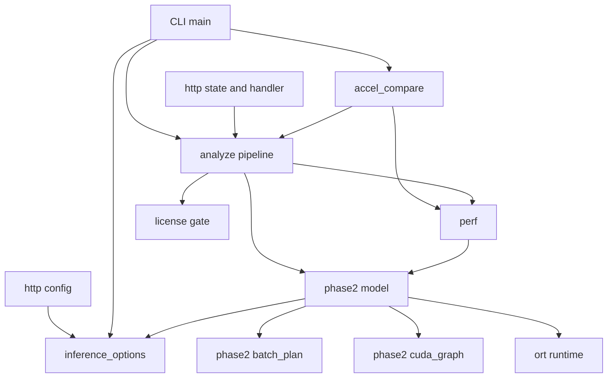
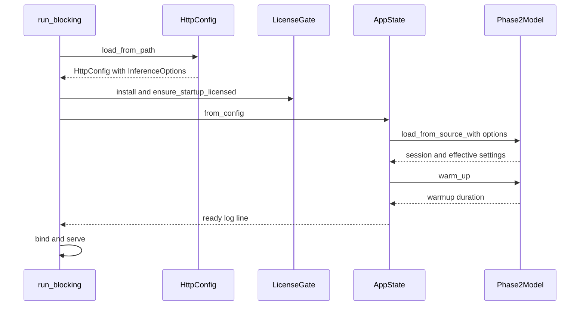
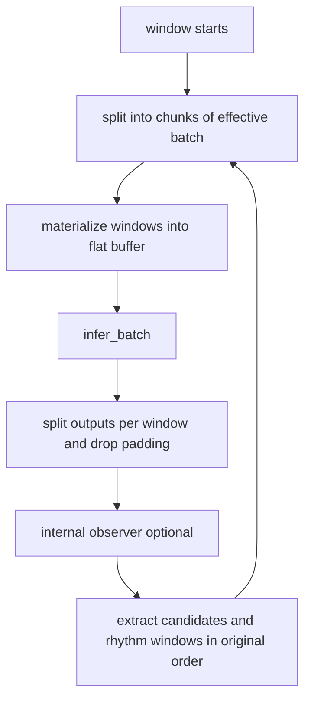

# Design Document — inference-acceleration

## Overview

**Purpose**: 本機能は、Holter Analysis Assist の Phase-2 ONNX 推論を GPU（Windows・Ampere 世代以降）で高速化し、その効果と精度差を数値で確認できるようにする。
**Users**: 解析オペレータ（CLI `analyze-ecl`）、連携システム運用者（HTTP API / UI コンソール）、品質責任者（比較レポート）。
**Impact**: 現在の「20 秒ウィンドウを 1 件ずつ推論」「CUDA 設定は既定のまま」「計測なし」を、「複数ウィンドウのまとめ推論」「三値の CUDA チューニング」「段階別計測」「HTTP 起動時暖機」「CPU FP32 基準の比較サブコマンド」に置き換える。出力契約（CSV / JSON）とライセンス計上単位は変えない。

### Goals
- 段階別所要時間・実効設定を 1 行の診断ログとして CLI / HTTP の両方で出す
- 可変バッチモデルで 1 回の推論に複数ウィンドウを載せ、旧固定バッチモデルでも従来どおり動く
- HTTP は起動時にモデルを準備・暖機してからリッスンする
- CUDA の TF32 / Conv1D パディング / CUDA Graph を個別に切り替えられ、未指定なら導入前と同一
- 同一 ECL を基準（CPU・FP32・まとめ 1）と候補で解析し、精度差と速度をレポートする

### Non-Goals
- TensorRT、FP16 / INT8、複数 GPU
- 推論ワーカースレッド化、前処理・後処理の並列化（計測結果を見て別仕様で検討）
- UI コンソールへの計測表示
- 採否閾値の確定

## Boundary Commitments

### This Spec Owns
- `InferenceOptions`（実行プロバイダ・まとめ処理件数・CUDA チューニング）の型、検証、共通パーサ、既定値
- `Phase2Model` のまとめ推論（`infer_batch`）、モデル入力形状に基づく実効まとめ件数の決定、CUDA チューニングの適用、CUDA Graph 用 IoBinding 経路、暖機（`warm_up`）
- 解析パイプラインのバッチ化と段階別計測（`AnalyzePerf`）、およびその診断ログ書式
- HTTP 起動時の暖機・準備ログ、`[http]` の新キー（`batch_size`, `cuda_tf32`, `cuda_conv1d_pad_to_nc1d`, `cuda_graph`）
- CLI `analyze-ecl` の新オプションと比較サブコマンド `compare-accel`、比較指標・レポート形式
- 可変バッチ ONNX の再エクスポート手段（`--dynamic-batch`）と、テスト用極小 ONNX フィクスチャ
- 設定例・README・Windows GPU 計測手順の文書

### Out of Boundary
- 解析アルゴリズム（前処理・後処理・閾値）とラベル体系、CSV 列・JSON キー
- ライセンスゲートの実装と計上単位（既存 `ensure_inference_licensed` を呼ぶだけ）
- `ExecutionProviderKind` の選択肢（`auto`/`cpu`/`cuda`）と `auto` の候補順
- 配布パッケージの構成（新たなランタイムを同梱しない）
- UI コンソール（`static/console/`）
- 学習済みモデルの重み・構造

### Allowed Dependencies
- `ort =2.0.0-rc.13`（既存 `cuda` feature、IoBinding / Allocator / `Tensor::copy_into`）
- 既存モジュール: `model_source`, `preprocess`, `postprocess`, `license`（ゲート呼出しのみ）, `http`
- 標準ライブラリ `std::time::Instant`（計測）、既存 `serde_json`（レポート JSON）、既存 `clap`
- 新しい crate 依存は追加しない
- 依存方向: `inference_options` → `phase2` → `perf` → `analyze` → {`accel_compare`, `http`, `main.rs`}。逆向きの import を禁止する。`accel_compare` は `http` に依存しない

### Revalidation Triggers
- 正本入口 `analyze_ecl_with_source` の引数が `provider` から `&InferenceOptions` に変わる（`http-api`・CLI・テストの呼出し側）
- `AnalyzeSummary` に `perf` フィールドが増える（`http::response` の JSON マッピングは不変であることを再確認）
- `[http]` に新キーが増える（`packaging-distribution` の ini サンプル同梱、`http-api` の設定例）
- HTTP 起動シーケンスに暖機が入る（起動時間の増加、暖機失敗でリッスンしない）
- 再エクスポートしたモデル（可変バッチ）を埋め込む場合の `model-embedding` 成果物

## Architecture

### Existing Architecture Analysis
- `Phase2Model`（`src/phase2.rs`）が EP 解決（auto = CUDA → CPU、明示指定は失敗時エラー）とセッション生成を所有。推論は `infer_window`（バッチ 1）のみ。
- `analyze_ecl_with_source` が正本入口（ゲート → モデルロード → パイプライン）。常駐用に `analyze_ecl_with_model` があり、内部の `analyze_ecl_with_loaded_model` がパイプライン本体。
- HTTP は `AppState::from_config` で常駐モデルを 1 回ロードし `Arc<Mutex<Phase2Model>>` で共有。リクエストごとの provider 上書き時のみ一時セッション。
- 進捗・診断は `eprintln!`（ロギング crate なし）。本機能もこれに従う。

### Architecture Pattern & Boundary Map



**Architecture Integration**:
- Selected pattern: `Phase2Model` 拡張（推論の内側に閉じる）。パイプラインはバッチ単位で呼ぶだけ。
- Domain boundaries: 設定の型と検証は `inference_options`、推論実行は `phase2`、計測書式は `perf`、比較は `accel_compare`。HTTP / CLI は設定を読み取り `InferenceOptions` を組み立てるだけ。
- Existing patterns preserved: library-first、正本入口経由のライセンス計上、`eprintln!` 診断、実モデル不在時の test skip。
- Steering compliance: 推論差し替えは `phase2` の内側、CLI / HTTP は薄いアダプタ。

### Technology Stack

| Layer | Choice / Version | Role in Feature | Notes |
|-------|------------------|-----------------|-------|
| CLI | clap 4.5（既存） | `analyze-ecl` 新オプション、`compare-accel` | 値パーサは `inference_options` の関数を共有 |
| Backend | Rust 2021 / `ort =2.0.0-rc.13`（既存） | まとめ推論、CUDA EP オプション、IoBinding | 新依存なし |
| Config | rust-ini（既存 `ini` crate） | `[http]` 新キー | 既存キー意味は不変 |
| Tooling | Python + TensorFlow + tf2onnx（既存） | `--dynamic-batch` 再エクスポート、極小フィクスチャ生成 | フィクスチャは生成済みをコミット |

## File Structure Plan

### Directory Structure
```
src/
├── inference_options.rs        # 新規: InferenceOptions の構成要素（BatchSize, CudaTuning）、共通パーサ、キー名定数、検証エラー
├── perf.rs                     # 新規: StageTimings / AnalyzePerf と診断ログ 1 行書式
├── phase2.rs                   # 変更: InferenceOptions, load_*_with, infer_batch, warm_up, CUDA チューニング適用
├── phase2/
│   ├── batch_plan.rs           # 新規: モデル入力形状 → 実効まとめ件数・詰め物要否（純関数）
│   └── cuda_graph.rs           # 新規: CUDA Graph 用 IoBinding 実行器（固定デバイスバッファ）
├── analyze.rs                  # 変更: 正本入口の引数を &InferenceOptions に、バッチ化、段階計測、内部観測フック
├── accel_compare/
│   ├── mod.rs                  # 新規: 比較の実行（モデル 2 本ロード、ECL ごとに基準→候補、観測フックで確率差分）
│   ├── metrics.rs              # 新規: 拍対応付け・一致率・混同表・確率差分累積・集計（純関数）
│   └── report.rs               # 新規: CompareReport の JSON / Markdown 出力、閾値判定
├── main.rs                     # 変更: analyze-ecl 新オプション、compare-accel サブコマンド、perf 行の出力
├── lib.rs                      # 変更: pub mod inference_options / perf / accel_compare、再エクスポート
└── http/
    ├── config.rs               # 変更: [http] 新キーの読取り・検証、inference_options() 提供
    ├── state.rs                # 変更: 設定付きロード、warm_up、準備ログ
    └── handlers/analyze.rs     # 変更: InferenceOptions の受け渡し、perf ログ
tests/
├── fixtures/
│   ├── phase2_tiny_dynamic.onnx   # 新規: 可変バッチ極小モデル（数 KB）
│   └── phase2_tiny_fixed1.onnx    # 新規: 固定バッチ 1 極小モデル
└── inference_batching.rs       # 新規: フィクスチャでまとめ推論の一致・順序・端数・実効件数を検証
tools/
├── export/
│   ├── export_onnx.py          # 変更: --dynamic-batch（入力バッチ次元を None）とバッチ N の数値比較
│   ├── make_tiny_batch_onnx.py # 新規: テスト用極小 ONNX 2 種の生成
│   └── README.md               # 変更: 可変バッチ再エクスポート手順
└── compare/
    └── run_accel_compare.ps1   # 新規: Windows で CUDA パスを通して compare-accel を実行するラッパ
docs/
└── perf/
    └── windows-gpu-benchmark.md  # 新規: Windows GPU 端末での速度・精度計測手順
```

### Modified Files
- `src/http/response.rs` — テスト内の `AnalyzeSummary` 構築に `perf` を追加するのみ（JSON マッピングは不変）
- `config/http.ini.example` — 新キー 4 種と既定値・有効な組み合わせ
- `README.md` — 「推論の高速化設定」節（CLI オプション・ini キー・再エクスポート・比較の使い方）
- `.gitignore` — `!tests/fixtures/*.onnx` の例外を追加

## System Flows

### HTTP 起動と暖機



- 設定エラー（まとめ件数・チューニング値）は `HttpConfig` 段階で失敗し、ライセンス確認より前に終了する。
- ロード失敗・暖機失敗は `StartupError::Model` として終了し、ポートを開かない（3.3）。

### まとめ推論ループ



- ウィンドウ番号 `wi` は全体通し番号のまま渡すため、候補抽出・リズム窓の順序はまとめ件数に依存しない（2.3, 2.4）。
- 実効まとめ件数が固定形状を要する場合（固定バッチモデル、CUDA Graph）は、最後のチャンクを零埋めし、詰め物の出力を破棄する。

## Requirements Traceability

| Requirement | Summary | Components | Interfaces | Flows |
|-------------|---------|------------|------------|-------|
| 1.1 | 段階別所要時間・ウィンドウ数を記録 | AnalyzePipeline, Perf | `AnalyzePerf`, `log_line` | まとめ推論ループ |
| 1.2 | 実効プロバイダ・まとめ件数・チューニングを記録 | Perf, Phase2Model | `EffectiveInference` | — |
| 1.3 | 計測を CSV/JSON に混在させない | Perf, HttpAnalyzeAdapter | stderr のみ出力 | — |
| 1.4 | HTTP でも同じ計測をログ | HttpAnalyzeAdapter | `log_line("holter-http-api")` | — |
| 2.1 | まとめ件数を設定可能 | InferenceOptions, CliAdapter, HttpConfigAdapter | `BatchSize`, `KEY_BATCH_SIZE` | — |
| 2.2 | 既定まとめ件数 | InferenceOptions | `DEFAULT_BATCH_SIZE = 16` | — |
| 2.3 | 端数も欠落・重複なく処理 | AnalyzePipeline, BatchPlan | `infer_batch(count)` | まとめ推論ループ |
| 2.4 | まとめ件数で出力・順序不変 | AnalyzePipeline | 通し番号 `wi` | まとめ推論ループ |
| 2.5 | CPU でまとめ 1 と既定が一致 | Phase2Model, AccelCompare | `tests/inference_batching.rs`, `compare-accel` | — |
| 2.6 | 不正まとめ件数は開始前に拒否 | InferenceOptions | `BatchSize::new` → `InferenceOptionsError` | HTTP 起動 |
| 2.7 | 埋め込みモデルでも利用可 | Phase2Model | `load_from_source_with(ModelSource::Embedded)` | — |
| 3.1 | 読込み＋暖機後に受付開始 | HttpStateAdapter, Phase2Model | `warm_up` | HTTP 起動と暖機 |
| 3.2 | リクエスト間でモデル再利用 | HttpStateAdapter（既存常駐） | `SharedModel::Resident` | — |
| 3.3 | 読込み・暖機失敗でリッスンしない | HttpStateAdapter | `StartupError::Model` | HTTP 起動と暖機 |
| 3.4 | 同時リクエストを失敗させない | HttpStateAdapter（既存 Mutex） | `Arc<Mutex<Phase2Model>>` | — |
| 3.5 | 準備時の設定と暖機時間をログ | HttpStateAdapter, Perf | 準備ログ行 | HTTP 起動と暖機 |
| 3.6 | 計上単位を変えない | AnalyzePipeline | 既存 `ensure_inference_licensed` 1 回 | — |
| 4.1 | TF32 / Conv1D パディング / CUDA Graph を個別切替 | InferenceOptions, Phase2Model, CudaGraphRunner | `CudaTuning` | — |
| 4.2 | 未指定なら導入前と同等 | InferenceOptions, Phase2Model | `Option<bool>::None` は ORT に未設定 | — |
| 4.3 | CUDA 以外では適用せず警告 | Phase2Model | `EffectiveInference.notes` | — |
| 4.4 | 不正値は開始前に拒否 | InferenceOptions | `parse_switch` → `InferenceOptionsError` | HTTP 起動 |
| 5.1 | 基準と候補の差分レポート | AccelCompare | `run_compare` | — |
| 5.2 | 精度指標一式 | CompareMetrics | `AccuracyMetrics` | — |
| 5.3 | 段階別時間・ウィンドウ/秒 | AccelCompare, Perf | `PerfReport` | — |
| 5.4 | ファイル別と全体集計 | CompareMetrics | `aggregate` | — |
| 5.5 | 機械可読と人向け要約 | CompareReportWriter | `report.json`, `report.md` | — |
| 5.6 | 閾値指定時のみ合否 | CompareReportWriter | `Thresholds`, `Verdict` | — |
| 5.7 | 候補プロバイダ不可なら中止 | AccelCompare | 候補モデルを最初にロード | — |
| 6.1 | CLI と ini で同じ意味・値体系 | InferenceOptions, CliAdapter, HttpConfigAdapter | 共通パーサ・キー名定数 | — |
| 6.2 | 未指定なら出力契約不変 | AnalyzePipeline, HttpAnalyzeAdapter | `AnalyzeSummaryJson` 不変 | — |
| 6.3 | 既存プロバイダ値の意味不変 | Phase2Model | `ExecutionProviderKind` 不変 | — |
| 6.4 | Windows / Linux で同じ項目名 | InferenceOptions | キー名定数 | — |
| 6.5 | 設定例と README に記載 | Docs | `config/http.ini.example`, `README.md` | — |
| 7.1 | 新ランタイムを同梱しない | Docs（境界） | packaging 無変更 | — |
| 7.2 | GPU なしでも従来どおり | Phase2Model | auto → CPU、未指定チューニング | — |
| 7.3 | Windows GPU 計測手順 | Docs | `docs/perf/windows-gpu-benchmark.md`, `run_accel_compare.ps1` | — |
| 8.1 | TensorRT を含めない | 境界 | `ExecutionProviderKind` 不変 | — |
| 8.2 | FP16 / INT8 を含めない | 境界 | FP32 のみ | — |
| 8.3 | 閾値確定を含めない | CompareReportWriter | 閾値は任意入力 | — |
| 8.4 | 複数 GPU を含めない | 境界 | device_id 固定 0 | — |
| 8.5 | 出力契約・計上単位を変えない | AnalyzePipeline | 3.6, 6.2 と同じ | — |

## Components and Interfaces

| Component | Domain/Layer | Intent | Req Coverage | Key Dependencies | Contracts |
|-----------|--------------|--------|--------------|------------------|-----------|
| InferenceOptions | inference_options | 設定の型・検証・共通パーサ | 2.1, 2.2, 2.6, 4.1, 4.2, 4.4, 6.1, 6.4 | なし | Service |
| Phase2Model（拡張） | phase2 | まとめ推論・チューニング適用・暖機 | 1.2, 2.3, 2.5, 2.7, 4.1–4.3, 6.3, 7.2 | ort (P0), BatchPlan (P0), CudaGraphRunner (P1) | Service, State |
| BatchPlan | phase2/batch_plan | 実効まとめ件数と詰め物要否 | 2.3, 2.6 | なし | Service |
| CudaGraphRunner | phase2/cuda_graph | CUDA Graph 用固定バッファ実行 | 4.1 | ort IoBinding (P1) | Service, State |
| Perf | perf | 段階別計測値と 1 行書式 | 1.1–1.4, 3.5, 5.3 | phase2 (P2) | Service |
| AnalyzePipeline（拡張） | analyze | バッチ化・計測・観測フック | 1.1, 2.3, 2.4, 3.6, 6.2, 8.5 | Phase2Model (P0), LicenseGate (P0) | Service |
| AccelCompare | accel_compare | 基準・候補の比較実行 | 2.5, 5.1, 5.3, 5.7 | AnalyzePipeline (P0), Phase2Model (P0) | Batch |
| CompareMetrics | accel_compare/metrics | 精度指標の計算と集計 | 5.2, 5.4 | なし | Service |
| CompareReportWriter | accel_compare/report | JSON / Markdown・閾値判定 | 5.5, 5.6, 8.3 | serde_json (P2) | Service |
| CliAdapter | main.rs | CLI オプション・`compare-accel` | 1.1, 2.1, 6.1 | clap (P2) | — |
| HttpConfigAdapter | http/config | `[http]` 新キー | 2.1, 2.6, 4.4, 6.1 | ini (P2) | — |
| HttpStateAdapter | http/state | 設定付きロード・暖機・準備ログ | 3.1–3.5 | Phase2Model (P0) | State |
| HttpAnalyzeAdapter | http/handlers/analyze | 設定受け渡し・perf ログ | 1.3, 1.4, 6.2 | AnalyzePipeline (P0) | — |
| Docs / Tooling | docs, tools, config | 設定例・手順・再エクスポート・フィクスチャ | 2.5, 6.5, 7.1, 7.3 | — | — |

### inference_options

#### InferenceOptions（構成要素と共通パーサ）

| Field | Detail |
|-------|--------|
| Intent | まとめ件数と CUDA チューニングの型・検証・値体系を一箇所で定義する |
| Requirements | 2.1, 2.2, 2.6, 4.1, 4.2, 4.4, 6.1, 6.4 |

**Responsibilities & Constraints**
- 他モジュールに依存しない葉モジュール。`ExecutionProviderKind` を含む完全な `InferenceOptions` は `phase2` 側で組み立てる（循環回避）。
- キー名定数を CLI（`--batch-size` 等は定数の `_`→`-` 置換）と ini の双方が参照する。

**Contracts**: Service [x]

##### Service Interface
```rust
pub const DEFAULT_BATCH_SIZE: usize = 16;
pub const MAX_BATCH_SIZE: usize = 256;
pub const KEY_BATCH_SIZE: &str = "batch_size";
pub const KEY_CUDA_TF32: &str = "cuda_tf32";
pub const KEY_CUDA_CONV1D_PAD: &str = "cuda_conv1d_pad_to_nc1d";
pub const KEY_CUDA_GRAPH: &str = "cuda_graph";

#[derive(Debug, Clone, Copy, PartialEq, Eq)]
pub struct BatchSize(std::num::NonZeroUsize);
impl BatchSize {
    pub fn new(n: usize) -> Result<Self, InferenceOptionsError>; // 1..=MAX_BATCH_SIZE
    pub fn get(self) -> usize;
}
impl Default for BatchSize { /* DEFAULT_BATCH_SIZE */ }
impl std::str::FromStr for BatchSize { type Err = InferenceOptionsError; }

/// None = ONNX Runtime に渡さない（導入前と同一）
#[derive(Debug, Clone, Copy, PartialEq, Eq, Default)]
pub struct CudaTuning {
    pub tf32: Option<bool>,
    pub conv1d_pad_to_nc1d: Option<bool>,
    pub cuda_graph: Option<bool>,
}
impl CudaTuning {
    pub fn is_unset(&self) -> bool;
    pub fn specified_keys(&self) -> Vec<&'static str>;
    pub fn describe(&self) -> String; // "tf32=default,conv1d_pad_to_nc1d=on,cuda_graph=off"
    pub fn wants_cuda_graph(&self) -> bool; // cuda_graph == Some(true)
}

/// true|false|on|off|1|0（大文字小文字無視）
pub fn parse_switch(key: &'static str, raw: &str) -> Result<bool, InferenceOptionsError>;

#[derive(Debug, thiserror::Error, Clone, PartialEq, Eq)]
pub enum InferenceOptionsError {
    #[error("invalid '{key}': expected integer 1..={max}, got '{raw}'")]
    InvalidBatchSize { key: &'static str, raw: String, max: usize },
    #[error("invalid '{key}': expected true|false|on|off|1|0, got '{raw}'")]
    InvalidSwitch { key: &'static str, raw: String },
}
```
- Preconditions: 入力は trim 済みでなくてよい（内部で trim）。空文字は不正値。
- Postconditions: 検証済みの値のみ生成される。
- Invariants: `BatchSize` は常に `1..=MAX_BATCH_SIZE`。

### phase2

#### Phase2Model（拡張）

| Field | Detail |
|-------|--------|
| Intent | 設定に従うセッション生成、まとめ推論、暖機、実効設定の公開 |
| Requirements | 1.2, 2.3, 2.5, 2.7, 4.1, 4.2, 4.3, 6.3, 7.2 |

**Responsibilities & Constraints**
- 既存の EP 解決（auto = CUDA → CPU、明示指定失敗はエラー）を維持し、CUDA セッション生成時のみ `CudaTuning` の `Some` 値を `ep::CUDA` に適用する。
- 解決後のプロバイダが CUDA 以外で `CudaTuning` に指定がある場合は適用せず、`notes` に警告を積み stderr に出す（4.3）。
- ロード後に入力 0 の形状から `ModelBatchShape` を判定し、`BatchPlan` で実効まとめ件数を確定する。
- CUDA Graph が実効（プロバイダ CUDA かつ `cuda_graph=Some(true)`）なら `CudaGraphRunner` 経由で推論し、常に実効件数で実行する。
- 既存 `load_from_source(source, provider)` / `load_with_provider` / `load_from_memory` / `infer_window` は互換のため残し、内部で新 API に委譲する（`InferenceOptions::from(provider)`）。

**Dependencies**
- Inbound: AnalyzePipeline, HttpStateAdapter, AccelCompare, CLI `infer-window`（P0）
- Outbound: BatchPlan（P0）, CudaGraphRunner（P1）
- External: `ort` Session / `ep::CUDA` / IoBinding（P0）

**Contracts**: Service [x] / State [x]

##### Service Interface
```rust
#[derive(Debug, Clone, Copy, PartialEq, Eq, Default)]
pub struct InferenceOptions {
    pub provider: ExecutionProviderKind,
    pub batch_size: BatchSize,
    pub cuda: CudaTuning,
}
impl From<ExecutionProviderKind> for InferenceOptions { /* 他は既定 */ }

#[derive(Debug, Clone, Copy, PartialEq, Eq)]
pub enum ModelBatchShape { Dynamic, Fixed(usize) }

#[derive(Debug, Clone, PartialEq, Eq)]
pub struct EffectiveInference {
    pub provider: ExecutionProviderKind,   // 解決後（Auto にならない）
    pub batch_size: usize,                 // 実効まとめ件数
    pub requested_batch_size: usize,
    pub model_batch: ModelBatchShape,
    pub pad_tail: bool,
    pub cuda: CudaTuning,                  // 要求値
    pub cuda_applied: bool,                // provider == Cuda のときのみ true
    pub cuda_graph_active: bool,
    pub notes: Vec<String>,                // 警告（クランプ・未適用など）
}

impl Phase2Model {
    pub fn load_from_source_with(source: &ModelSource, options: &InferenceOptions) -> Result<Self, InferError>;
    pub fn load_with_options(path: impl AsRef<Path>, options: &InferenceOptions) -> Result<Self, InferError>;
    pub fn effective(&self) -> &EffectiveInference;
    pub fn batch_size(&self) -> usize;
    /// windows.len() == count * WINDOW_SAMPLES, 1 <= count <= batch_size()
    pub fn infer_batch(&mut self, windows: &[f32], count: usize) -> Result<Vec<WindowOutputs>, InferError>;
    pub fn infer_window(&mut self, samples: &[f32]) -> Result<WindowOutputs, InferError>; // 既存・委譲
    /// 実効件数分の零入力で 1 回推論（cuDNN 探索・CUDA Graph 捕捉を含む）
    pub fn warm_up(&mut self) -> Result<std::time::Duration, InferError>;
}

// InferError への追加
// InvalidBatch { count: usize, max: usize }
// CudaGraph(String)   // 捕捉・バインド失敗。メッセージで cuda_graph=false を案内
```
- Preconditions: `infer_batch` の `count` は `1..=batch_size()`、長さ不一致は `InvalidWindow` / `InvalidBatch`。
- Postconditions: 戻り値は `count` 件、入力順。詰め物分は含まない。
- Invariants: `effective().provider != Auto`。`cuda_graph_active` なら毎回の実行形状は `[batch_size, 10000, 1]`。

##### State Management
- State model: セッション + 実効設定 +（CUDA Graph 時）固定デバイスバッファ。ロード後に不変。
- Concurrency strategy: `&mut self` による排他。HTTP では既存 `Mutex` で直列化（同時 Run をしない）。

**Implementation Notes**
- Integration: 出力抽出は `beat [B,10000,1]`, `event [B,10000,3]`, `rhythm [B,1]` を連続スライスとして切り分ける。
- Validation: 固定バッチ 1 の旧モデルで `batch_size()==1`、設定 16 なら `notes` にクランプ警告。
- Risks: 可変バッチモデルで過大な件数による GPU メモリ不足 → `ort` エラーとして返る（HTTP は暖機で検出）。

#### BatchPlan

| Field | Detail |
|-------|--------|
| Intent | モデル形状・要求件数・固定形状要否から実効まとめ件数を決める純関数 |
| Requirements | 2.3, 2.6 |

```rust
pub struct BatchPlan { pub size: usize, pub pad_tail: bool, pub note: Option<String> }
pub fn plan_batch(model: ModelBatchShape, requested: BatchSize, fixed_shape_required: bool) -> BatchPlan;
```
- 規則: `Dynamic` → `size = requested`, `pad_tail = fixed_shape_required`。`Fixed(n)` → `size = n`, `pad_tail = n > 1`、`requested != n` なら `note`（「モデルは固定バッチ n。batch_size=要求値 は無視」）。

#### CudaGraphRunner

| Field | Detail |
|-------|--------|
| Intent | CUDA Graph の前提（形状・アドレス固定）を満たす IoBinding 実行 |
| Requirements | 4.1 |

**Contracts**: Service [x] / State [x]
```rust
#[cfg(feature = "cuda")]
pub(crate) struct CudaGraphRunner { /* IoBinding, 入力デバイス Tensor [B,10000,1], 出力デバイス Tensor 3 本 */ }
#[cfg(feature = "cuda")]
impl CudaGraphRunner {
    pub(crate) fn new(session: &Session, batch: usize) -> Result<Self, InferError>;
    /// flat.len() == batch * WINDOW_SAMPLES（詰め物済み）。ホスト→デバイス複写 → run_binding → ホストへ取得
    pub(crate) fn run(&mut self, session: &mut Session, flat: &[f32]) -> Result<RawBatchOutputs, InferError>;
}
pub(crate) struct RawBatchOutputs { pub beat: Vec<f32>, pub event: Vec<f32>, pub rhythm: Vec<f32> }
```
- セッション生成時に `with_cuda_graph(true)` を設定。最初の `run`（暖機）で捕捉され、以後は再生される。
- 失敗（CPU フォールバックノードの存在等）は `InferError::CudaGraph` として返す。

### perf

#### Perf

| Field | Detail |
|-------|--------|
| Intent | 段階別所要時間と実効設定を保持し、1 行の診断ログに整形する |
| Requirements | 1.1, 1.2, 1.3, 1.4, 3.5, 5.3 |

```rust
#[derive(Debug, Clone, Default, PartialEq)]
pub struct StageTimings {
    pub model_load: Option<Duration>, // 正本入口でロードした場合のみ
    pub preprocess: Duration,         // ECL 読込み + AI 用連続信号生成
    pub inference: Duration,          // ウィンドウ具現化 + infer_batch + 候補抽出
    pub postprocess: Duration,        // クラスタリング〜Unknown QC〜RUN 確定
    pub output: Duration,             // 行生成 + CSV 書込み + 整合性検査
    pub total: Duration,
}
#[derive(Debug, Clone, Default, PartialEq)]
pub struct AnalyzePerf {
    pub timings: StageTimings,
    pub windows: usize,
    pub effective: Option<EffectiveInference>,
}
impl AnalyzePerf {
    pub fn windows_per_sec_total(&self) -> f64;
    pub fn windows_per_sec_inference(&self) -> f64;
    /// 例: "perf: provider=cuda batch_size=16 model_batch=dynamic cuda_tuning=tf32=default,conv1d_pad_to_nc1d=on,cuda_graph=off windows=2064 model_load_ms=812.3 preprocess_ms=... inference_ms=... postprocess_ms=... output_ms=... total_ms=... windows_per_s=..."
    pub fn log_line(&self) -> String;
}
```
- 出力先は常に stderr。CSV / JSON 本体には含めない（1.3）。

### analyze

#### AnalyzePipeline（拡張）

| Field | Detail |
|-------|--------|
| Intent | バッチ単位推論・段階計測・内部観測を行う解析パイプライン |
| Requirements | 1.1, 2.3, 2.4, 3.6, 6.2, 8.5 |

**Responsibilities & Constraints**
- 正本入口の引数を `provider` から `&InferenceOptions` に変更する（呼出し側を更新）。互換ラッパ `analyze_ecl` / `analyze_ecl_with_limit` は署名を保ち内部で `InferenceOptions::from(provider)` を使う。
- ライセンス確認は従来どおりジョブ開始時に 1 回（3.6）。観測フック付き入口は `pub(crate)` とし、公開 gated 入口を増やさない。
- `AnalyzeSummary` に `perf: AnalyzePerf` を追加。CLI・HTTP の既存出力（CSV 列・JSON キー）は不変。

**Contracts**: Service [x]
```rust
pub fn analyze_ecl_with_source(
    ecl_path: &Path, model: &ModelSource, output_csv: &Path,
    max_windows: Option<usize>, options: &InferenceOptions,
) -> Result<(Vec<BeatResultRow>, AnalyzeSummary), AnalyzeError>;

pub fn analyze_ecl_with_model( // 既存・署名不変（まとめ件数等はモデルの実効設定に従う）
    ecl_path: &Path, model: &mut Phase2Model, output_csv: &Path, max_windows: Option<usize>,
) -> Result<(Vec<BeatResultRow>, AnalyzeSummary), AnalyzeError>;

pub(crate) type WindowObserver<'a> = &'a mut dyn FnMut(usize, &WindowOutputs);
pub(crate) fn analyze_ecl_with_model_observed(
    ecl_path: &Path, model: &mut Phase2Model, output_csv: &Path,
    max_windows: Option<usize>, observer: WindowObserver<'_>,
) -> Result<(Vec<BeatResultRow>, AnalyzeSummary), AnalyzeError>;

pub struct AnalyzeSummary { pub beats: usize, pub unknown_ones: usize, pub short_run_ones: usize, pub windows: usize, pub perf: AnalyzePerf }
```
- Postconditions: 同一モデル・同一プロバイダで、まとめ件数が異なっても行の順序・列は同一。

### accel_compare

#### AccelCompare

| Field | Detail |
|-------|--------|
| Intent | 基準（CPU・FP32・まとめ 1・チューニング未指定）と候補で各 ECL を解析し差分と速度を集める |
| Requirements | 2.5, 5.1, 5.3, 5.7 |

**Contracts**: Batch [x]

##### Batch / Job Contract
- Trigger: CLI `holter-analysis-assist compare-accel <ECL>...`（CLI 起動時ライセンス確認後）
- Input / validation: ECL 1 件以上、`ModelSource`（`--model` 省略時は既存規則: 埋め込み or 開発既定パス）、候補 `InferenceOptions`、`tolerance_samples`（既定 40 = 80 ms）、`prob_stride`（既定 1）、任意の `Thresholds`、`max_windows`、`report_dir`（既定 `output/accel_compare`）
- 処理順: (1) 候補モデルをロード（失敗なら中止し理由を表示、5.7）→ (2) 基準モデルをロード → (3) ECL ごとに基準を観測付きで解析（リズムスコア全窓、`prob_stride` ごとの beat/event を保持）→ 候補を観測付きで解析し逐次差分 → 行同士を比較 → (4) 集計・レポート出力
- Output / destination: `report_dir/report.json`, `report_dir/report.md`（stdout にも Markdown）、ECL ごとの `report_dir/<ECL 名>/baseline.csv` / `candidate.csv`（同名 ECL は `_2` などを付けて区別）
- 計上: 各解析は正本のゲートを通るため、ECL 1 件につき 2 回計上（文書に明記）
- Idempotency & recovery: 出力は上書き。途中失敗は非 0 終了（既に書いたファイルは残る）
- 終了コード: 0 = 成功、1 = エラー、2 = 指定閾値のいずれかが不合格。ただし clap の引数エラーも 2 で終了するため、2 だけでは閾値不合格と区別できない（CLI ヘルプと手順書に明記）

```rust
pub struct CompareConfig {
    pub ecl_paths: Vec<PathBuf>, pub model: ModelSource, pub candidate: InferenceOptions,
    pub tolerance_samples: u32, pub prob_stride: usize, pub max_windows: Option<usize>,
    pub thresholds: Thresholds, pub report_dir: PathBuf,
}
pub fn run_compare(cfg: &CompareConfig) -> Result<CompareReport, CompareError>;
#[derive(Debug, thiserror::Error)]
pub enum CompareError {
    #[error("candidate provider unavailable: {0}")] CandidateUnavailable(InferError),
    #[error(transparent)] Analyze(#[from] AnalyzeError),
    #[error(transparent)] Infer(#[from] InferError),
    #[error(transparent)] Io(#[from] std::io::Error),
    #[error(transparent)] Metrics(#[from] MetricsError), // beat_time の解析失敗
    #[error("{0}")] Config(String),                      // 比較設定の不正
}
```

#### CompareMetrics

| Field | Detail |
|-------|--------|
| Intent | 精度指標の計算とファイル横断集計（純関数） |
| Requirements | 5.2, 5.4 |

```rust
pub struct AccuracyMetrics {
    pub windows: usize,
    pub rhythm_window_agreement: f64,        // リズム区間の一致率: 窓ごとの SR / AF/AFL 判定（TH_AF）一致割合
    pub baseline_beats: usize, pub candidate_beats: usize, pub beat_count_diff: i64,
    pub matched_beats: usize,                // 許容幅内で 1 対 1 対応付け
    pub match_rate_vs_baseline: f64, pub match_rate_vs_candidate: f64,
    pub offset_max_samples: f64, pub offset_mean_samples: f64, // 500 Hz サンプル
    pub beat_class_agreement: f64,
    pub beat_class_confusion: [[u64; 3]; 3], // 行 = 基準 [N,PAC,PVC]、列 = 候補
    pub rhythm_class_agreement: f64, pub unknown_agreement: f64, pub short_run_agreement: f64,
    pub prob_max_abs_diff: ProbDiff,         // { beat, event_pac, event_pvc, event_n, rhythm, sampled_windows }
}
pub fn match_beats(baseline_ms: &[i64], candidate_ms: &[i64], tolerance_samples: u32) -> Vec<(usize, usize, i64)>;
pub fn aggregate(files: &[AccuracyMetrics]) -> AccuracyMetrics; // 件数は合算、率はプール、最大は最大、平均は件数加重
```
- 拍時刻は `beat_time`（ms 精度）をパースして ms に変換し、許容幅は `tolerance_samples * 2 ms` として比較する（`BeatResultRow` を変更しない）。
- 対応付けは時刻順の貪欲法（最も近い未対応候補、許容幅内）。

#### CompareReportWriter

| Field | Detail |
|-------|--------|
| Intent | レポートの JSON / Markdown 出力と、閾値指定時のみの合否判定 |
| Requirements | 5.5, 5.6, 8.3 |

```rust
pub struct Thresholds {
    pub min_rhythm_window_agreement: Option<f64>, pub min_beat_match_rate: Option<f64>,
    pub min_beat_class_agreement: Option<f64>, pub max_prob_abs_diff: Option<f64>,
    pub max_offset_samples: Option<f64>,
}
pub struct ThresholdCheck { pub metric: String, pub actual: f64, pub threshold: f64, pub passed: bool }
pub struct Verdict { pub checks: Vec<ThresholdCheck>, pub passed: bool }
pub struct CompareReport { pub baseline: ConfigInfo, pub candidate: ConfigInfo, pub files: Vec<FileReport>, pub aggregate: AggregateReport, pub verdict: Option<Verdict> }
pub fn to_json(report: &CompareReport) -> String;
pub fn to_markdown(report: &CompareReport) -> String;
```
- `verdict` は閾値が 1 つも指定されなければ `None`（合否を出さない）。判定は集計値に対して行う。

### Adapters（summary-only）

- **CliAdapter**（`src/main.rs`）: `analyze-ecl` に `--batch-size`, `--cuda-tf32 <switch>`, `--cuda-conv1d-pad-to-nc1d <switch>`, `--cuda-graph <switch>` を追加（`value_parser` は `inference_options` のパーサ）。解析成功時に `summary.perf.log_line()` を stderr へ。`compare-accel` は同じ推論オプション＋比較専用オプション（`--tolerance-samples`, `--prob-stride`, `--max-windows`, `--report-dir`, 閾値 5 種）を持つ。
- **HttpConfigAdapter**（`src/http/config.rs`）: `[http]` の `batch_size`, `cuda_tf32`, `cuda_conv1d_pad_to_nc1d`, `cuda_graph` を任意キーとして読む。不正値は `HttpConfigError::Config`（起動拒否）。`HttpConfig::inference_options() -> InferenceOptions`。既存キーの意味は不変。
- **HttpStateAdapter**（`src/http/state.rs`）: `from_config` で `load_from_source_with` → `warm_up` → 準備ログ `holter-http-api: model ready provider=… batch_size=… model_batch=… cuda_tuning=… warmup_ms=…` と `notes` の警告。リクエスト単位の provider 上書き時の一時セッションも同じまとめ件数・チューニングを使う（暖機なし）。
- **HttpAnalyzeAdapter**（`src/http/handlers/analyze.rs`）: 解析後に `holter-http-api: ` 接頭辞付きで `perf.log_line()` に `response_encode_ms` を加えて stderr へ。応答本体は不変。

## Data Models

### Domain Model
- `InferenceOptions`（値オブジェクト）: provider × BatchSize × CudaTuning。検証済みのみ生成。
- `EffectiveInference`（値オブジェクト）: ロード後に確定する実効設定。`AnalyzePerf` と準備ログの唯一の情報源。
- `AnalyzePerf`: ジョブ単位の計測。永続化しない。
- `CompareReport`: ファイル別 `FileReport { ecl, accuracy: AccuracyMetrics, baseline_perf: PerfReport, candidate_perf: PerfReport }` と集計。

### Data Contracts & Integration

**`report.json`（抜粋）**
```json
{
  "baseline": {"provider": "cpu", "batch_size": 1, "cuda_tuning": "tf32=default,conv1d_pad_to_nc1d=default,cuda_graph=default"},
  "candidate": {"provider": "cuda", "batch_size": 16, "model_batch": "dynamic", "cuda_tuning": "tf32=default,conv1d_pad_to_nc1d=on,cuda_graph=off"},
  "tolerance_samples": 40,
  "files": [{"ecl": "…", "accuracy": {"rhythm_window_agreement": 1.0, "matched_beats": 0, "beat_class_confusion": [[0,0,0],[0,0,0],[0,0,0]], "prob_max_abs_diff": {"beat": 0.0, "sampled_windows": 0}}, "baseline_perf": {"inference_ms": 0.0, "total_ms": 0.0, "windows_per_s_total": 0.0, "windows_per_s_inference": 0.0}, "candidate_perf": {}}],
  "aggregate": {},
  "verdict": null
}
```

**`[http]` 新キー**

| Key | Values | Default（未指定時） | Notes |
|-----|--------|--------------------|-------|
| `batch_size` | 1–256 | 16 | 固定バッチモデルではモデルの値に従い警告 |
| `cuda_tf32` | true/false/on/off/1/0 | ORT 既定（有効） | CUDA 以外では無視＋警告 |
| `cuda_conv1d_pad_to_nc1d` | 同上 | ORT 既定（無効） | 同上 |
| `cuda_graph` | 同上 | ORT 既定（無効） | 有効時は常に実効件数で実行（端数は零埋め） |

## Error Handling

### Error Strategy
- 設定値の不正（2.6, 4.4）: CLI は clap の引数エラー（ライセンス確認前に終了）、HTTP は `HttpConfigError` で起動拒否。メッセージにキー名・受理値・入力値を含める。
- 実行時の不整合（4.3, 固定バッチでのクランプ）: 失敗にせず `EffectiveInference.notes` に警告を積み stderr に出す。
- プロバイダ不可: 既存どおり明示 `cuda` はエラー、`auto` は CPU へ。比較ツールは候補ロード失敗で `CandidateUnavailable`（5.7）。
- CUDA Graph 捕捉失敗: `InferError::CudaGraph`。CLI は解析失敗、HTTP は暖機で失敗し起動しない。メッセージで `cuda_graph=false` を案内。ただし `provider=auto` でセッション生成時（固定バッファ実行経路の作成時）に失敗した場合は、既存のプロバイダ解決により CPU へフォールバックする。
- GPU メモリ不足: `InferError::Ort` として伝播。HTTP は暖機で検出。

### Monitoring
- すべて stderr の 1 行ログ（`perf:`、`model ready`、警告）。外部監視連携は範囲外。

## Testing Strategy

### Unit Tests
- `inference_options`: `BatchSize::new` が 0 と 257 を拒否し 1・16・256 を受理する（2.6）。`parse_switch` の受理値・拒否値とエラー文言にキー名が含まれる（4.4, 6.1）。`CudaTuning::default().is_unset()`（4.2）。
- `batch_plan`: `Dynamic`/`Fixed(1)`/`Fixed(8)` × 要求 1/16 × 固定形状要否の組合せで `size`・`pad_tail`・`note` が規則どおり（2.3）。
- `perf`: `log_line` に provider・batch_size・cuda_tuning・各段階 ms・windows が含まれ、JSON/CSV を生成しない（1.1, 1.2, 1.3）。
- `metrics`: 既知の拍列で `match_beats` の対応数・ずれ、混同表、一致率、`aggregate` のプール計算が期待値（5.2, 5.4）。
- `report`: 閾値なしで `verdict == None`、閾値ありで合否が正しく、JSON に必須キーが揃う（5.5, 5.6）。

### Integration Tests
- `tests/inference_batching.rs`（CPU・極小フィクスチャ）: 可変バッチモデルで `infer_batch` 16 件の各出力が `infer_window` 1 件ずつと一致（2.5）、37 件を 16 件ずつ処理して 37 件が入力順に返る（2.3, 2.4）、固定バッチ 1 モデルで要求 16 が実効 1 に落ち `notes` に警告（2.2 の補足）。
- 同フィクスチャで CPU プロバイダに `CudaTuning` を指定すると適用されず `notes` に警告が出て推論は成功（4.3, 7.2）。
- `http::config` テスト: 新キーの既定値、正常値、不正値で `HttpConfigError`（2.6, 4.4, 6.1）。
- `http::state`（極小フィクスチャ）: `from_config` 後に暖機済みで、`batch_size` が設定どおり反映される（3.1, 3.5）。存在しないモデルで失敗（3.3、既存テスト維持）。
- 既存 `http_api_listen` / `response` テスト: JSON キー・CSV 列が変わらない（6.2）。

### E2E / Manual（Windows GPU、`docs/perf/windows-gpu-benchmark.md`）
- `compare-accel --provider cpu --batch-size 16` を実 ECL で実行し、拍・ラベル・リズムが 100% 一致すること（2.5）。
- `compare-accel --provider cuda` を `batch_size` 1/8/16/32 と `cuda_conv1d_pad_to_nc1d`・`cuda_tf32=false`・`cuda_graph` の組合せで実行し、速度と精度差を記録（4.1, 5.x）。
- `--provider cuda` を CUDA 非導入環境で指定し、比較が中止されること（5.7）。
- HTTP を `cuda_graph=true` で起動し、2 リクエスト連続・同時で成功すること（3.4、CUDA Graph のスレッド検証）。

### Performance
- 丸 1 日 ECL（約 2,064 窓）で、CUDA・可変バッチ 16 の推論段階時間を、まとめ 1 と比較して記録する（目標値は設けず計測結果で判断）。

## Security Considerations
- 比較ツールは既存ライセンスゲートを通る（計上 2 回 / ECL）。観測フックは `pub(crate)` で外部公開しない。
- テスト用極小 ONNX は学習済み重みを含まない合成モデルであり、`.gitignore` 例外は `tests/fixtures/*.onnx` に限定する。

## Performance & Scalability
- まとめ件数上限 256、既定 16。実効件数と GPU メモリの関係は計測手順で確認する。
- 比較ツールの基準ウィンドウ保持は 1 ウィンドウ約 160 KB で、丸 1 日で約 800 MB、7 日で約 5.7 GB（`prob_stride=1`）。複数日 ECL では `--prob-stride` で間引く。
- CUDA Graph 時の端数詰め物による無駄計算は最大 `batch_size - 1` 窓。

## Migration Strategy
- 旧固定バッチ 1 モデルはそのまま動作（実効 1、警告のみ）。高速化には `tools/export/export_onnx.py --dynamic-batch` で再エクスポートし、`resources/models/phase2_rev1.onnx`（開発）または `HOLTER_EMBEDDED_MODEL_PATH`（埋め込みビルド）に配置する。
- 再エクスポート時はスクリプトが Keras と ORT（バッチ N）の数値一致、およびバッチ N と 1 の一致を確認する。
