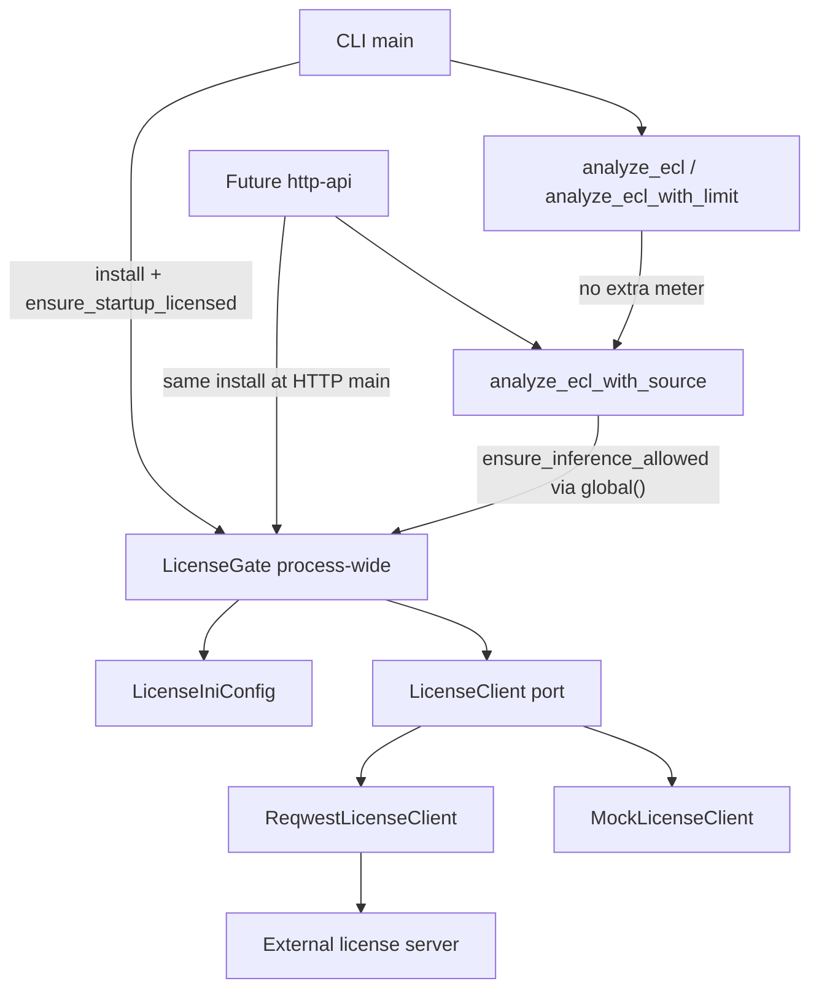
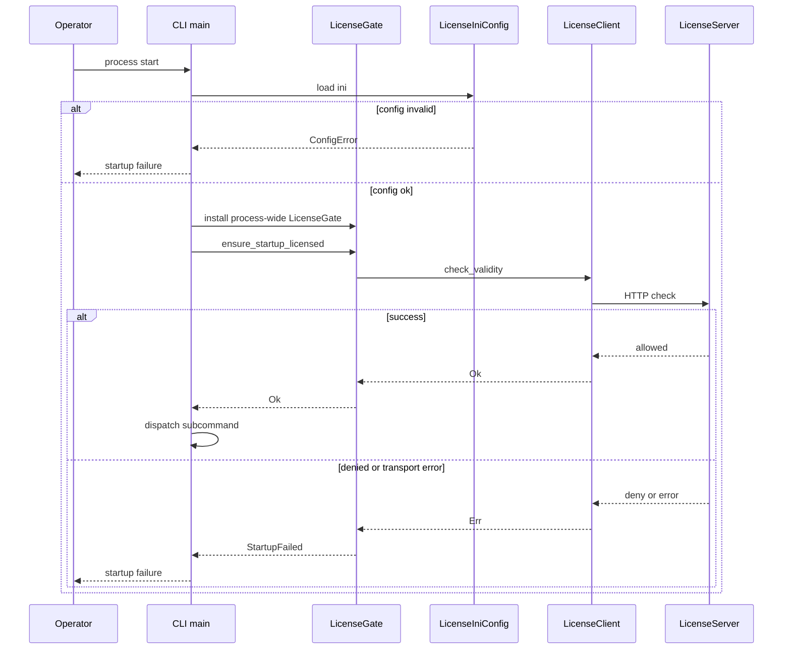
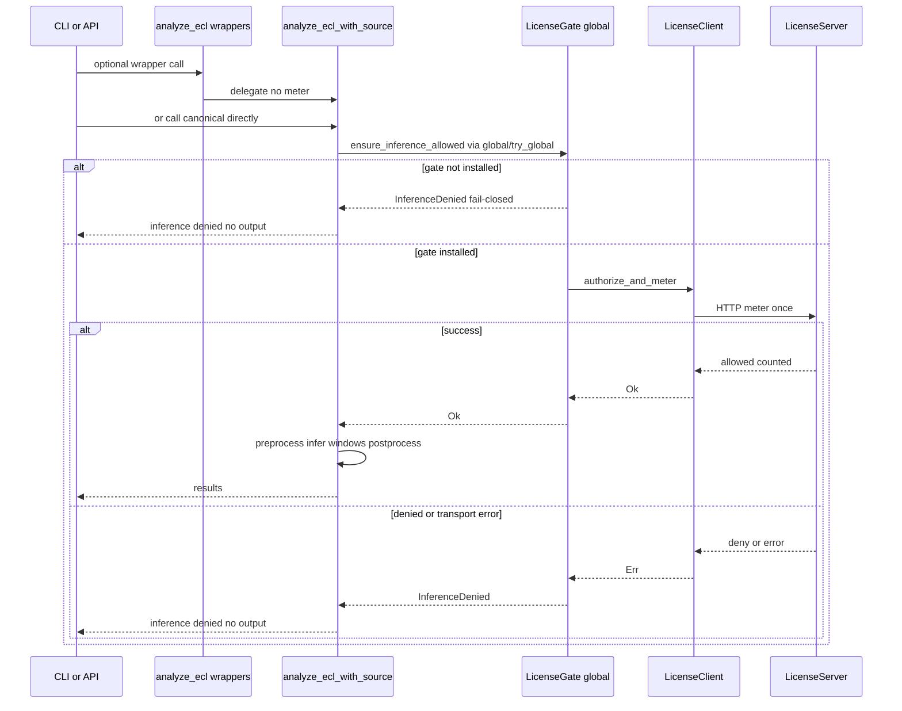

# Design Document: license-client

## Overview

本機能は、Holter Analysis Assist にライセンスサーバー向けの薄いクライアントと ini 設定を追加し、プロセス起動時の有効性確認と 1 解析ジョブごとの許可確認・利用計上を fail-closed で強制する。運用オペレータは同一設定キーで Windows / Linux を切り替えられ、開発者はトレイト境界でサーバー無しの自動テストが可能になる。

**Purpose**: 商用ライセンス運用に必要なクライアント側ゲートを、CLI と将来 API が共有する lib に提供する。  
**Users**: 運用オペレータ（起動・解析実行）、ライセンス管理者（計上単位の保証）、開発者（モック検証）。  
**Impact**: ローカル完結の解析プロセスに、設定必須のオンラインゲートが加わる。ライセンスサーバー本体は別プロジェクトのまま。

### Goals
- 起動時 1 回の有効性確認（失敗時は起動拒否）
- 1 推論（正本入口 `analyze_ecl_with_source`＝`analyze-ecl` / API 1 解析リクエスト）ごとの許可確認と利用計上（失敗時は推論拒否）。ラッパでの二重計上なし
- ini による接続設定（少なくとも `server_url`。認証・タイムアウト・パス）。`config/license.ini.example` が `[license]` 正本
- モック可能なクライアント境界と、秘密情報のログマスク
- プロセス全体の `LicenseGate`（CLI／HTTP 同一 install。解析は global 参照）

### Non-Goals
- ライセンスサーバー実装、課金 DB、管理 UI
- オフライン運用、リトライ／サーキットブレーカによる継続実行
- ONNX window 単位の計上
- モデル埋め込み、HTTP API リソース設計、配布パッケージ

## Boundary Commitments

### This Spec Owns
- ライセンス ini の読取と設定スキーマ（キー名・必須性・デフォルト）
- `config/license.ini.example` の `[license]` セクション正本（キー意味・既定値。他仕様はコピー／参照のみで再定義しない）
- `LicenseClient` ポート（有効性確認 / 許可+計上）とその HTTP 実装
- 起動ゲートと解析ジョブゲートの lib 公開 API
- **ファイル所有（ゲート挿入）**: `src/analyze.rs` への meter／推論ゲート挿入（正本公開入口 `analyze_ecl_with_source` 先頭）、および `src/main.rs` の CLI 起動ゲート挿入
- 起動失敗 / 推論拒否のエラー区分とログ上の秘密情報マスク
- 単体テスト用のモック差し替え手段
- プロセス全体の `LicenseGate` インストール契約（`install` / `global` / `try_global`）

### Shared File Ownership（`src/analyze.rs` / `src/main.rs`）
- **model-embedding が先**: `ModelSource` 配線・`analyze_ecl_with_source` シグネチャ導入
- **license-client が後**: 同ファイルへ起動／推論ゲートを挿入。実装順序は embedding → license
- model-embedding はゲート呼び出しを所有しない。本仕様は `ModelSource` を再定義しない

### Out of Boundary
- ライセンスサーバーのパス最終決定・認証方式のサーバー側実装・課金永続化
- `model-embedding` のモデルロード／`ModelSource` 変更
- `http-api` のルート設計・`[http]` セクション定義（本仕様はゲート呼び出し契約と `[license]` 正本のみ提供）
- `packaging-distribution` の成果物構成（サンプル ini のキー再定義禁止。コピー／参照のみ）
- `InferWindow` / `Classify` への利用計上
- ラッパ `analyze_ecl` / `analyze_ecl_with_limit` への二重 meter（禁止）

### Allowed Dependencies
- 既存: `thiserror`, `serde` / `serde_json`, `analyze` / CLI 入口（上流で `analyze_ecl_with_source` が定義されている前提でゲートを挿入）
- 新規採用: `reqwest` 0.12（blocking + json + TLS）、`rust-ini`（crate `ini`）
- 外部: 別リポのライセンスサーバー（合意済み HTTP 契約）
- 禁止: サーバー実装コードの本リポ取り込み、window ループ内でのゲート呼び出し、解析関数への `LicenseGate` 引数追加（v1）

### Revalidation Triggers
- 有効性確認 / 許可+計上のリクエスト・レスポンス最小スキーマ変更
- ini キー名・必須項目の変更、または `config/license.ini.example` 正本パスの変更
- ゲート公開 API（起動 / 推論 / global インストール）のシグネチャまたは fail-closed 意味の変更
- 正本解析入口（`analyze_ecl_with_source`）または二重計上防止契約の変更
- 「1 推論」の定義変更（ジョブ単位以外への拡張）
- 依存（reqwest major、TLS バックエンド）の変更で実行環境要件が変わる場合

## Architecture

### Existing Architecture Analysis
- Library-first: ドメインは `src/lib.rs` 配下、CLI は薄い `main`
- 正本公開解析入口は `model-embedding` 定義の `analyze::analyze_ecl_with_source`（前処理 → 複数 window 推論 → 後処理）。`analyze_ecl` / `analyze_ecl_with_limit` は互換ラッパ
- HTTP / ini / ライセンス層は未存在
- エラーは `thiserror`、公開型は明示的

### Architecture Pattern & Boundary Map



**Architecture Integration**:
- Selected pattern: Ports & Adapters（ライセンスポート + HTTP / Mock アダプタ）＋プロセス全体のゲートインストール
- Domain boundaries: 設定読取 / 通信 / ゲート適用を分離。解析コアはゲート成功後のみ実行
- Existing patterns preserved: library-first、CLI 薄さ、`thiserror`、`ModelSource` シグネチャは変更しない
- New components rationale: 商用計上とテスト可能性のためポートが必須。v1 は解析引数に Gate を足さず global 参照で二重計上を防ぐ
- Steering compliance: CLI と HTTP が同一 lib ゲート（同一 install）を共有

**Dependency direction**（左のみ依存可）:  
`LicenseTypes` → `LicenseIniConfig` → `LicenseClient` port → `ReqwestLicenseClient` / Mock → `LicenseGate` → `analyze_ecl_with_source` / CLI・HTTP main

### Technology Stack

| Layer | Choice / Version | Role in Feature | Notes |
|-------|------------------|-----------------|-------|
| CLI | clap 既存 | 起動ゲート呼び出し | サブコマンド実行前に確認 |
| Library | Rust 2021 / MSRV 1.74 | ゲート・設定・クライアント | structure.md 準拠 |
| HTTP | reqwest 0.12 blocking + json + rustls-tls | ライセンスサーバー呼出 | 0.13 は MSRV 不適合 |
| Config | rust-ini 0.21 | ini 読取 | Win/Linux 同一キー |
| Errors | thiserror 既存 | 起動失敗 / 推論拒否 | |
| External | ライセンスサーバー HTTP | 有効性・計上 | 別プロジェクト |

## File Structure Plan

### Directory Structure
```
src/
├── license/
│   ├── mod.rs           # モジュール公開境界
│   ├── types.rs         # エラー区分・レスポンス型
│   ├── config.rs        # ini 読取と LicenseConfig
│   ├── client.rs        # LicenseClient トレイト
│   ├── http.rs          # ReqwestLicenseClient
│   └── gate.rs          # 起動 / 推論ゲート API
├── analyze.rs           # 推論ゲート挿入（入口のみ）
├── lib.rs               # pub mod license
└── main.rs              # プロセス起動ゲート挿入
config/
└── license.ini.example  # [license] セクション正本（本仕様所有。他仕様はコピー／参照）
Cargo.toml               # reqwest / rust-ini 依存追加
```

### Modified Files（本仕様が所有する編集）
- `Cargo.toml` — `reqwest` 0.12（blocking, json, rustls-tls）、`ini`（rust-ini）を追加
- `src/lib.rs` — `pub mod license` を公開
- `src/main.rs` — **本仕様所有**: 設定ロード → `LicenseGate` をプロセスに install → `ensure_startup_licensed`。失敗時は非 0 終了。`ModelSource` 配線は model-embedding 所有（embedding 実装後に本ゲートを挿入）
- `src/analyze.rs` — **本仕様所有（ゲート挿入のみ）**: 正本入口 `analyze_ecl_with_source` の先頭で `LicenseGate::global()`（または `try_global`）経由の `ensure_inference_allowed` を **1 回**呼ぶ。`analyze_ecl` / `analyze_ecl_with_limit` には meter を入れない（二重計上禁止）。window ループ内では呼ばない。`ModelSource` 配線は model-embedding 所有
- `config/license.ini.example` — **本仕様所有の `[license]` 正本**。http-api の `[http]` は別 example または同ファイルの別セクションとして追加可。packaging はコピー／参照のみでキーを再定義しない

## System Flows

### 起動時確認



### 1 推論ごとの許可確認と計上



**Key Decisions**:
- 起動確認はサブコマンド分岐前（または HTTP main の listen 前）に 1 回。CLI／HTTP とも同一の process-wide install
- 許可+計上（meter）は正本公開入口 `analyze_ecl_with_source` の先頭で **1 回のみ**。ラッパは追加 meter しない
- window 数に依存しない。通信失敗・タイムアウト・設定不備・未 install はすべて fail-closed
- v1 は `analyze_ecl_with_source` に `LicenseGate` 引数を追加しない（`ModelSource` シグネチャ安定）

## Requirements Traceability

| Requirement | Summary | Components | Interfaces | Flows |
|-------------|---------|------------|------------|-------|
| 1.1–1.4 | 起動時有効性確認と起動拒否 | LicenseGate, LicenseClient, CliStartup | `ensure_startup_licensed`, `check_validity`, `install` | 起動時確認 |
| 2.1–2.5 | 推論時許可+計上、window 非計上 | LicenseGate, AnalyzeEntry | `ensure_inference_allowed`, `authorize_and_meter`（正本 `analyze_ecl_with_source`） | 1 推論ごと |
| 3.1–3.4 | 1 推論 = 解析ジョブ、ラッパ非二重計上 | AnalyzeEntry, LicenseGate | 正本入口のみ meter | 1 推論ごと |
| 4.1–4.6 | ini 設定・同一キー・正本 sample・必須欠落 fail-closed | LicenseIniConfig | `LicenseConfig::load_from_path`, `config/license.ini.example` | 両フロー |
| 5.1–5.3 | 起動失敗 / 推論拒否の区分 | LicenseTypes, LicenseGate | `LicenseError` | 両フロー |
| 6.1–6.3 | モック境界 | LicenseClient, Mock | trait 差し替え | テスト |
| 7.1–7.3 | 秘密情報マスクと権限前提の文書化 | LicenseIniConfig, ReqwestLicenseClient | `Debug`/`Display` マスク, example ini 注記 | — |
| 8.1–8.3 | オンライン必須・範囲外明示 | Boundary Commitments, docs in example | — | — |
| 9.1–9.4 | process-wide Gate install / global / 未 install fail-closed | LicenseGate, CliStartup, AnalyzeEntry | `install`, `global`, `try_global` | 両フロー |

## Components and Interfaces

| Component | Domain/Layer | Intent | Req Coverage | Key Dependencies (P0/P1) | Contracts |
|-----------|--------------|--------|--------------|--------------------------|-----------|
| LicenseTypes | Domain types | エラー区分とサーバー応答の最小型 | 5.1–5.3, 8.1 | thiserror (P0) | State |
| LicenseIniConfig | Config | ini から接続設定を構築 | 4.1–4.5, 7.1–7.3, 1.3, 2.3 | rust-ini (P0) | Service |
| LicenseClient | Port | サーバー通信の差し替え可能境界 | 1.x, 2.x, 6.x | LicenseTypes (P0) | Service |
| ReqwestLicenseClient | Adapter | blocking HTTP 実装 | 1.x, 2.x, 7.1 | reqwest (P0), Config (P0) | API |
| LicenseGate | Application | 起動/推論ゲートと process-wide install | 1.x, 2.x, 3.x, 5.x, 9.x | Client+Config (P0) | Service |
| CliStartupIntegration | CLI | 起動時 install + ゲート適用 | 1.x, 5.1, 9.1, 9.4 | LicenseGate (P0) | — |
| AnalyzeEntryIntegration | Analyze | 正本入口でゲート適用（二重計上なし） | 2.x, 3.x, 5.2, 9.2, 9.3 | LicenseGate (P0) | — |

### Domain / Config

#### LicenseTypes

| Field | Detail |
|-------|--------|
| Intent | 起動失敗と推論拒否を型で区別し、サーバー応答の最小形を定義する |
| Requirements | 5.1, 5.2, 5.3, 8.1 |

**Responsibilities & Constraints**
- `LicenseError::StartupFailed` / `InferenceDenied` / `Config` を提供
- エラーメッセージに区分ラベルと概要を含める。秘密情報を含めない
- サーバー JSON の最小フィールド: `allowed: bool`, 任意 `message: string`

**Contracts**: Service [ ] / API [ ] / Event [ ] / Batch [ ] / State [x]

##### State Management
- クライアントはサーバー側ライセンス状態を保持しない（都度問い合わせ）
- オフラインキャッシュ無し

#### LicenseIniConfig

| Field | Detail |
|-------|--------|
| Intent | ini からライセンス接続設定を読み取り検証する |
| Requirements | 4.1, 4.2, 4.3, 4.4, 4.5, 4.6, 7.1, 7.2, 7.3 |

**Responsibilities & Constraints**
- セクション `[license]`、キーは Win/Linux 同一
- **正本サンプル**: `config/license.ini.example` を本仕様が所有。`[license]` キー意味・既定の唯一の定義源
- http-api は `[http]` を別 example、または同一ファイルの別セクションとして追加してよい（`[license]` キーを再定義しない）
- packaging-distribution は配布用にコピー／参照するのみ。キー再定義禁止
- 必須: `server_url`
- 任意: `api_key`, `timeout_secs`（デフォルト 10）, `check_path`（デフォルト `/v1/license/check`）, `meter_path`（デフォルト `/v1/license/meter`）, `config_path` 解決は呼出側
- 必須欠落・不正 URL・非正のタイムアウトは `Config` エラー（fail-closed）
- `api_key` の `Debug` / ログ出力はマスク（例: `***`）
- example ini にファイル権限（例: 所有者のみ読取）の運用注記を記載

**Dependencies**
- External: rust-ini — INI パース (P0)

**Contracts**: Service [x]

##### Service Interface
```rust
pub struct LicenseConfig {
    pub server_url: String,
    pub api_key: Option<SecretString>,
    pub timeout: Duration,
    pub check_path: String,
    pub meter_path: String,
}

impl LicenseConfig {
    pub fn load_from_path(path: &Path) -> Result<Self, LicenseError>;
}
```
- Preconditions: path が読取可能な ini
- Postconditions: 検証済み設定、または Config エラー
- Invariants: 同一キー名を OS 問わず使用

### Port / Adapter

#### LicenseClient

| Field | Detail |
|-------|--------|
| Intent | ライセンスサーバー操作のモック可能な境界 |
| Requirements | 1.1, 2.1, 6.1, 6.2, 6.3 |

**Responsibilities & Constraints**
- 2 操作のみ: 有効性確認、許可+計上
- 実装は HTTP またはテスト用モック
- トレイトオブジェクトまたはジェネリクスで Gate から注入

**Contracts**: Service [x]

##### Service Interface
```rust
pub trait LicenseClient: Send + Sync {
    fn check_validity(&self) -> Result<LicenseCheckResult, LicenseError>;
    fn authorize_and_meter(&self) -> Result<LicenseMeterResult, LicenseError>;
}

pub struct LicenseCheckResult { pub allowed: bool, pub message: Option<String> }
pub struct LicenseMeterResult { pub allowed: bool, pub message: Option<String> }
```
- Preconditions: 設定はクライアント構築時に保持
- Postconditions: `allowed == true` のときのみ Ok として Gate が続行。`allowed == false` および輸送エラーは Err
- Invariants: モックは外部ネットワークに到達しない

#### ReqwestLicenseClient

| Field | Detail |
|-------|--------|
| Intent | blocking HTTP でライセンスサーバーを呼ぶ |
| Requirements | 1.1–1.3, 2.1–2.3, 7.1, 7.3, 8.1 |

**Responsibilities & Constraints**
- `server_url` + path で POST（JSON）。Authorization は `api_key` がある場合 `Bearer` または合意ヘッダ（初期: `Authorization: Bearer <key>`）
- タイムアウト厳守。タイムアウト・DNS・TLS・非 2xx・JSON 不正・`allowed:false` はすべて失敗
- リクエスト/レスポンスログに api_key と生ヘッダ秘密を出さない
- 最小リクエスト（meter）: `{ "units": 1, "kind": "analyze_job" }`
- 最小レスポンス: `{ "allowed": bool, "message"?: string }`

**Dependencies**
- External: reqwest 0.12 blocking — HTTP (P0)
- External: License server — 契約遵守 (P0)

**Contracts**: API [x]

##### API Contract
| Method | Endpoint | Request | Response | Errors |
|--------|----------|---------|----------|--------|
| POST | `{server_url}{check_path}` | `{}` または空 JSON | `{allowed, message?}` | 輸送/非2xx/`allowed:false` → StartupFailed 系 |
| POST | `{server_url}{meter_path}` | `{units:1, kind:"analyze_job"}` | `{allowed, message?}` | 同上 → InferenceDenied 系 |

パス既定値は合意変更に備え ini で上書き可能。サーバー側の追加フィールドは無視してよい。

**Implementation Notes**
- Integration: クライアントは Gate 経由でのみ利用
- Validation: 単体でモックサーバーまたはモック trait により成功/拒否/タイムアウトを検証
- Risks: サーバー契約変更 → path/スキーマの revalidation

### Application / Integration

#### LicenseGate

| Field | Detail |
|-------|--------|
| Intent | 起動・推論の fail-closed ゲートを公開し、プロセス全体で 1 インスタンスを共有する |
| Requirements | 1.2, 1.3, 2.2, 2.3, 2.5, 3.3, 5.1–5.3, 9.1–9.4 |

**Responsibilities & Constraints**
- `ensure_startup_licensed` / `ensure_inference_allowed` を提供
- 成功時のみ Ok。失敗を握りつぶさない
- **Gate 注入契約（v1・決定済み）**:
  - プロセス起動時（CLI `main` / HTTP `main`）に `LicenseGate` を **1 回だけ**構築し、`LicenseGate::install(...)`（名称は同等可）でプロセス全体に登録する
  - 解析正本入口は `LicenseGate::global()` または `try_global()` で取得する。**`analyze_ecl_with_source` への新規 Gate 引数は v1 では追加しない**（`ModelSource` シグネチャを安定に保つ）
  - HTTP は CLI と同一の startup install を呼ぶこと。別経路で Gate を再発明しない
  - 計上が必要な経路で Gate 未 install の場合は **fail-closed**（`InferenceDenied` または同等。解析を進めない）
- 推論ゲートは呼び出し回数をジョブ単位に限定する責務を持つ（正本入口のみ。ラッパ・window ループでは呼ばない）

**Contracts**: Service [x]

##### Service Interface
```rust
pub struct LicenseGate { /* dyn LicenseClient or owned client */ }

impl LicenseGate {
    /// プロセス起動時に 1 回。以降の analyze は global を参照する
    pub fn install(gate: Self) -> Result<(), LicenseError>;
    pub fn global() -> &'static Self; // 未 install 時はパニックまたは Err 経路へ誘導しない設計なら try_global を使う
    pub fn try_global() -> Option<&'static Self>;

    pub fn ensure_startup_licensed(&self) -> Result<(), LicenseError>;
    pub fn ensure_inference_allowed(&self) -> Result<(), LicenseError>;
}
```
- Preconditions: Client が構築済み。推論経路では install 済みであること
- Postconditions: Ok なら後続処理可。Err は区分付き。未 install で meter が必要な場合は fail-closed
- Invariants: オフライン時に Ok を返さない。プロセス内に有効な Gate は高々 1

#### CliStartupIntegration

| Field | Detail |
|-------|--------|
| Intent | プロセス起動時に設定ロード・Gate install・起動ゲートを適用する |
| Requirements | 1.1–1.4, 4.4, 5.1, 9.1, 9.4 |

**Responsibilities & Constraints**
- ini パスは CLI 引数または既定相対パス（例: `config/license.ini`）で解決。キー自体は OS 共通
- 順序: load `LicenseConfig` → 構築 → `LicenseGate::install` → `ensure_startup_licensed` → サブコマンド
- 失敗時は解析サブコマンドを実行せず終了コード非 0
- 詳細実装は thin main に留め、論理は Gate に置く
- HTTP main も同一 install 契約を満たす（本仕様は CLI 側挿入を所有。HTTP 側の呼び出しは http-api）

#### AnalyzeEntryIntegration

| Field | Detail |
|-------|--------|
| Intent | 正本公開入口で許可+計上を 1 回行う（二重計上なし） |
| Requirements | 2.1–2.5, 3.1–3.4, 5.2, 9.2, 9.3 |

**Responsibilities & Constraints**
- **正本**: `analyze_ecl_with_source`（model-embedding 定義）の先頭で `ensure_inference_allowed` を 1 回。失敗時は CSV／結果出力なし
- **ラッパ**: `analyze_ecl` / `analyze_ecl_with_limit` は正本へ委譲するのみ。meter／`ensure_inference_allowed` を **追加で呼ばない**
- window ループ・前処理・後処理からは呼び出さない
- Gate 取得は `LicenseGate::global()` / `try_global()`。解析関数シグネチャに Gate を足さない（v1）
- テストでは install 前に Mock クライアント付き Gate を差し替え可能であること

## Cross-Spec Contracts

他仕様が消費する本仕様の公開契約（再定義禁止。破壊的変更時は本 design を再検証）:

| Export | Kind | Consumer | Notes |
|--------|------|----------|-------|
| `LicenseConfig` | type + `load_from_path` | http-api, packaging（キー参照） | `[license]` スキーマの実行時表現 |
| `LicenseGate` | type | http-api, analyze 入口 | process-wide。CLI/HTTP main で install |
| `LicenseGate::install` | fn | CLI main（本仕様）, HTTP main（http-api） | 起動時 1 回 |
| `LicenseGate::global` / `try_global` | fn | `analyze_ecl_with_source`（本仕様が挿入） | 未 install は fail-closed |
| `ensure_startup_licensed` | method | CLI / HTTP startup | 有効性確認のみ |
| `ensure_inference_allowed` | method | 正本 analyze 入口のみ | 内部で `authorize_and_meter` |
| `authorize_and_meter` | `LicenseClient` method | Gate 内部 | HTTP meter。外部から直接呼ばない想定 |
| `check_validity` | `LicenseClient` method | Gate 内部（startup） | |
| `config/license.ini.example` `[license]` | artifact | http-api（併用可）, packaging（コピー／参照） | **キー正本は本仕様**。packaging は再定義しない |
| 正本 meter 点 | behavior | model-embedding / http-api | meter は `analyze_ecl_with_source` のみ。HTTP ハンドラは `ensure_inference_allowed` を呼ばない |

**実装順序（共有ファイル）**: model-embedding（`ModelSource` / `analyze_ecl_with_source`）→ license-client（ゲート挿入・CLI startup install）。

## Data Models

### Domain Model
- **LicenseConfig**: 接続設定の集約。秘密情報はマスク可能な値オブジェクト
- **LicenseCheckResult / LicenseMeterResult**: サーバー応答の値オブジェクト
- **LicenseError**: 起動失敗 / 推論拒否 / 設定不正の区分
- Invariant: `allowed != true` では解析を進めない

### Data Contracts & Integration

**API Data Transfer（クライアント視点）**
- Check request: 空オブジェクト可
- Meter request: `units` は常に 1、`kind` は `analyze_job`
- Response: `allowed` 必須（bool）。`message` 任意
- シリアライゼーション: JSON

**Cross-Service**
- サーバー永続化・冪等キーはサーバー責務。クライアントはジョブごとに 1 回呼ぶ
- 初期スコープでリトライしない（二重計上リスク回避）

## Error Handling

### Error Strategy
- すべて fail-closed。部分実行やローカルフォールバック無し
- ユーザー向けメッセージは区分（起動失敗 / 推論拒否）+ 概要（拒否理由または通信失敗）
- 秘密情報はマスク

### Error Categories and Responses
| 状況 | 区分 | 振る舞い |
|------|------|----------|
| ini 欠落・必須キー欠落・不正値 | 設定 → 起動失敗として表面化 | 起動拒否 |
| check 拒否 / 通信失敗 / タイムアウト | StartupFailed | 起動拒否 |
| meter 拒否 / 通信失敗 / タイムアウト | InferenceDenied | 当該ジョブ拒否、出力なし |
| 計上が必要な経路で Gate 未 install | InferenceDenied（または同等） | fail-closed、解析なし |
| JSON 不正・非 2xx | 上記いずれか（呼出コンテキスト依存） | fail-closed |

### Monitoring
- stderr / エラー型 Display で区分を出力
- api_key を含む行をログに出さないことをテストで固定

## Testing Strategy

### Unit Tests
- `LicenseIniConfig`: 必須キー欠落、同一キー読取、timeout デフォルト、api_key の Debug マスク（4.x, 7.x）
- Mock `LicenseClient`: check/meter の success・deny・transport error（6.x）
- `LicenseGate`: deny 時に Ok を返さない（1.3, 2.3, 5.x）

### Integration Tests
- 正本入口 `analyze_ecl_with_source`: meter 成功で解析継続、失敗で出力ファイル未生成（2.x, 3.x）
- ラッパ経由でも meter 呼び出しが **合計 1 回**であること（二重計上なし）
- Gate 未 install で正本入口を呼ぶと fail-closed（推論拒否）（注入契約）
- CLI 起動: check 失敗でサブコマンド未実行（exit non-zero）（1.x, 5.1）
- window 複数でも meter 呼び出しが 1 回であることをモック呼び出し回数で検証（2.5, 3.3）

### E2E / 手動
- 実サーバー合意後: example ini で check + 1 ジョブ meter のスモーク（契約接続確認）。初期 CI ではモック必須、実サーバーは任意

### Performance
- ゲートはジョブあたり 1 HTTP。window 数千でも追加呼び出し無し（要件上の非機能）

## Security Considerations
- api_key は ini に保存可能。example でファイル権限の運用前提を明記（7.2）
- ログ・エラー・Debug で平文キーを出さない（7.1, 7.3）
- TLS 付き HTTPS を前提（`server_url` は `https://` 推奨。`http://` は開発用途として文書化し、拒否はしないが推奨を記載）
- オフライン迂回パスを設けない（8.1）

## Supporting References
- 詳細調査: `research.md`（MSRV と reqwest 0.12 選定、rust-ini 採用理由）
- 上流契約プレースホルダ: check/meter の既定パスは別リポ合意で変更しうる。ini で上書きし、スキーマ変更時は本 design を再検証する
- 隣接: `model-embedding`（正本 `analyze_ecl_with_source` / `ModelSource`）、`http-api`（同一 Gate install・ハンドラで meter しない）、`packaging-distribution`（`[license]` キーは本正本をコピー／参照）
- 共有ファイル実装順: embedding → license（本仕様がゲート挿入を所有）
