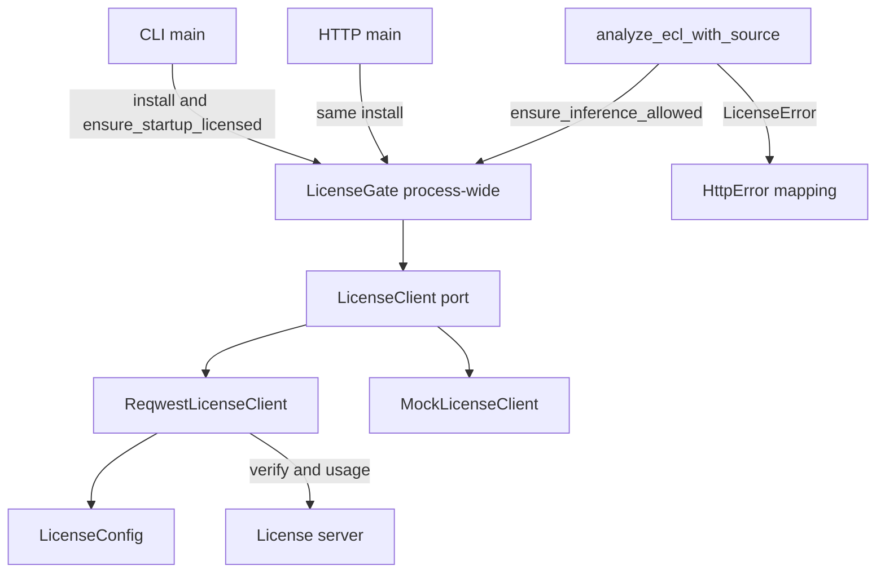
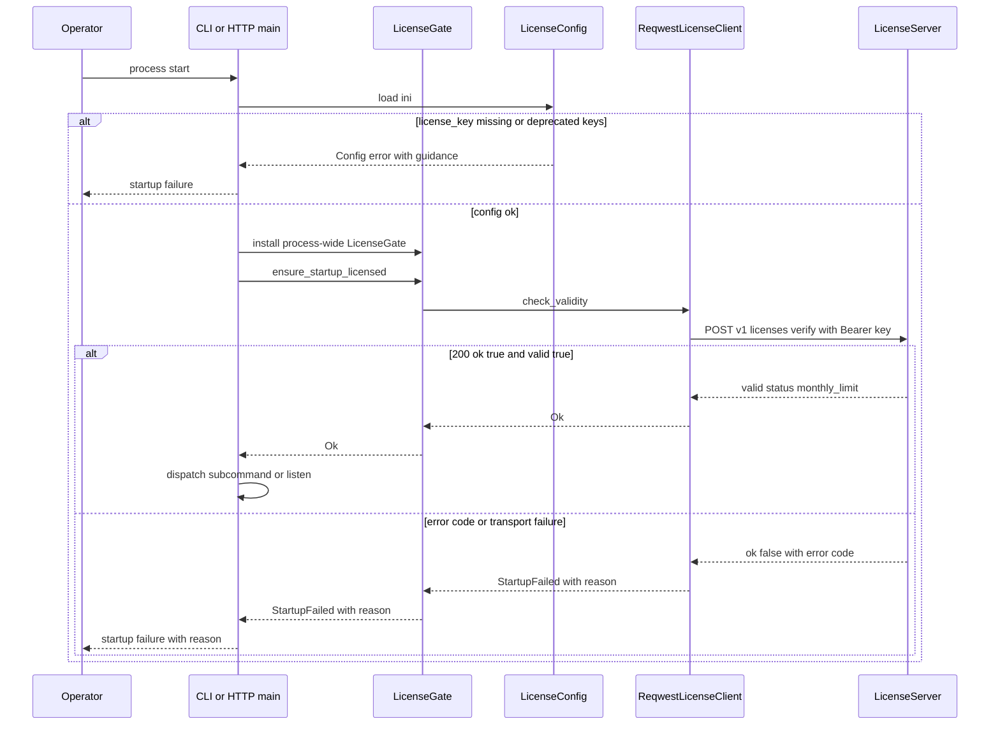
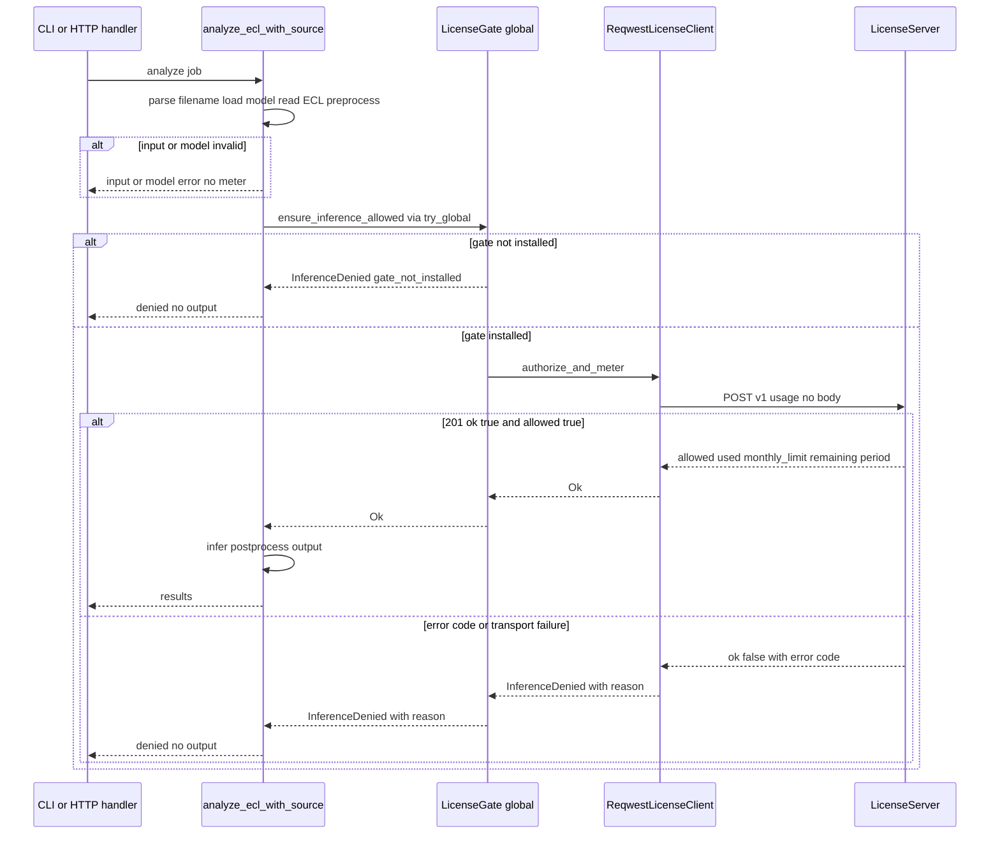

# Design Document: license-client

## Overview

本機能は、Holter Analysis Assist にライセンスサーバー向けの薄いクライアントと ini 設定を追加し、プロセス起動時の有効性確認と 1 解析ジョブごとの利用記録を fail-closed で強制する。運用オペレータは同一設定キーで Windows / Linux を切り替えられ、開発者はトレイト境界でサーバー無しの自動テストが可能になる。

**改訂（2026-09-29）**: ライセンスサーバー（別リポ `holter-analysis-assist-license-server`）のクライアント向け契約が確定した。本改訂で、(1) エンドポイント・認証・応答形式を確定契約に合わせ、(2) 暫定許可（到達不能・非成功応答でも許可）を撤廃し、(3) 拒否理由を区分してオペレータと API 呼出側に提示し、(4) ライセンスキー設定を `license_key` に一本化する。

**Purpose**: 商用ライセンス運用に必要なクライアント側ゲートを、CLI と HTTP API が共有する lib に提供する。  
**Users**: 運用オペレータ（起動・解析実行・障害切り分け）、ライセンス管理者（計上単位の保証）、開発者（モック検証）。  
**Impact**: ライセンスサーバーに到達できない環境では起動も解析もできなくなる（暫定許可の撤廃）。既存 ini の `api_key` / `check_path` / `meter_path` は使えなくなり、`license_key` の設定が必須になる。

### Goals
- 起動時 1 回の有効性確認（`POST /v1/licenses/verify`。失敗時、CLI は起動拒否。HTTP は Gate が失敗を保持し、再確認が通るまで推論を拒否する）
- 1 推論（正本入口 `analyze_ecl_with_source`）ごとに推論直前の利用記録（`POST /v1/usage`。201 のときだけ推論）。ラッパでの二重計上なし
- 拒否理由の区分（キー設定不備・ライセンス無効・利用停止・当月上限到達・要求過多・一時障害）と、HTTP API での再試行可否の区別
- 月間上限 0（上限なし）ライセンスを正しく扱う
- ini による接続設定（`server_url` / `license_key` / `timeout_secs`）。`config/license.ini.example` が `[license]` 正本
- モック可能なクライアント境界と、秘密情報のログマスク
- プロセス全体の `LicenseGate`（CLI／HTTP 同一 install。解析は global 参照）

### Non-Goals
- ライセンスサーバー実装、課金 DB、管理 UI、管理用 API（`/v1/admin/*`）
- 当月利用状況の照会（`GET /v1/usage/current`）と残り回数の表示
- オフライン運用、リトライ／サーキットブレーカによる継続実行
- ONNX window 単位の計上
- モデル埋め込み、HTTP API リソース設計、配布パッケージ

## Boundary Commitments

### This Spec Owns
- ライセンス ini の読取と設定スキーマ（キー名・必須性・デフォルト・廃止キーの扱い）
- `config/license.ini.example` の `[license]` セクション正本（キー意味・既定値。他仕様はコピー／参照のみで再定義しない）
- `LicenseClient` ポート（有効性確認 / 利用記録）とその HTTP 実装（確定契約への追従）
- 拒否理由の区分（`LicenseFailureReason`）と、サーバー応答・通信失敗から区分への対応付け
- 起動ゲートと解析ジョブゲートの lib 公開 API
- **ファイル所有（ゲート挿入）**: `src/analyze.rs` への推論ゲート挿入（正本公開入口 `analyze_ecl_with_source` 先頭）、および `src/main.rs` の CLI 起動ゲート挿入
- **共有ファイル編集（本改訂）**: `src/http/error.rs` の `LicenseError` → HTTP 応答の対応付け（拒否理由に応じたステータスとコード）
- 起動失敗 / 推論拒否のエラー区分とログ上の秘密情報マスク
- 単体テスト用のモック差し替え手段と、結合テスト用の共通モックサーバー（`tests/common/license_mock.rs`）
- プロセス全体の `LicenseGate` インストール契約（`install` / `global` / `try_global`）

### Shared File Ownership
- `src/analyze.rs` / `src/main.rs`: model-embedding が `ModelSource` 配線・`analyze_ecl_with_source` を所有。本仕様はゲート挿入のみ所有
- `src/http/error.rs`: http-api が `HttpError` の構造を所有。本仕様は `From<LicenseError> for HttpError` の対応付けと、それに必要なライセンス系バリアント追加のみを行う
- 既存の結合テスト（`tests/cli_*.rs`, `tests/http_api_listen.rs`, `tests/accel_compare_run.rs`）: 各テストの所有は元の仕様のまま。本仕様は各ファイル内のライセンスモック部分を共通モックへ置き換え、ini に `license_key` を加える編集のみを行う

### Out of Boundary
- ライセンスサーバーの実装・認証方式のサーバー側実装・課金永続化
- `model-embedding` のモデルロード／`ModelSource` 変更
- `http-api` のルート設計・`[http]` セクション定義・ライセンス以外の HTTP エラー
- `packaging-distribution` の成果物構成（サンプル ini は本正本をコピー／参照するのみ）
- `api-console-ui`（エラーは既存どおり `code: message` で表示されるため変更しない）
- `InferWindow` / `Classify` への利用計上
- ラッパ `analyze_ecl` / `analyze_ecl_with_limit` への二重計上（禁止）

### Allowed Dependencies
- 既存: `thiserror`, `serde` / `serde_json`, `reqwest` 0.12（blocking + json + rustls-tls）, `ini`（rust-ini）, `analyze` / CLI 入口
- 新規依存の追加なし
- 外部: 別リポのライセンスサーバー（確定契約。正本はサーバー側 `src/license_server/http/client_routes.py`）
- 禁止: サーバー実装コードの本リポ取り込み、window ループ内でのゲート呼び出し、解析関数への `LicenseGate` 引数追加（v1）、利用記録の自動リトライ

### Revalidation Triggers
- サーバー契約（パス・認証方式・応答の共通形式・エラーコード・成功ステータス）の変更
- ini キー名・必須項目の変更、または `config/license.ini.example` 正本パスの変更
- ゲート公開 API（起動 / 推論 / global インストール）のシグネチャ、fail-closed の意味、`LicenseError` の形の変更
- 拒否理由と HTTP ステータス・コードの対応の変更（http-api・api-console-ui・API 利用者に影響）
- 正本解析入口（`analyze_ecl_with_source`）または二重計上防止契約の変更
- 「1 推論」の定義変更（ジョブ単位以外への拡張）

## Architecture

### Existing Architecture Analysis
- Library-first: ドメインは `src/lib.rs` 配下、CLI は薄い `main`、HTTP は `src/bin/holter_http_api.rs` と `src/http/`
- 正本公開解析入口は `analyze::analyze_ecl_with_source`。先頭で `LicenseGate::try_global()` → `ensure_inference_allowed()` を 1 回呼ぶ（実装済み）
- `src/license/` は types / config / client / http / gate の 5 ファイル構成で実装済み。本改訂は各ファイルの中身を確定契約に合わせて更新する
- 現行の HTTP アダプタは暫定の最小契約（`/v1/license/check`・`/v1/license/meter`、応答 `{allowed, message?}`）と暫定許可を実装しており、これを置き換える
- 既存の結合テスト 7 ファイルがそれぞれ独自の小さなモックライセンスサーバー（暫定契約）を持つ

### Architecture Pattern & Boundary Map


```mermaid
graph TB
    CLI[CLI main]
    HttpMain[HTTP main]
    Gate[LicenseGate process-wide]
    Config[LicenseConfig]
    Port[LicenseClient port]
    Http[ReqwestLicenseClient]
    Mock[MockLicenseClient]
    Canonical[analyze_ecl_with_source]
    HttpErr[HttpError mapping]
    Server[License server]

    CLI -->|install and ensure_startup_licensed| Gate
    HttpMain -->|same install| Gate
    Gate --> Port
    Port --> Http
    Port --> Mock
    Http --> Config
    Http -->|verify and usage| Server
    Canonical -->|ensure_inference_allowed| Gate
    Canonical -->|LicenseError| HttpErr
```

**Architecture Integration**:
- Selected pattern: Ports & Adapters（ライセンスポート + HTTP / Mock アダプタ）＋プロセス全体のゲートインストール（変更なし）
- 本改訂の変更点は、アダプタのワイヤー契約、エラー型の理由区分、設定スキーマ、HTTP エラー対応付けに限られる。Gate と正本入口の構造は変えない
- Steering compliance: CLI と HTTP が同一 lib ゲート（同一 install）を共有

**Dependency direction**（左のみ依存可）:  
`LicenseTypes` → `LicenseConfig` → `LicenseClient` port → `ReqwestLicenseClient` / Mock → `LicenseGate` → `analyze_ecl_with_source` / CLI・HTTP main → `HttpError` mapping

### Technology Stack

| Layer | Choice / Version | Role in Feature | Notes |
|-------|------------------|-----------------|-------|
| CLI | clap 既存 | 起動ゲート呼び出し | 変更なし |
| Library | Rust 2021 / MSRV 1.88 | ゲート・設定・クライアント | 設計時は 1.74。`ort 2.0.0-rc.13` の要求で 1.88 に引き上げ |
| HTTP client | reqwest 0.12 blocking + json + rustls-tls | ライセンスサーバー呼出 | 既存。本文なし POST と `Authorization: Bearer` |
| Config | rust-ini 0.21 | ini 読取 | 既存 |
| Errors | thiserror 既存 | 起動失敗 / 推論拒否 + 理由区分 | |
| External | ライセンスサーバー（Cloudflare Workers 上の Flask アプリ） | 有効性確認・利用記録 | 別リポ |

## File Structure Plan

### Directory Structure
```
src/
├── license/
│   ├── mod.rs           # 公開境界（新しい型の再エクスポートを追加）
│   ├── types.rs         # LicenseError / LicenseFailure / LicenseFailureReason / 結果型
│   ├── config.rs        # [license] 読取（license_key 必須・廃止キーの検出）
│   ├── client.rs        # LicenseClient トレイトと MockLicenseClient（理由付き失敗の再現）
│   ├── http.rs          # ReqwestLicenseClient（確定契約・応答解釈・暫定許可の撤廃）
│   └── gate.rs          # 起動 / 推論ゲート（未 install 時の理由を gate_not_installed に）
├── analyze.rs           # 正本入口のゲート呼出（未 install 時のエラー生成のみ更新）
├── http/error.rs        # LicenseError → HttpError の対応付け（再試行可否でステータスを分ける）
└── main.rs              # 変更なし（エラー表示は Display に従う）
tests/
├── common/
│   ├── mod.rs           # 新規: 結合テスト共通補助の入口（未使用警告の抑止を含む）
│   └── license_mock.rs  # 新規: 確定契約を話す結合テスト用モックライセンスサーバー
├── cli_license_startup.rs, cli_model_select.rs, cli_inference_options.rs,
│   cli_compare_accel.rs, http_api_listen.rs   # 独自モックを共通モックへ置換、ini に license_key 追加
└── accel_compare_run.rs                       # 結果型のフィールド追加に追従
config/
├── license.ini.example  # [license] 正本（license_key 必須、廃止キーと暫定許可の記述を削除）
└── http.ini.example     # コメント中の api_key 言及を license_key に更新
README.md                # 暫定許可の記述削除、license_key、拒否理由と HTTP ステータス
docs/packaging/windows.md             # api_key → license_key の記述更新（コピー／参照の文言のみ）
packaging/scripts/assemble-ini-sample.sh  # コメント中の api_key → license_key のみ
```

### Modified Files（本改訂で編集）
- `src/license/types.rs` — `LicenseFailureReason` / `LicenseFailure` を追加し、`LicenseError::{StartupFailed, InferenceDenied}` の中身を `LicenseFailure` に変更。結果型に `monthly_limit` / 利用状況を追加
- `src/license/config.rs` — `license_key` 必須化、`api_key` 単独は案内付きエラー、`check_path` / `meter_path` は廃止キーとしてエラー、`server_url` の末尾スラッシュ正規化
- `src/license/client.rs` — `MockOutcome` を `Success` / `Reject { reason, message }` / `TransportFail` に整理
- `src/license/http.rs` — 確定契約の 2 エンドポイント、共通応答形式の解釈、エラーコード→理由区分、暫定許可の撤廃、単体テストの全面更新
- `src/license/gate.rs` — 未 install 時・`allowed == false` 時の理由区分を設定。公開 API は不変
- `src/license/mod.rs` — 新しい型の再エクスポート
- `src/analyze.rs` — 未 install 時の `InferenceDenied` 生成を `LicenseFailure` 形式に更新（テスト内の `Deny` モックも `Reject` へ）
- `src/http/error.rs` — ライセンス系の再試行可能バリアント 2 つを追加し、`From<LicenseError>` を理由区分で振り分け
- `src/http/routes.rs`, `src/http/handlers/{analyze,health,static_ui}.rs` — テスト内のモック・テストダブル（`Deny` → `Reject`、結果型のフィールド追加）の追従のみ
- `src/http/config.rs` — `[license]` 併記を読むテストの ini に `license_key` を加え、`server_url` 正規化後の期待値に合わせる（テストのみ）
- `tests/common/license_mock.rs`（新規）と既存結合テスト 6 ファイル — 上記のとおり
- `config/license.ini.example`, `config/http.ini.example`, `README.md`, `docs/packaging/windows.md`, `packaging/scripts/assemble-ini-sample.sh` — 文書・サンプルの追従

## System Flows

### 起動時確認


```mermaid
sequenceDiagram
    participant Op as Operator
    participant Main as CLI or HTTP main
    participant Gate as LicenseGate
    participant Cfg as LicenseConfig
    participant Cli as ReqwestLicenseClient
    participant Srv as LicenseServer

    Op->>Main: process start
    Main->>Cfg: load ini
    alt license_key missing or deprecated keys
        Cfg-->>Main: Config error with guidance
        Main-->>Op: startup failure
    else config ok
        Main->>Gate: install process-wide LicenseGate
        Main->>Gate: ensure_startup_licensed
        Gate->>Cli: check_validity
        Cli->>Srv: POST v1 licenses verify with Bearer key
        alt 200 ok true and valid true
            Srv-->>Cli: valid status monthly_limit
            Cli-->>Gate: Ok
            Gate-->>Main: Ok
            Main->>Main: dispatch subcommand or listen
        else error code or transport failure
            Srv-->>Cli: ok false with error code
            Cli-->>Gate: StartupFailed with reason
            Gate-->>Main: StartupFailed with reason
            Main-->>Op: startup failure with reason
        end
    end
```

### 1 推論ごとの利用記録


```mermaid
sequenceDiagram
    participant Caller as CLI or HTTP handler
    participant Canonical as analyze_ecl_with_source
    participant Gate as LicenseGate global
    participant Cli as ReqwestLicenseClient
    participant Srv as LicenseServer

    Caller->>Canonical: analyze job
    Canonical->>Canonical: parse filename load model read ECL preprocess
    alt input or model invalid
        Canonical-->>Caller: input or model error no meter
    end
    Canonical->>Gate: ensure_inference_allowed via try_global
    alt gate not installed
        Gate-->>Canonical: InferenceDenied gate_not_installed
        Canonical-->>Caller: denied no output
    else gate installed
        Gate->>Cli: authorize_and_meter
        Cli->>Srv: POST v1 usage no body
        alt 201 ok true and allowed true
            Srv-->>Cli: allowed used monthly_limit remaining period
            Cli-->>Gate: Ok
            Gate-->>Canonical: Ok
            Canonical->>Canonical: infer postprocess output
            Canonical-->>Caller: results
        else error code or transport failure
            Srv-->>Cli: ok false with error code
            Cli-->>Gate: InferenceDenied with reason
            Gate-->>Canonical: InferenceDenied with reason
            Canonical-->>Caller: denied no output
        end
    end
```

**Key Decisions**:
- 起動確認はサブコマンド分岐前（または HTTP の listen 前）に 1 回。利用記録は 1 ジョブ 1 回のまま、呼出位置を正本入口の先頭から「前処理の後・推論の直前」へ移す。ファイル名・ECL 内容・モデル読み込みの不備では計上しない。推論開始後の失敗（推論エラー、出力書き込み失敗、HTTP のタイムアウト）は計上済みのまま返す
- 利用記録は自動リトライしない（二重計上の回避）。要求過多・一時障害は再試行可能な拒否として呼出側へ返す
- 到達不能・タイムアウト・非成功応答・解釈不能な応答はすべて拒否（暫定許可の撤廃）

## Requirements Traceability

| Requirement | Summary | Components | Interfaces | Flows |
|-------------|---------|------------|------------|-------|
| 1.1–1.4 | 起動時有効性確認と起動拒否 | LicenseGate, ReqwestLicenseClient, CliStartup | `ensure_startup_licensed`, `check_validity`, `install` | 起動時確認 |
| 1.5 | 起動時確認の失敗の保持と、保持中の推論拒否 | LicenseGate | `startup_failure`, `ensure_inference_allowed` | 起動時確認・推論時確認 |
| 2.1–2.6 | 推論時の利用記録、window 非計上、入力不備では非計上 | LicenseGate, AnalyzeEntry | `ensure_inference_allowed`, `authorize_and_meter` | 1 推論ごと |
| 3.1–3.4 | 1 推論 = 解析ジョブ、ラッパ非二重計上 | AnalyzeEntry, LicenseGate | 正本入口のみ | 1 推論ごと |
| 4.1–4.6 | ini 設定・同一キー・正本 sample・必須欠落 fail-closed | LicenseConfig, LicenseIniDocs | `LicenseConfig::load_from_path`, `config/license.ini.example` | 起動時確認 |
| 5.1–5.3 | 起動失敗 / 推論拒否の区分 | LicenseTypes, LicenseGate | `LicenseError` | 両フロー |
| 6.1–6.3 | モック境界（理由区分・上限なしを含む） | LicenseClient, MockLicenseClient, LicenseMockServer | `MockOutcome`, `tests/common/license_mock.rs` | テスト |
| 7.1–7.3 | 秘密情報マスクと権限前提の文書化 | LicenseConfig, ReqwestLicenseClient, LicenseIniDocs | `SecretString`, Debug マスク | — |
| 8.1–8.3, 8.5 | オンライン必須・範囲外明示 | Boundary Commitments, LicenseIniDocs | — | — |
| 8.4 | 暫定許可の撤廃 | ReqwestLicenseClient | 応答解釈表 | 両フロー |
| 9.1–9.4 | process-wide Gate install / global / 未 install fail-closed | LicenseGate, CliStartup, AnalyzeEntry | `install`, `global`, `try_global` | 両フロー |
| 10.1, 10.2, 10.3 | verify で起動、usage 201 のときだけ推論 | ReqwestLicenseClient | API Contract | 両フロー |
| 10.4, 10.5 | 推論データを送らない、キーは認証ヘッダのみ | ReqwestLicenseClient | 本文なし POST、`Authorization: Bearer` | 両フロー |
| 10.6 | 解釈不能な応答は拒否 | ReqwestLicenseClient | 応答解釈表（`unexpected_response`） | 両フロー |
| 10.7 | 日時・月の判定はサーバーに委ねる | ReqwestLicenseClient | クライアントは時刻判定しない | — |
| 11.1–11.6, 11.8 | 拒否理由の区分と提示 | LicenseTypes, ReqwestLicenseClient | `LicenseFailureReason`, `LicenseFailure` | 両フロー |
| 11.7 | HTTP API での再試行可否の区別 | HttpErrorLicenseMapping | `From<LicenseError> for HttpError` | 1 推論ごと |
| 12.1–12.3 | `license_key` 必須、`api_key` 単独は案内付き拒否 | LicenseConfig | `load_from_path` | 起動時確認 |
| 12.4, 12.5 | 月間上限 0 を上限なしとして扱う | ReqwestLicenseClient, LicenseTypes | `UsageSnapshot::is_unlimited` | 両フロー |

## Components and Interfaces

| Component | Domain/Layer | Intent | Req Coverage | Key Dependencies (P0/P1) | Contracts |
|-----------|--------------|--------|--------------|--------------------------|-----------|
| LicenseTypes | Domain types | エラー区分・拒否理由・サーバー応答の値型 | 5.x, 11.1–11.6, 11.8, 12.4, 12.5 | thiserror (P0) | State |
| LicenseConfig | Config | ini から接続設定を構築 | 4.x, 7.x, 12.1–12.3 | rust-ini (P0) | Service |
| LicenseClient / MockLicenseClient | Port | サーバー通信の差し替え可能境界 | 1.x, 2.x, 6.x | LicenseTypes (P0) | Service |
| ReqwestLicenseClient | Adapter | 確定契約の blocking HTTP 実装 | 1.x, 2.x, 8.4, 10.x, 11.x, 12.4, 12.5 | reqwest (P0), LicenseConfig (P0) | API |
| LicenseGate | Application | 起動/推論ゲートと process-wide install | 1.x, 2.x, 3.x, 5.x, 9.x | LicenseClient (P0) | Service |
| AnalyzeEntryIntegration | Analyze | 前処理後・推論直前でゲート適用（二重計上なし、入力不備は非計上） | 2.x, 3.x, 9.2, 9.3 | LicenseGate (P0) | — |
| HttpErrorLicenseMapping | HTTP | 拒否理由を HTTP ステータス・コードへ対応付け | 11.7 | LicenseTypes (P0), http-api `HttpError` (P0) | API |
| LicenseMockServer | Test support | 確定契約を話す結合テスト用モック | 6.2, 6.3 | std TcpListener (P0) | — |
| LicenseIniDocs | Docs | 正本 sample・README・関連文書 | 4.5, 4.6, 7.2, 8.x, 12.1 | — | — |

### Domain / Config

#### LicenseTypes

| Field | Detail |
|-------|--------|
| Intent | 起動失敗と推論拒否を型で区別し、拒否理由を機械可読な区分として持つ |
| Requirements | 5.1, 5.2, 5.3, 11.1–11.6, 11.8, 12.4, 12.5 |

**Responsibilities & Constraints**
- `LicenseError::{StartupFailed, InferenceDenied}` は `LicenseFailure { reason, message }` を持つ。`Config(String)` は変更しない
- `LicenseFailureReason` はサーバーのクライアント向けエラーコード 6 種と、クライアント側の 2 種（`unexpected_response`、`gate_not_installed`）からなる
- Display は `license startup failed (<reason code>): <message>` / `license inference denied (<reason code>): <message>`。区分と理由が 1 行で分かる
- `message` はサーバーが返した説明文（固定の英文で秘密情報を含まない）または通信失敗の要約。ライセンスキーを含めない

**Contracts**: State [x]

##### Service Interface
```rust
#[derive(Debug, Clone, Copy, PartialEq, Eq)]
pub enum LicenseFailureReason {
    InvalidRequest,      // invalid_request: キーの欠落・形式不正（キー設定不備）
    LicenseInvalid,      // license_invalid: 未登録キー
    LicenseSuspended,    // license_suspended: 利用停止
    MonthlyLimitReached, // monthly_limit_reached: 当月上限（利用記録のみ）
    RateLimited,         // rate_limited: 要求過多（再試行可）
    TemporaryFailure,    // temporary_failure / 到達不能 / タイムアウト（再試行可）
    UnexpectedResponse,  // 解釈不能・未知のコード・成功形式の不一致
    GateNotInstalled,    // 計上経路で LicenseGate 未 install
}

impl LicenseFailureReason {
    pub fn code(self) -> &'static str;          // 上記コメントの snake_case 文字列
    pub fn is_retryable(self) -> bool;          // RateLimited | TemporaryFailure
    pub fn from_server(code: Option<&str>, http_status: u16) -> Self;
}

#[derive(Debug, Clone, PartialEq, Eq)]
pub struct LicenseFailure {
    pub reason: LicenseFailureReason,
    pub message: String,
}

#[derive(Debug, thiserror::Error, Clone, PartialEq, Eq)]
pub enum LicenseError {
    #[error("license startup failed ({}): {}", .0.reason.code(), .0.message)]
    StartupFailed(LicenseFailure),
    #[error("license inference denied ({}): {}", .0.reason.code(), .0.message)]
    InferenceDenied(LicenseFailure),
    #[error("license config error: {0}")]
    Config(String),
}

impl LicenseError {
    pub fn reason(&self) -> Option<LicenseFailureReason>;
    pub fn is_retryable(&self) -> bool;
}

pub struct LicenseCheckResult {
    pub allowed: bool,
    pub status: Option<String>,
    pub monthly_limit: Option<u64>,
    pub message: Option<String>,
}

pub struct UsageSnapshot {
    pub used: u64,
    pub monthly_limit: u64,
    pub remaining: Option<u64>,
}
impl UsageSnapshot { pub fn is_unlimited(&self) -> bool; } // monthly_limit == 0

pub struct LicenseMeterResult {
    pub allowed: bool,
    pub usage: Option<UsageSnapshot>,
    pub message: Option<String>,
}
```
- `from_server` の規則: 既知の 6 コードはそのまま対応。ただし `invalid_request` は HTTP 400 のときだけ `InvalidRequest` とし、それ以外のステータス（サーバーはルーティング上のエラー 404・405 なども `invalid_request` で返す）は下記のステータス規則で判定する。この場合アダプタは説明文に `server_url` の確認を促す案内を付ける。未知のコードまたはコードなしの場合、HTTP 429 → `RateLimited`、5xx → `TemporaryFailure`、それ以外 → `UnexpectedResponse`。管理系のコード（`unauthorized`, `license_not_found`）はクライアント経路では想定外として `UnexpectedResponse`
- Invariants: `monthly_limit == 0` を上限到達とみなさない。`remaining == None` を拒否理由にしない

#### LicenseConfig

| Field | Detail |
|-------|--------|
| Intent | ini からライセンス接続設定を読み取り検証する |
| Requirements | 4.1–4.6, 7.1–7.3, 12.1, 12.2, 12.3 |

**Responsibilities & Constraints**
- セクション `[license]`、キーは Win/Linux 同一
- 必須: `server_url`, `license_key`（空白のみも未設定扱い）
- 任意: `timeout_secs`（デフォルト 10、正の整数）
- `api_key` だけがあり `license_key` が無い → `Config` エラー（「`api_key` は廃止。`license_key` に書き換えてください」）。両方ある場合は `license_key` を使い、`api_key` を無視した旨を stderr に 1 行出す（値は出さない）
- `check_path` / `meter_path` が書かれている → `Config` エラー（「廃止。エンドポイントはサーバー契約で固定」）。エンドポイントを ini で変えられるとキー設定不備と誤判定しやすいため、確定契約に固定する
- `server_url` は末尾に `/` を補って保持し、`https://host/prefix` のようなパス付き URL でも接頭辞を保ったままエンドポイントを連結できるようにする
- キーの形式（`lk_` + 16 進 32 桁）はクライアントで検証しない。判定はサーバー（`invalid_request`）に委ね、形式変更に追従不要にする
- `license_key` の `Debug` / ログ出力はマスク（`***`）

**Contracts**: Service [x]

##### Service Interface
```rust
pub struct LicenseConfig {
    pub server_url: String,          // 末尾 "/" 正規化済み
    pub license_key: SecretString,
    pub timeout: Duration,
}

impl LicenseConfig {
    pub fn load_from_path(path: &Path) -> Result<Self, LicenseError>;
}
```
- Preconditions: path が読取可能な ini
- Postconditions: 検証済み設定、または `Config` エラー（CLI / HTTP main で起動失敗として表面化）
- Invariants: 同一キー名を OS 問わず使用

### Port / Adapter

#### LicenseClient / MockLicenseClient

| Field | Detail |
|-------|--------|
| Intent | ライセンスサーバー操作のモック可能な境界 |
| Requirements | 1.1, 2.1, 6.1, 6.2, 6.3 |

**Responsibilities & Constraints**
- トレイトの 2 操作（有効性確認、利用記録）は変更しない
- `MockOutcome` は `Success { message }`、`Reject { reason, message }`、`TransportFail { message }`（= `TemporaryFailure`）の 3 種。旧 `Deny` の呼出箇所は理由を明示した `Reject` に置き換える
- Mock の check は `StartupFailed`、meter は `InferenceDenied` に包んで返す（既存の文脈対応を維持）

##### Service Interface
```rust
pub trait LicenseClient: Send + Sync {
    fn check_validity(&self) -> Result<LicenseCheckResult, LicenseError>;
    fn authorize_and_meter(&self) -> Result<LicenseMeterResult, LicenseError>;
}

pub enum MockOutcome {
    Success { message: Option<String> },
    Reject { reason: LicenseFailureReason, message: Option<String> },
    TransportFail { message: String },
}
```

#### ReqwestLicenseClient

| Field | Detail |
|-------|--------|
| Intent | 確定契約で blocking HTTP によりライセンスサーバーを呼ぶ |
| Requirements | 1.1–1.3, 2.1–2.3, 7.1, 7.3, 8.4, 10.1–10.7, 11.1–11.6, 11.8, 12.4, 12.5 |

**Responsibilities & Constraints**
- `Authorization: Bearer <license_key>` を常に付ける。URL・クエリ・本文にキーを載せない
- 要求本文は送らない（`POST` で本文なし）。推論の入力・結果は送らない
- 応答は共通形式 `{"ok": true, "data": {...}}` / `{"ok": false, "error": {"code", "message"}}` として解釈する
- 成功判定は厳密に行う: verify は HTTP 200 かつ `ok == true` かつ `data.valid == true`、usage は HTTP 201 かつ `ok == true` かつ `data.allowed == true`。それ以外の 2xx は `unexpected_response`
- 暫定許可を撤廃し、どの失敗経路でも `Ok` を返さない
- 自動リトライしない
- 失敗メッセージには、サーバーの `error.message`（200 文字で切り詰め）か通信失敗の要約を入れる。reqwest のエラー文言は URL を含みうるが、キーは URL に載せないため漏れない

**Contracts**: API [x]

##### API Contract
| Method | Endpoint | Request | Success | Errors |
|--------|----------|---------|---------|--------|
| POST | `{server_url}v1/licenses/verify` | 本文なし、`Authorization: Bearer lk_...` | 200 `{ok:true, data:{valid, status, monthly_limit}}` | 400 invalid_request / 401 license_invalid / 403 license_suspended / 429 rate_limited / 503 temporary_failure |
| POST | `{server_url}v1/usage` | 本文なし、`Authorization: Bearer lk_...` | 201 `{ok:true, data:{allowed, used, monthly_limit, remaining, period}}` | 上記 + 403 monthly_limit_reached |

`GET /v1/usage/current` と `/v1/admin/*` は呼ばない。`period`（UTC の開始・終了と `timezone: "Asia/Tokyo"`）は読み飛ばしてよく、クライアントは時刻で判定しない。

##### 応答解釈表
| 状況 | 結果 | 理由区分 |
|------|------|----------|
| 接続失敗・DNS・TLS・タイムアウト・本文読取失敗 | 失敗 | `temporary_failure` |
| 成功条件を満たす応答 | 成功（`monthly_limit` / 利用状況を結果に格納。0 は上限なし） | — |
| 2xx だが成功条件を満たさない、または JSON として解釈できない | 失敗 | `unexpected_response` |
| 非 2xx で `ok:false` と既知のエラーコード | 失敗 | コードどおり |
| 非 2xx で未知のコード、または JSON として解釈できない | 失敗 | 429 → `rate_limited`、5xx → `temporary_failure`、その他 → `unexpected_response` |

失敗は呼出文脈で包む: check → `StartupFailed`、meter → `InferenceDenied`。

**Implementation Notes**
- Integration: クライアントは Gate 経由でのみ利用
- Validation: ローカル TCP のモックサーバーで各行を単体テスト（成功・上限なし成功・6 コード・未知コード・非 JSON・タイムアウト・到達不能・キーが本文と URL に無いこと）
- Risks: サーバー契約の変更 → Revalidation Trigger

### Application / Integration

#### LicenseGate

| Field | Detail |
|-------|--------|
| Intent | 起動・推論の fail-closed ゲートを公開し、プロセス全体で 1 インスタンスを共有する |
| Requirements | 1.2, 1.3, 2.2, 2.3, 2.5, 3.3, 5.1–5.3, 9.1–9.4 |

**Responsibilities & Constraints**
- 公開 API（`install` / `global` / `try_global` / `ensure_startup_licensed` / `ensure_inference_allowed`）は変更しない
- クライアントが `Ok` で `allowed == false` を返した場合は `unexpected_response` として拒否する
- 計上経路で未 install の場合は `InferenceDenied(gate_not_installed)`（`analyze_ecl_with_source` が生成）

#### AnalyzeEntryIntegration

| Field | Detail |
|-------|--------|
| Intent | 正本公開入口で利用記録を 1 回行う（二重計上なし） |
| Requirements | 2.1–2.6, 3.1–3.4, 9.2, 9.3 |

**Responsibilities & Constraints**
- 回数は 1 ジョブ 1 回のまま。未 install 時のエラー値を新しい形に合わせる
- 呼出位置は、共通の解析本体で ECL の読み込みと前処理（ファイル名解析・読み込み・連続信号化・window 開始点の決定）を終えた後、最初の window 推論の前とする。`analyze_ecl_with_source` はそれより前にモデルを読み込むため、モデル不備も計上前に失敗する。`analyze_ecl_with_model(_observed)` も同じ本体を通るので同じ順序になる
- ゲート未 install の判定も同じ位置で行う（入力不備が先に見つかればその失敗を返す。いずれの場合も結果は出力しない）
- 呼出位置の移動により、計上の有無を確かめる単体テスト・結合テストは「有効な ECL と読み込めるモデル」を前提に書き直す（無効入力で計上 1 回を期待していたテストは、計上 0 回の期待に改める）

#### HttpErrorLicenseMapping

| Field | Detail |
|-------|--------|
| Intent | API 呼出側が再試行できる拒否とそれ以外を区別できるよう、拒否理由を HTTP 応答へ対応付ける |
| Requirements | 11.7 |

**Responsibilities & Constraints**
- `HttpError` にライセンス系の 2 バリアントを追加する（http-api の構造に沿う）
- 永続的な拒否は既存の 403 `license_inference_denied` を維持し（既存クライアント互換）、メッセージに理由コードを含める
- 応答本文にライセンスキーを含めない（既存の `sanitize_public_message` を通し、現行の `api_key=` に加えて `license_key=` と `lk_` で始まる語もマスクするよう拡張する）

##### API Contract（`POST /v1/analyze` のライセンス起因エラー）
| 理由区分 | HTTP | `error.code` | `error.message` 例 |
|----------|------|--------------|--------------------|
| `invalid_request` / `license_invalid` / `license_suspended` / `monthly_limit_reached` / `unexpected_response` / `gate_not_installed` | 403 | `license_inference_denied` | `monthly_limit_reached: The monthly usage limit has been reached.` |
| `rate_limited` | 429 | `license_rate_limited` | `rate_limited: Too many requests. Please retry later.` |
| `temporary_failure` | 503 | `license_temporarily_unavailable` | `temporary_failure: request timed out` |

- 起動失敗・設定エラーは従来どおり 500 `internal_error`（リクエスト処理中には通常発生しない）

### Test Support

#### LicenseMockServer

| Field | Detail |
|-------|--------|
| Intent | 結合テストが確定契約を話すライセンスサーバーを外部到達なしで使えるようにする |
| Requirements | 6.2, 6.3 |

**Responsibilities & Constraints**
- `tests/common/license_mock.rs` に置き、各結合テストは `mod common;` で取り込む
- verify と usage に対し、成功（上限あり・上限なし）または指定したエラーコードとステータスを返す。呼出回数（verify / usage 別）を数える
- 受け取った `Authorization` と要求本文の長さを記録し、キーが認証ヘッダだけにあることをテストで確認できる
- テスト用ライセンスキー定数（`lk_` + 16 進 32 桁）と、`[license]` 断片を返す補助関数を提供する

## Cross-Spec Contracts

| Export | Kind | Consumer | Notes |
|--------|------|----------|-------|
| `LicenseConfig` | type + `load_from_path` | http-api, packaging（キー参照） | 本改訂でフィールドが `license_key` に変わる |
| `LicenseGate` と `install` / `global` / `try_global` | type / fn | CLI main, HTTP main, analyze 入口 | 変更なし |
| `ensure_startup_licensed` / `ensure_inference_allowed` | method | CLI / HTTP startup, 正本 analyze 入口 | 変更なし |
| `LicenseError`（`LicenseFailure` と `reason()` / `is_retryable()`） | type | http-api（エラー対応付け）, CLI, compare-accel | 本改訂で形が変わる |
| `LicenseFailureReason` | enum | http-api, テスト | 理由コード文字列は安定させる |
| `config/license.ini.example` `[license]` | artifact | http-api（併用可）, packaging（コピー／参照） | `license_key` 必須、廃止キーの削除 |
| ライセンス起因の HTTP 応答（403 / 429 / 503） | behavior | api-console-ui, API 利用者 | UI は `code: message` 表示のまま変更不要 |
| 正本計上点 | behavior | model-embedding / http-api / inference-acceleration | 計上は `analyze_ecl_with_source` のみ。比較サブコマンドは ECL あたり 2 回 |

## Data Models

### Domain Model
- **LicenseConfig**: 接続設定の集約。`license_key` はマスク可能な値オブジェクト
- **LicenseCheckResult / LicenseMeterResult / UsageSnapshot**: サーバー応答の値オブジェクト。`monthly_limit == 0` は上限なし、`remaining == None` は上限なしで残り回数なし
- **LicenseFailure / LicenseFailureReason**: 拒否の区分と説明
- Invariant: 成功条件を満たさない限り解析を進めない

### Data Contracts & Integration
- 要求: 本文なし。`Authorization: Bearer <license_key>` のみ
- 応答: 共通形式（`ok` + `data` または `error`）。未知の追加フィールドは無視する
- シリアライゼーション: JSON
- 冪等性・日時・月の区切り（日本時間の暦月）はサーバー責務。クライアントはジョブごとに 1 回呼ぶだけ

## Error Handling

### Error Strategy
- すべて fail-closed。部分実行・ローカルフォールバック・暫定許可・自動リトライは無し
- メッセージは「区分（起動失敗 / 推論拒否）＋理由コード＋説明」の 1 行
- 秘密情報はマスク

### Error Categories and Responses
| 状況 | エラー | CLI | HTTP API |
|------|--------|-----|----------|
| ini 欠落・`server_url` / `license_key` 欠落・`api_key` 単独・廃止キー・不正値 | `Config` | 起動拒否（非 0 終了） | 起動拒否（listen しない） |
| verify 失敗（各理由） | `StartupFailed(reason)` | 起動拒否 | 受付は開始し、Gate が失敗を保持している間は解析を利用記録なしで拒否（理由に応じて 403 / 429 / 503）。30 秒ごとに再確認（1.5、`http-api` 3.3・3.4） |
| usage 失敗（永続的な理由） | `InferenceDenied(reason)` | 解析失敗・出力なし | 403 `license_inference_denied` |
| usage 失敗（`rate_limited`） | `InferenceDenied(rate_limited)` | 解析失敗・出力なし | 429 `license_rate_limited` |
| usage 失敗（`temporary_failure`・到達不能・タイムアウト） | `InferenceDenied(temporary_failure)` | 解析失敗・出力なし | 503 `license_temporarily_unavailable` |
| 計上経路で Gate 未 install | `InferenceDenied(gate_not_installed)` | 解析失敗 | 403 |

### Monitoring
- stderr / エラー型 Display で区分と理由を出力
- 成功時も `LicenseGate` が stderr に 1 行出す（13.1–13.4）。追加の要求は行わず、verify / usage の成功応答の値だけを使う
  - 起動時: `license: verified status=<status|-> monthly_limit=<N|unlimited|->`
  - 推論時: `license: usage recorded used=<N> monthly_limit=<N> remaining=<N|->`（上限なしは `used=<N> monthly_limit=unlimited`、使用量が無い応答は `license: usage recorded`）
- ライセンスキーを含む行をログに出さないことをテストで固定

## Testing Strategy

### Unit Tests
- `LicenseConfig`: `license_key` 必須（欠落・空白のみ）、`api_key` 単独で案内付き `Config` エラー、両方あれば `license_key` 採用、`check_path` / `meter_path` で廃止エラー、`server_url` 末尾スラッシュ正規化（接頭辞付き URL を含む）、Debug マスク（12.1–12.3, 4.4, 7.1）
- `LicenseFailureReason::from_server`: 6 コード、管理系コード、未知コード × 429 / 5xx / 4xx、コードなし（11.1–11.6）
- `ReqwestLicenseClient`（ローカルモックサーバー）: verify 成功・上限なし成功、usage 201 成功・上限なし（`remaining: null`）成功、200 の usage は `unexpected_response`、各エラーコード、非 JSON の 502、タイムアウト・到達不能は `temporary_failure`、要求本文が空で URL にキーが無く `Authorization: Bearer` が付くこと（8.4, 10.x, 11.x, 12.4, 12.5）
- `MockLicenseClient` / `LicenseGate`: `Reject` の理由が区分付きエラーとして伝わる、未 install は `gate_not_installed`（6.x, 9.3）
- `HttpError` 対応付け: 永続的な理由は 403、`rate_limited` は 429、`temporary_failure` は 503、メッセージに理由コード（11.7）

### Integration Tests
- CLI 起動（`tests/cli_license_startup.rs`）: verify 成功で続行、`license_invalid` / `license_suspended` / 到達不能で非 0 終了と理由表示、`license_key` 未設定・`api_key` 単独で起動拒否（1.x, 12.2, 12.3）
- HTTP（`tests/http_api_listen.rs`）: 起動時 verify の失敗でも listen し、`/health` が `license.state=unavailable` を返し、解析は usage なしで拒否される（1.5）、解析で usage が 1 回、`monthly_limit_reached` で 403、`temporary_failure` で 503、要求過多で 429（2.x, 11.7）
- 既存の CLI・比較・推論オプション系テストが共通モック（上限なし成功）で従来どおり通る（回帰）
- window 複数でも usage 呼び出しが 1 回（2.5, 3.3。既存テストを維持）

### E2E / 手動
- 実サーバー（またはサーバー側リポのローカル起動）で、管理画面から発行したキー（上限 0）を `license_key` に設定し、起動 → 1 解析 → 管理画面の利用ログに 1 件記録されることを確認する

## Security Considerations
- `license_key` は ini に保存する秘密情報。example でファイル権限の運用前提を明記（7.2）
- ログ・エラー・Debug で平文キーを出さない。キーは認証ヘッダのみで送り、URL・本文に載せない（7.1, 7.3, 10.5）
- 推論の入力・結果をサーバーへ送らない（10.4）
- TLS 付き HTTPS を前提（`http://` は開発用途として文書化）
- オフライン迂回・暫定許可を設けない（8.1, 8.4）

## Supporting References
- 詳細調査: `research.md`（初版の依存選定、本改訂の契約調査と判断）
- 上流契約の正本: `holter-analysis-assist-license-server` の `src/license_server/http/client_routes.py`、`http/responses.py`（ステータス対応）、`domain/errors.py`（コード・固定文言）、`http/auth.py`（Bearer とキー形式）、`http/dto.py`（利用状況の形）
- 隣接: `model-embedding`（正本 `analyze_ecl_with_source`）、`http-api`（同一 Gate install・`HttpError`）、`packaging-distribution`（`[license]` キーは本正本をコピー／参照）、`api-console-ui`（エラー表示）、`inference-acceleration`（比較は ECL あたり 2 回計上）
