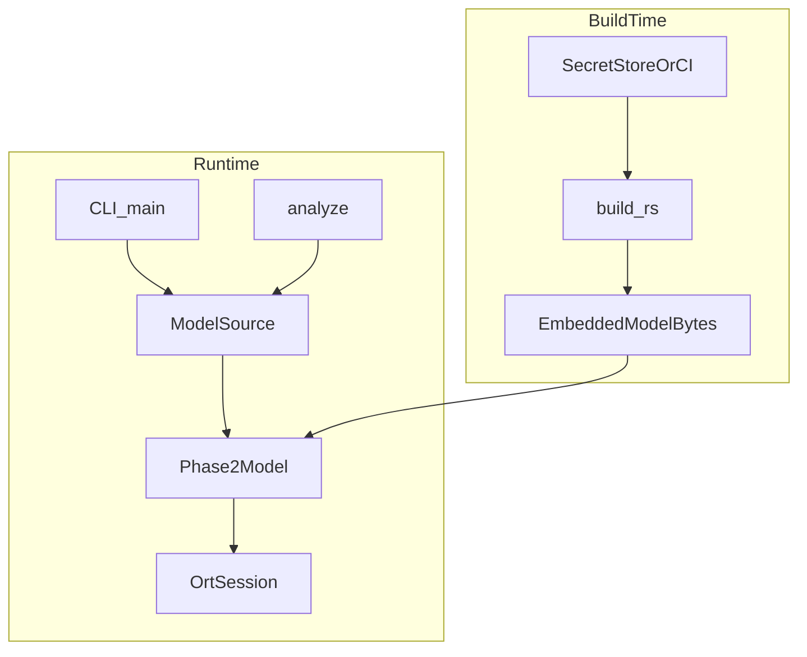
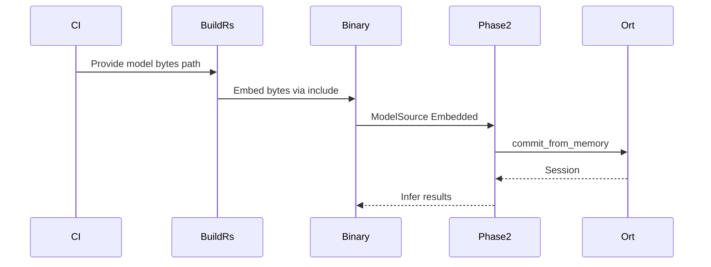
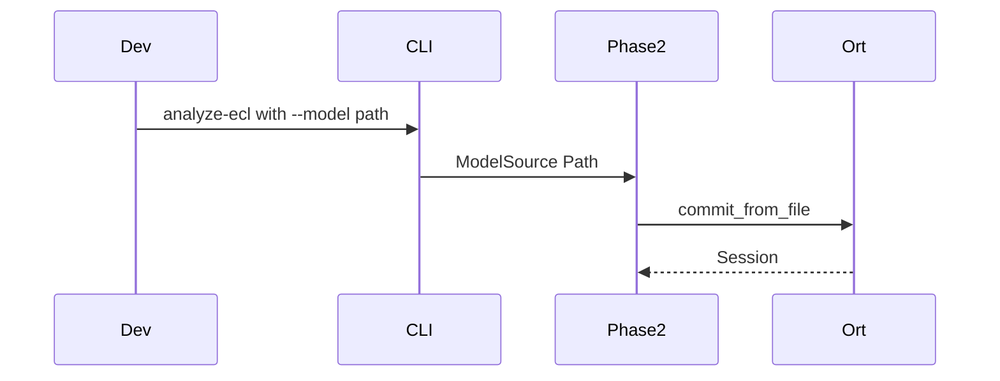

# Design Document

## Overview
本機能は、検査会社向け配布バイナリに Phase-2 推論モデルをビルド時埋め込みし、運用者が生モデルファイルを配置せずに解析 CLI を実行できるようにする。開発者向けには従来のファイルパスロードを維持する。

**Users**: 検査会社の運用者・解析オペレータ（埋め込みバイナリでの解析）、CI／リリース担当（モデル注入ビルドとサイズ計測）、開発者（パスロードでの検証）。
**Impact**: `Phase2Model` のロード契約をパス専用から `ModelSource`（Path / Embedded）へ拡張し、配布成果物から生 `.onnx` を分離する。

### Goals
- リリースバイナリが外部の生モデルファイルなしで推論できる
- 配布成果物に生モデルを同梱せず、本番バイト列を Git に置かない
- Windows / Linux x86_64 で同一の埋め込み方針を適用する
- 既存 EP 選択と CLI 解析結果契約を維持する

### Non-Goals
- ライセンス確認・利用計上（`license-client` が OWN。本仕様は meter 呼び出し位置の調整メモのみ）
- HTTP API（`http-api`）および `holter-http-api` 埋め込み成果物
- Docker / インストーラ / Linux パッケージ（`packaging-distribution`）
- 高度 DRM・鍵ローテーション・完全な耐リバース保証

## Boundary Commitments

### Ownership / Boundary（ファイル・責務の正）
本仕様が **OWN** する範囲:
- `src/phase2.rs` の `ModelSource` / `load_from_source`（およびメモリ経路）と、既存 `load_with_provider` と共有する EP 解決
- `build.rs`、Cargo feature `embedded-model`
- 埋め込み CLI 用 CI ジョブ（成果物名・計測。ジョブ名は `release-embedded-cli`）

本仕様が **変更してよいが OWN しない** 範囲:
- `src/analyze.rs` / `src/main.rs` — **ModelSource 配線のためのシグネチャ／呼び出し変更のみ**（解析本体・ライセンスゲート挿入は対象外）

隣接仕様の **OWN**（本仕様は触れない／奪わない）:
- `license-client` — `analyze.rs` へのライセンスゲート挿入、および `main.rs` の起動時確認。調整順: **本仕様が先に `ModelSource` と正規解析入口を着地**し、その後 `license-client` が正規入口（または共有 gated 入口）へゲートを追加する
- `http-api` / `packaging-distribution` — `holter-http-api` の埋め込み成果物・パッケージ／Docker／インストーラ CI。本仕様の `release-embedded-cli` は **CLI 埋め込みバイナリのみ** を対象とし、それらジョブ／アーティファクトを OWN しない

### This Spec Owns
- モデルバイト列のビルド時埋め込み（Cargo feature + `build.rs` + 静的バイト参照）
- メモリからの ORT セッション構築（`commit_from_memory`）
- `ModelSource` と `Phase2Model` の埋め込みロード API
- CLI（`analyze-ecl` / `infer-window`）のソース切替と開発用パス維持
- CI ジョブ `release-embedded-cli` でのモデル注入・埋め込み CLI release・サイズ計測
- 「配布成果物に生モデルを含めない」契約の定義（本仕様が作る CLI 成果物について）

### Out of Boundary
- ライセンスサーバー連携・ini ライセンス設定・利用計上（meter）の実装・所有
- HTTP エンドポイント設計・実装、および `holter-http-api` 埋め込み成果物／その CI
- Docker Image / Windows Installer / Linux パッケージの作成本体とその CI（`packaging-distribution`）
- EP 選択ロジックの再設計（既存 `ExecutionProviderKind` を維持）
- ONNX エクスポートパイプライン（`tools/export` 等）の変更

### Allowed Dependencies
- 既存 `phase2` / `analyze` / CLI（`ort = 2.0.0-rc.13`）
- 既存 CI マトリクス（Linux / Windows x86_64）
- CI／秘密ストアから供給されるモデルファイル（ビルド入力のみ。リポジトリにはコミットしない）
- 隣接: `runtime-ep-selection` の既存振る舞い（本仕様は消費のみ）

### Revalidation Triggers
- `ModelSource` / `Phase2Model` 公開ロード API のシグネチャ変更
- 正規解析入口 `analyze_ecl_with_source` のシグネチャまたは委譲関係の変更
- 埋め込み feature 名または必須環境変数名の変更
- 配布成果物にモデル関連ファイルを追加する方針変更
- 対象 OS / ターゲットトリプルの変更
- メモリロード API（`commit_from_memory` 等）の互換破壊
- `release-embedded-cli` ジョブ／アーティファクト契約の変更
## Architecture

### Existing Architecture Analysis
- Library-first: 推論は `src/phase2.rs`、ECL パイプラインは `src/analyze.rs`、CLI は薄く `src/main.rs`
- 現状ロード: `Session::builder()` → EP 設定 → `commit_from_file(path)`
- 重みは `resources/models/`（gitignore）。CI はバイナリアーティファクトのみアップロード

### Architecture Pattern & Boundary Map



**Architecture Integration**:
- Selected pattern: Feature-gated asset embedding + source enum at the inference boundary
- Domain boundaries: 埋め込み資産供給はビルド境界、ロード契約は `phase2`、解析オーケストレーションは `analyze`、配布パッケージ作成は下流
- Existing patterns preserved: EP 選択、window 推論契約、CLI 出力形式
- Steering compliance: library-first、Git に重みを置かない、Windows/Linux CI 正

### Technology Stack

| Layer | Choice / Version | Role in Feature | Notes |
|-------|------------------|-----------------|-------|
| CLI | clap 4.x | モデルソース選択（パス任意化） | feature で既定値切替 |
| Library | Rust 2021 / MSRV 1.74+ | `ModelSource`, 埋め込みロード | |
| Inference | ort =2.0.0-rc.13 | `commit_from_memory` | 既存依存を拡張利用 |
| Build | Cargo feature `embedded-model` + `build.rs` | モデル注入と欠落検出 | 環境変数でパス指定 |
| CI | GitHub Actions 既存マトリクス | `release-embedded-cli`（注入・CLI release・サイズ計測） | packaging / `holter-http-api` ジョブは非所有 |

**依存方向**: Types/`ModelSource` → EmbeddedBytes（feature） → Phase2Model → analyze → CLI / 将来 API
## File Structure Plan

### Directory Structure
```
src/
├── model_source.rs      # ModelSource 列挙と解決ヘルパ
├── embedded_model.rs    # feature 時の静的バイト参照（非 feature はスタブ/未提供）
├── phase2.rs            # メモリロード経路の追加（既存 EP 解決を再利用）
├── analyze.rs           # 正規入口 analyze_ecl_with_source（Path API は薄ラッパ）
├── main.rs              # CLI の ModelSource 配線（ゲート挿入は license-client）
├── lib.rs               # モジュール公開
build.rs                 # embedded-model 時のモデル配置検証と OUT_DIR 連携
Cargo.toml               # feature 定義
.github/workflows/ci.yml # release-embedded-cli（注入・CLI release・サイズ計測）
resources/models/README.md  # 開発用パスと埋め込みビルド手順の案内更新
```

### Modified Files
- `src/phase2.rs` — **OWN**: `ModelSource` / `load_from_source` / `load_from_memory`。既存 `load_with_provider` の EP 解決を Path／メモリで共有。`model_path` は Path 時のみ実パス、Embedded 時は識別用ラベル
- `src/analyze.rs` — **配線のみ**: 正規入口 `analyze_ecl_with_source` を追加。`analyze_ecl` / `analyze_ecl_with_limit` は Path → `ModelSource::Path` の薄ラッパ。ライセンス meter 挿入は OWN しない
- `src/main.rs` — **配線のみ**: `--model` を開発用に維持。埋め込みビルドでは未指定時に Embedded。起動ライセンスゲートは OWN しない
- `Cargo.toml` — **OWN**: `embedded-model` feature（default に含めない）
- `.github/workflows/ci.yml` — **OWN**: `release-embedded-cli` ジョブ（埋め込み CLI バイナリ + サイズ記録）。packaging / `holter-http-api` ジョブは追加しない
- `build.rs` — **OWN**: 新規。feature 有効時のみモデル必須
## System Flows

### 埋め込みビルドと実行



### 開発用パスロード（feature なし）



## Requirements Traceability

| Requirement | Summary | Components | Interfaces | Flows |
|-------------|---------|------------|------------|-------|
| 1.1 | 外部生ファイルなしで推論 | Phase2Model, EmbeddedModelBytes, CLI | `load_from_source` | 埋め込み実行 |
| 1.2 | メモリからセッション構築 | Phase2Model | `load_from_memory` | 埋め込み実行 |
| 1.3 | 結果契約同等 | Phase2Model, analyze | 既存 infer API | 両経路 |
| 2.1 | 配布に生モデル非同梱 | CI Release Embed | artifact 契約 | CI |
| 2.2 | casual 防止水準 | Boundary / Security | — | — |
| 2.3 | Git に本番バイト非コミット | build.rs, CI, gitignore | 注入契約 | CI |
| 3.1 | パス指定で推論 | ModelSource, CLI | Path 経路 | 開発パス |
| 3.2 | 経路切替可能 | ModelSource, Cargo feature | feature / CLI | 両経路 |
| 3.3 | 欠落パスでエラー | Phase2Model | InferError | 開発パス |
| 4.1 | analyze-ecl 埋め込み動作 | analyze, CLI | `analyze_ecl_with_source` | 埋め込み実行 |
| 4.2 | infer-window 埋め込み動作 | CLI, Phase2Model | `load_from_source` / `load_with_provider` | 埋め込み実行 |
| 4.3 | EP 選択維持 | Phase2Model | ExecutionProviderKind | 両経路 |
| 5.1 | CI/秘密ストアから埋め込み | build.rs, `release-embedded-cli` | HOLTER_EMBEDDED_MODEL_PATH | CI |
| 5.2 | 欠落でビルド失敗 | build.rs | feature gate | CI |
| 5.3 | Win/Linux 同一方針 | `release-embedded-cli` | matrix targets | CI |
| 6.1 | サイズ計測手段 | `release-embedded-cli` | 計測ステップ | CI |
| 6.2 | 100MB 超を隠さない | `release-embedded-cli` | ログ/artifact | CI |
| 7.1–7.3 | 範囲外の非所有 | Ownership / Boundary | — | — |

## Components and Interfaces

| Component | Domain/Layer | Intent | Req Coverage | Key Dependencies | Contracts |
|-----------|--------------|--------|--------------|------------------|-----------|
| ModelSource | Library types | ロード元の明示 | 3.1, 3.2 | — | State |
| EmbeddedModelBytes | Build/Runtime asset | 静的モデルバイト提供 | 1.1, 5.1, 5.2 | build.rs (P0) | State |
| Phase2ModelLoader | Inference | Path/Memory から Session 構築 | 1.2, 1.3, 3.3, 4.3 | ort (P0) | Service |
| AnalyzeEntry | Pipeline | 正規 ECL 解析入口（ModelSource） | 4.1 | Phase2Model (P0) | Service |
| CliModelSelect | CLI | 引数と feature から ModelSource 決定 | 3.1, 3.2, 4.1, 4.2 | clap (P1) | Service |
| EmbedBuildGate | Build | 注入検証と欠落失敗 | 5.1, 5.2 | env path (P0) | Batch |
| CiEmbedRelease | CI | `release-embedded-cli`：注入・両 OS CLI release・サイズ計測・生ファイル非同梱 | 2.1, 2.3, 5.3, 6.1, 6.2 | secrets (P0) | Batch |

### Library / Inference

#### ModelSource

| Field | Detail |
|-------|--------|
| Intent | 推論モデルの供給元を型で区別する |
| Requirements | 3.1, 3.2 |

**Responsibilities & Constraints**
- `Path(PathBuf)` と `Embedded` の 2 値（必要なら Embedded に論理名ラベルを付与）
- 配布既定は Embedded、開発既定は Path

**Contracts**: Service [ ] / API [ ] / Event [ ] / Batch [ ] / State [x]

##### State Management
- 実行時に単一の `ModelSource` が解析ジョブに束縛される
- Embedded は feature 無効時に選択不可（コンパイルまたは実行時エラー）

#### EmbeddedModelBytes

| Field | Detail |
|-------|--------|
| Intent | ビルド埋め込みされたモデルバイト列へのアクセスを提供する |
| Requirements | 1.1, 5.1, 5.2 |

**Responsibilities & Constraints**
- `#[cfg(feature = "embedded-model")]` でのみ実体を公開
- バイト列は `'static`（`include_bytes!` 相当）
- 本番重みファイル自体はリポジトリに含めない

**Dependencies**
- Outbound: EmbedBuildGate — OUT_DIR 上のバイト生成 (P0)

**Contracts**: State [x]

#### Phase2ModelLoader（`Phase2Model` 拡張）

| Field | Detail |
|-------|--------|
| Intent | ModelSource から EP 解決済み Session を構築する |
| Requirements | 1.2, 1.3, 3.3, 4.3 |

**Responsibilities & Constraints**
- Path: 既存 `commit_from_file` 経路を維持
- Embedded/Memory: `commit_from_memory`
- EP auto/cpu/cuda の既存フォールバック方針を変更しない
- 推論入出力契約（window outputs / ラベル）は不変

**Dependencies**
- External: ort SessionBuilder — メモリ/ファイル commit (P0)
- Inbound: ModelSource, EmbeddedModelBytes (P0)

**Contracts**: Service [x]

##### Service Interface
```rust
pub enum ModelSource {
    Path(PathBuf),
    Embedded,
}

impl Phase2Model {
    /// 既存 Path 経路（EP 指定）。メモリ経路と同一の EP 解決を共有する。
    pub fn load_with_provider(
        path: impl AsRef<Path>,
        provider: ExecutionProviderKind,
    ) -> Result<Self, InferError>;

    pub fn load_from_source(
        source: &ModelSource,
        provider: ExecutionProviderKind,
    ) -> Result<Self, InferError>;

    pub fn load_from_memory(
        model_bytes: &[u8],
        provider: ExecutionProviderKind,
    ) -> Result<Self, InferError>;
}
```
- Preconditions: Path は存在すること。Embedded は feature 有効かつバイト非空
- Postconditions: 返却モデルは指定（または auto 解決後）EP で推論可能
- Invariants: 推論結果スキーマは Path 経路と同一。`load_with_provider`（Path）と `load_from_memory` / Embedded は同一の EP 解決を共有する

**Implementation Notes**
- Integration: 既存 `load_with_provider` の EP 設定を Path/Memory で共有し、commit 呼び出しのみ分岐（`commit_from_file` / `commit_from_memory`）
- Validation: 空バイト・欠落パスは `InferError` で失敗
- Risks: `model_path` フィールドは Embedded 時にプレースホルダ文字列（例: `<embedded>`）を用いる

### Pipeline / CLI

#### AnalyzeEntry

| Field | Detail |
|-------|--------|
| Intent | wave-1 着地後の正規 ECL 解析入口を `analyze_ecl_with_source` に統一する |
| Requirements | 4.1 |

**Contracts**: Service [x]

##### Canonical analyze entry（wave-1 後の公開契約）
`model-embedding` と `license-client` の両方が着地したあと、**単一の公開解析 API** は次とする:

```rust
pub fn analyze_ecl_with_source(
    ecl_path: &Path,
    model: &ModelSource,
    output_csv: &Path,
    // existing optional limit / provider params retained
) -> Result<AnalyzeSummary, AnalyzeError>;
```

- 本関数が `ModelSource` 経由でモデルをロードし、解析パイプラインを実行する
- パス専用の `analyze_ecl` / `analyze_ecl_with_limit` は `ModelSource::Path` へ委譲する **薄い互換ラッパ** とする（新規呼び出し側は正規入口を使う）
- **ライセンス利用計上（meter）は本仕様の所有外**。本仕様は meter を実装・独占しない。`license-client` が `analyze_ecl_with_source` の先頭（または共有 gated 入口）へ meter 呼び出しを挿入する想定である。調整順: 本仕様が ModelSource 配線を先に入れ、その後 license がゲートを追加する

##### Service Interface
上記 `analyze_ecl_with_source` が正。既存 Path API はラッパとして残す。

#### CliModelSelect

| Field | Detail |
|-------|--------|
| Intent | CLI 引数と feature から ModelSource を決定する |
| Requirements | 3.1, 3.2, 4.1, 4.2 |

**Responsibilities & Constraints**
- `--model` 指定時は常に Path
- 未指定かつ `embedded-model`: Embedded
- 未指定かつ非 embedding: 現行デフォルトパス（開発用）

**Implementation Notes**
- Integration: `analyze-ecl` / `infer-window` の両方に同一解決ロジック
- Risks: feature 差分のヘルプ文言を明記

### Build / CI

#### EmbedBuildGate

| Field | Detail |
|-------|--------|
| Intent | 埋め込み必須ビルドでモデル供給を検証する |
| Requirements | 5.1, 5.2 |

**Contracts**: Batch [x]

##### Batch / Job Contract
- Trigger: `cargo build` with `--features embedded-model`
- Input: 環境変数 `HOLTER_EMBEDDED_MODEL_PATH`（読み取り可能なモデルファイル）
- Output: `OUT_DIR` 経由の静的バイト埋め込み
- Failure: 未設定・非ファイル・空ファイルでビルド失敗
- Idempotency: 同一入力バイトで再現可能な埋め込み

#### CiEmbedRelease

| Field | Detail |
|-------|--------|
| Intent | ジョブ `release-embedded-cli` で Win/Linux の埋め込み **CLI** release・サイズ計測・生モデル非同梱を行う |
| Requirements | 2.1, 2.3, 5.3, 6.1, 6.2 |

**Contracts**: Batch [x]

##### Batch / Job Contract
- Job / artifact 名: **`release-embedded-cli`**（CLI 埋め込みバイナリ専用）
- Trigger: CI（既存マトリクス拡張または専用ジョブ）
- Input: 秘密ストア／CI secret から配置したモデルファイル（ワークスペース一時パス。コミットしない）
- Output: `holter-analysis-assist`（+ `.exe`）artifact とサイズログ
- Constraint: artifact パスに `.onnx` 等の生モデルを含めない
- Measurement: release バイナリのバイトサイズをログ（および可能なら artifact メタ）に出力。100MB 超でも抑制しない
- **非所有**: packaging ジョブ、および `holter-http-api` の埋め込み成果物／その CI（`http-api` / `packaging-distribution` が OWN）

## Cross-spec contracts

下流（`license-client` / `http-api` / `packaging-distribution`）が消費する、本仕様の公開インターフェース:

| 契約 | 役割 |
|------|------|
| `ModelSource` | Path / Embedded のロード元。解析・HTTP が共通参照 |
| `Phase2Model::load_with_provider` | パスおよびメモリ／埋め込みからの EP 指定ロード（メモリ経路は Path と同一 EP 解決を共有。`load_from_source` / `load_from_memory` 経由） |
| `analyze_ecl_with_source` | wave-1 後の正規解析入口。`ModelSource` でロード。Path 専用 API は薄ラッパ |

調整メモ:
- ライセンス meter は `license-client` が正規入口（または共有 gated 入口）へ挿入する。本仕様は meter を OWN しない
- 埋め込み CLI 成果物は `release-embedded-cli`。HTTP 埋め込みバイナリは下流 OWN

## Data Models

### Domain Model
- **ModelSource**: ロード元の値オブジェクト（Path / Embedded）
- **EmbeddedModelBytes**: 不変の静的バイト列（ビルド成果の一部）
- **Phase2Model**: 既存集約。Session + 解決済み EP + ソース識別子

### Logical Data Model
- 永続ストアなし。モデルバイトはバイナリ画像の一部、または開発時ファイルシステム上のローカル資源

## Error Handling

### Error Strategy
- 実行時: 既存 `InferError` / 解析エラーにソース関連バリアントを追加またはメッセージ拡張（欠落パス、Embedded 未ビルド、空バイト）
- ビルド時: `build.rs` が欠落を即失敗（fail fast）

### Error Categories and Responses
- User/Operator: モデルパス不正 → パスと対処（正しいパスまたは埋め込みビルド利用）を示す
- Build: 注入欠落 → 環境変数名と配置手順を示す
- System: ort commit 失敗 → 既存 Ort エラー伝播

## Testing Strategy

### Unit Tests
- `ModelSource` 解決（パス指定 / Embedded / feature 無効時の Embedded 拒否）
- `load_from_memory` が不正・空バイトでエラー
- EP 指定がメモリ経路でも Path 経路と同じ解決関数を通ること（モックまたは薄い分岐テスト）

### Integration Tests
- feature なし: 既存どおりパスから `analyze-ecl` / `infer-window` 相当が動作（モデルがある環境、または欠落スキップ方針を維持）
- feature あり: テスト用最小 ONNX（または fixture バイト）を `HOLTER_EMBEDDED_MODEL_PATH` 経由で埋め込み、外部ファイルなしでセッション構築できること

### E2E / CLI
- 埋め込みバイナリで `--model` 未指定の解析が完了すること
- `--model` 指定時は Path が優先されること
- 欠落パス指定時は非ゼロ終了と明確メッセージ

### Performance / Size
- CI ジョブ `release-embedded-cli` で release バイナリサイズを計測・記録（要件 6）
- 必要に応じて埋め込み有無のサイズ差分をログ比較

## Security Considerations
- 目標はカジュアルな持ち出し防止。バイナリから熟練者が抽出する耐性は保証しない
- 本番モデルは Git 禁止。CI 一時ファイルはワークスペース外または job 終了で破棄される前提
- 暗号化 DRM・ライセンスゲートは本仕様に含めない（ゲート挿入は `license-client`）

## Performance & Scalability
- バイナリ肥大（ONNX + ORT で 100MB 超）を許容し、サイズを可視化する
- `commit_from_memory` の内部コピーを受け入れる。ピークメモリ最適化は将来の `.ort` + `commit_from_memory_directly` 候補

## Migration Strategy
1. `ModelSource` とメモリロードを lib に追加（既存 `load_with_provider` Path API 互換維持）
2. 正規入口 `analyze_ecl_with_source` を追加し、`analyze_ecl` / `analyze_ecl_with_limit` を薄ラッパ化。CLI を ModelSource 配線
3. `embedded-model` feature と `build.rs` を追加
4. CI に `release-embedded-cli`（注入・計測）を追加（通常 PR CI は feature なしを維持してよい）
5. 配布 CLI は埋め込みバイナリを正とし、生モデル同梱を禁止。HTTP／パッケージ成果物は下流仕様

ロールバック: feature を外したビルドに戻せば従来のパスロード運用に復帰可能
