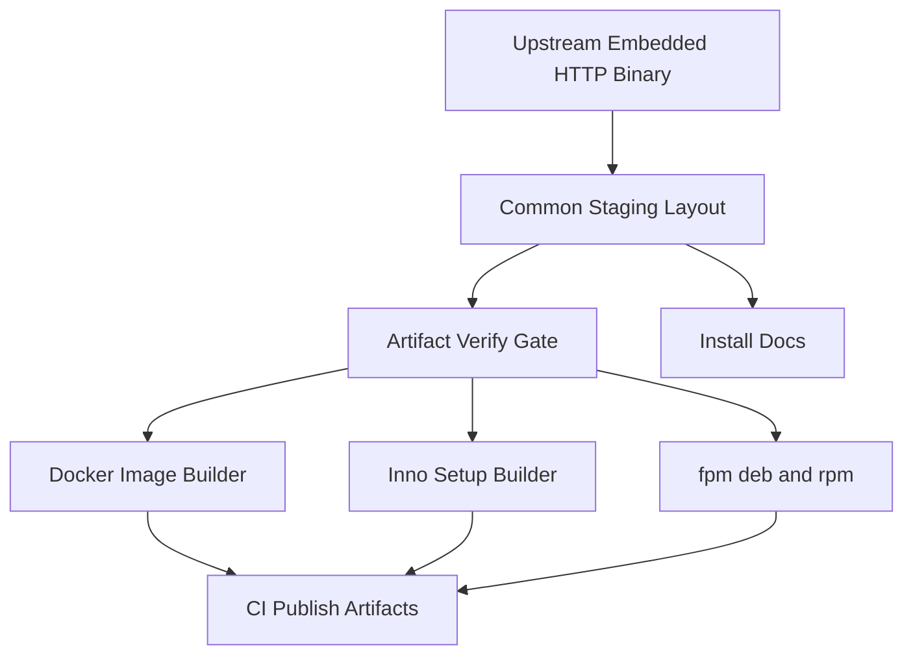
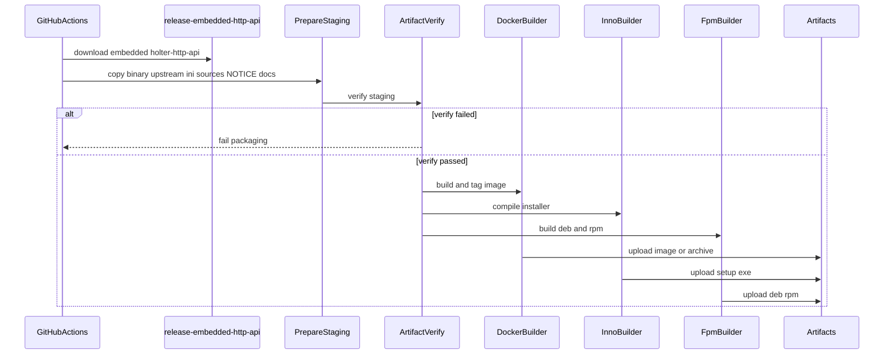

# Design Document: packaging-distribution

## Overview

本機能は、上流 `http-api` が生成する埋め込みモデル付き HTTP バイナリを入力に、Linux クラウド向けコンテナイメージ、Windows 向けインストーラ、Linux 向け deb/rpm パッケージを組み立て・公開する。運用オペレータはサンプル ini でライセンス接続先とリッスンを設定し、NOTICE 付きの成果物からサービスを起動できる。

**Purpose**: 手作業導入を減らし、生モデル非同梱の配布契約を全成果物で一貫させる。  
**Users**: クラウド／ローカル運用オペレータ、リリース担当者。  
**Impact**: 既存 CI に packaging ジョブが加わる（入力は `release-embedded-http-api`）。API 契約・ライセンスキー正本・埋め込みロジック・`release-embedded-cli` は所有しない。

### Goals
- Linux x86_64 向け Docker イメージ（CPU 既定）
- Windows x86_64 向け Inno Setup インストーラ
- Linux x86_64 向け deb および rpm（fpm）
- 全成果物で生モデル非同梱・サンプル ini・NOTICE を保証
- CI からの再現可能な公開と導入ドキュメント

### Non-Goals
- ライセンスサーバー配布・API／ini キー再設計・モデル埋め込み実装
- クラウド IaC、高度な自動更新チャネル
- Windows Service 常駐化や MSI/GPO 向け WiX（後続可）
- CUDA 付き成果物の必須化（任意・別成果物）
- ARM 等非 x86_64

## Boundary Commitments

### This Spec Owns
- 配布成果物のレイアウト（バイナリ配置、配布用サンプル ini の組み立て／同梱、NOTICE、導入ドキュメント）
- Dockerfile（バイナリ COPY 型）とイメージ起動ドキュメント
- Inno Setup スクリプトと Windows インストーラ成果物
- fpm による deb / rpm 生成とパッケージメタデータ
- 成果物検証（NOTICE／サンプル ini 必須、生モデル拡張子の禁止）
- CI **packaging** ジョブ（CPU 既定必須、CUDA 任意分離）。上流 artifact の消費のみ
- 導入・起動ドキュメント（Docker / Windows / Linux パッケージ）

### Out of Boundary
- `holter-http-api` の HTTP ルーティング・エラー契約・`[http]` / `[license]` キー意味の定義
- `config/license.ini.example`（`[license]` 正本）および http-api の `[http]` example 正本の所有
- `ModelSource` / 埋め込み `build.rs` / ライセンスゲート実装
- model-embedding の CI ジョブ `release-embedded-cli`（再定義・拡張しない）
- http-api の埋め込み HTTP バイナリ生成ジョブ本体（消費のみ。ジョブ名は合意どおり `release-embedded-http-api`）
- ライセンスサーバー本体・課金 UI
- Terraform 等のクラウド IaC、サイレント自動更新チャネル
- 解析アルゴリズム・ORT セッション構築ロジック

### Allowed Dependencies
- **Roadmap 直接依存**: `http-api`（埋め込み CPU 既定の `holter-http-api`、artifact `release-embedded-http-api`、`[http]` example）
- **推移的契約（roadmap 上は http-api のみだが運用上必須）**:
  - `model-embedding` — 生モデル非同梱・埋め込みバイナリ契約。ジョブ `release-embedded-cli` は **消費対象外**（CLI 専用。本仕様は再定義しない）
  - `license-client` — `[license]` キー正本 `config/license.ini.example`。コピー／参照のみで意味変更禁止
- **Existing Spec Update（`api-console-ui`）**: コンソール UI は同一 `holter-http-api` に埋め込み。追加フロント成果物は不要。正本 URL `/ui/`。本仕様は導入／スモーク文書への追記のみ（UI 実装・埋め込みは非所有）
- 既存: `.github/workflows/ci.yml` の artifact download パターン
- 新規ツール: Docker、Inno Setup 6.x、fpm（Ruby gem）、検証シェルスクリプト
- 禁止: 生 `.onnx` の成果物追加、`[license]` / `[http]` キーの別名再発明、ライセンスサーバーコード取り込み、`release-embedded-cli` の再定義、別 UI アーティファクトの必須化

### Revalidation Triggers
- 配布バイナリ名または必須同梱ファイル集合の変更
- サンプル ini のセクション／キー集合の変更（上流変更の追従含む）
- NOTICE 正本パスまたは検証ルールの変更
- Docker ベースイメージ／エントリポイント契約の変更
- Inno / fpm パッケージ名またはインストール先パスの変更
- CPU／CUDA バリアント命名規則の変更
- 上流 artifact 名（`release-embedded-http-api`）または本仕様 packaging ジョブ名の変更
- コンソール UI 正本 URL（`/ui/`）または「同一バイナリ埋め込み」契約の変更（`api-console-ui`）

## Architecture

### Existing Architecture Analysis
- Library-first。CLI と将来 HTTP が lib を共有
- model-embedding は `release-embedded-cli` で CLI 埋め込みバイナリを artifact 化（本仕様は触らない）
- http-api（または合意した同一 CI）は埋め込み `holter-http-api` を `release-embedded-http-api` として提供する想定
- Docker / Installer / deb / rpm / NOTICE 正本は未存在
- 埋め込みモデルは上流が CI 秘密注入する前提

### Architecture Pattern & Boundary Map



**Architecture Integration**:
- Selected pattern: Artifact-first packaging pipeline（共通ステージング → 検証 → 各パッケージャ）
- Domain boundaries: ステージング所有はファイル集合。各ビルダーは形式変換のみ。検証はゲート
- Existing patterns preserved: CI マトリクス（Win/Linux x86_64）、上流 ini キー非改変
- Steering compliance: roadmap の配布フェーズ、生モデル非同梱、CPU 既定

**Dependency direction**（左のみ依存可）:  
`PackagingTypes` → `StagingLayout` → `ArtifactVerify` → `DockerBuilder` / `InnoBuilder` / `FpmBuilder` → `ReleasePublish` → `InstallDocs`

### Technology Stack

| Layer | Choice / Version | Role in Feature | Notes |
|-------|------------------|-----------------|-------|
| Input binary | `holter-http-api`（埋め込み CPU） | 配布対象実行ファイル | artifact `release-embedded-http-api`（http-api OWN） |
| Sample ini sources | `license.ini.example` + http `[http]` example | キー正本は上流 | 本仕様はコピー／参照／マージのみ |
| Container | Docker multi-stage + `debian:bookworm-slim` | Linux クラウド実行イメージ | バイナリ COPY。CA 付き |
| Windows installer | Inno Setup 6.x | EXE インストーラ | WiX は非採用（research 参照） |
| Linux packages | fpm（gem）→ deb + rpm | ホスト導入 | 同一 staging から両形式 |
| Verify | shell + 拡張子／必須ファイル検査 | ゲート | NOTICE / ini / no onnx |
| CI | GitHub Actions packaging ジョブ | 消費→組み立て・公開 | `release-embedded-cli` は非所有 |
| Docs | Markdown under `docs/packaging/` | 導入・起動手順 | 3 系統 |

## File Structure Plan

### Directory Structure
```
packaging/
├── NOTICE                         # 第三者告知の正本（ORT 等）
├── staging/
│   └── README.md                  # ステージングレイアウト仕様
├── docker/
│   ├── Dockerfile                 # バイナリ COPY 型ランタイム
│   └── .dockerignore              # models/onnx 等を除外
├── windows/
│   └── holter-http-api.iss        # Inno Setup スクリプト
├── linux/
│   ├── stage.sh                   # 共通ステージング組み立て
│   └── fpm.sh                     # deb / rpm 生成
└── scripts/
    ├── verify-artifact.sh         # NOTICE/ini/生モデル検査
    └── prepare-staging.sh         # バイナリ+上流 ini ソース+NOTICE を staging へ
docs/
└── packaging/
    ├── docker.md
    ├── windows.md
    └── linux-packages.md
# 配布用マージ済みサンプルはパッケージ時に staging へ組み立てる（正本は上流）
# 参照元: config/license.ini.example（license-client）
#         config/http.ini.example 等の [http]（http-api）
.github/workflows/
└── ci.yml                         # packaging ジョブ追加（入力: release-embedded-http-api）
```

### Modified Files
- `.github/workflows/ci.yml` — **OWN**: packaging ジョブ（Docker / Inno / fpm + 検証・アップロード）。**消費**: http-api（または合意 CI）の artifact `release-embedded-http-api`（埋め込み `holter-http-api`）。**非所有**: model-embedding の `release-embedded-cli`。CUDA 任意ジョブは分離
- サンプル ini は `config/license.ini.example` と http-api の `[http]` example をコピー／参照し、必要ならパッケージ時に単一ランタイム用サンプルへマージ（キー意味は変更しない）

## System Flows

### リリース組み立て



**Key Decisions**:
- 検証失敗時はいずれのパッケージャも成功扱いにしない
- Docker はローカル再ビルドではなく `release-embedded-http-api` の埋め込み済みバイナリを入力とする
- `release-embedded-cli`（model-embedding）は入力に使わず、再定義もしない
### 運用者導入（概念）


## Requirements Traceability

| Requirement | Summary | Components | Interfaces | Flows |
|-------------|---------|------------|------------|-------|
| 1.1–1.4 | Docker イメージ生成・起動手順・x86_64 | DockerBuilder, InstallDocs | Batch: docker build/tag | リリース組み立て |
| 2.1–2.4 | Windows インストーラ | InnoBuilder, InstallDocs | Batch: iscc | リリース組み立て |
| 3.1–3.4 | Linux deb/rpm | FpmBuilder, StagingLayout, InstallDocs | Batch: fpm | リリース組み立て |
| 4.1–4.3 | 生モデル非同梱 | ArtifactVerify, DockerBuilder | Batch: verify | リリース組み立て |
| 5.1–5.4 | CPU 既定／CUDA 分離 | ReleasePublish, InstallDocs | naming/tags | リリース組み立て |
| 6.1–6.5 | サンプル ini（上流コピー／マージ） | StagingLayout, PackagingIniSample | State: ini ファイル | 導入フロー |
| 7.1–7.3 | NOTICE | NoticeBundle, ArtifactVerify | State: NOTICE | リリース組み立て |
| 8.1–8.4 | CI 公開（`release-embedded-http-api` 消費） | ReleasePublish, ArtifactVerify | Batch: download + upload-artifact | リリース組み立て |
| 9.1–9.3 | 導入ドキュメント | InstallDocs | Docs | 導入フロー |
| 10.1–10.4 | 責務境界 | Boundary Commitments | — | — |

## Components and Interfaces

| Component | Domain/Layer | Intent | Req Coverage | Key Dependencies (P0/P1) | Contracts |
|-----------|--------------|--------|--------------|--------------------------|-----------|
| StagingLayout | Packaging | 共通ファイル配置を定義 | 3.x, 6.x, 7.x | Upstream binary (P0), PackagingIniSample (P0), NoticeBundle (P0) | Batch, State |
| PackagingIniSample | Config | 上流 example をコピー／参照／マージして配布用サンプルを供給 | 6.1–6.5, 9.2 | license-client / http-api example (P0) | State |
| NoticeBundle | Compliance | NOTICE 正本を管理 | 7.1–7.3 | ORT ThirdPartyNotices (P1) | State |
| ArtifactVerify | Gate | 必須同梱と禁止ファイルを検査 | 4.3, 7.3, 8.3 | StagingLayout (P0) | Batch |
| DockerBuilder | Container | CPU 既定イメージを構築 | 1.x, 4.1, 5.1 | StagingLayout (P0), Docker (P0) | Batch |
| InnoBuilder | Windows | Inno インストーラを生成 | 2.x | StagingLayout (P0), Inno Setup (P0) | Batch |
| FpmBuilder | Linux | deb と rpm を生成 | 3.x | StagingLayout (P0), fpm (P0) | Batch |
| ReleasePublish | CI | 成果物公開と命名 | 5.x, 8.x | ArtifactVerify (P0), GHA (P0) | Batch |
| InstallDocs | Docs | 導入・起動手順 | 1.3, 2.3, 3.4, 5.4, 6.4, 7.2, 9.x | StagingLayout (P1) | — |

### Packaging Core

#### StagingLayout

| Field | Detail |
|-------|--------|
| Intent | 全パッケージャが共有する配置契約を固定する |
| Requirements | 3.1, 3.3, 4.1, 6.1, 7.1 |

**Responsibilities & Constraints**
- 配置例（論理パス）:
  - `bin/holter-http-api`（Windows は `.exe`）
  - サンプル ini（上流ソースからコピー、またはパッケージ時マージ成果）
  - `NOTICE`
  - `docs/`（短縮版またはポインタ）
- 生モデルファイルを置かない
- OS 差分はバイナリ拡張子とパス区切りのみ。ini キーは共通

**Dependencies**
- Inbound: ReleasePublish — 組み立て要求 (P0)
- Outbound: ArtifactVerify, DockerBuilder, InnoBuilder, FpmBuilder (P0)
- External: artifact `release-embedded-http-api` 内の埋め込み `holter-http-api` (P0)

**Contracts**: Batch [x] / State [x]

##### Batch / Job Contract
- Trigger: CI packaging ジョブ開始
- Input: `release-embedded-http-api` バイナリ、上流サンプル ini セクション、NOTICE
- Output: `packaging/out/staging/<os>/` 相当
- Idempotency: 同一入力で同一レイアウト。再実行は上書き可

#### PackagingIniSample

| Field | Detail |
|-------|--------|
| Intent | キー正本を所有せず、上流 example をコピー／参照し配布に載せる |
| Requirements | 6.1, 6.2, 6.3, 6.4, 6.5, 9.2 |

**Responsibilities & Constraints**
- **非所有**: `[license]` キー定義の正本は `config/license.ini.example`（license-client）。`[http]` キー定義の正本は http-api の example（例: `config/http.ini.example`）
- 配布成果物へは上記を **コピーまたは参照** して同梱する
- 運用者が単一ファイルを望む場合、パッケージ時に両ソースから **マージ済みランタイム用サンプル** を staging 上で組み立ててよい（キー名・意味・既定は上流のまま）
- 必須例の内容は上流に従う（例: `[http]` の `bind=0.0.0.0:8080`、`[license]` の `server_url=...`）
- キー意味・デフォルトの再定義禁止。変更が必要なら上流仕様を先に更新
- ファイル権限の運用注記（所有者のみ読取推奨）は上流コメントを維持、または配布ドキュメント側で補足

**Contracts**: State [x]

##### State Management
- 正本パス: 上流 `config/license.ini.example` および http-api の `[http]` example
- マージ成果（任意）: staging 内の配布用サンプル（リポジトリに独自キー正本 `packaging.ini.example` を置いて所有しない）
- 各成果物へコピー同梱。コンテナは既定パスへ配置し、実運用ファイルはボリューム／バインドで供給
#### NoticeBundle

| Field | Detail |
|-------|--------|
| Intent | ORT 等の第三者告知正本を成果物へ供給する |
| Requirements | 7.1, 7.2, 7.3 |

**Responsibilities & Constraints**
- `packaging/NOTICE` を正本とする
- ORT の LICENSE / ThirdPartyNotices への参照または必要抜粋を含める
- 欠落時は ArtifactVerify が失敗

**Contracts**: State [x]

#### ArtifactVerify

| Field | Detail |
|-------|--------|
| Intent | ステージングまたは最終成果物を合格判定する |
| Requirements | 4.1, 4.3, 7.3, 8.3 |

**Responsibilities & Constraints**
- 必須: `NOTICE` 存在、サンプル ini 存在、`holter-http-api` バイナリ存在
- 禁止: ステージング内の `*.onnx`, `*.ort`, `*.weights.h5` 等（リストはスクリプト内で明示）
- 失敗時は非 0 終了。CI ジョブ失敗

**Dependencies**
- Inbound: StagingLayout (P0)
- External: shell / `find` (P0)

**Contracts**: Batch [x]

##### Batch / Job Contract
- Trigger: パッケージャ実行前（必須）および必要なら最終成果物展開後
- Input: staging ルート
- Output: 成功／失敗（標準エラーに理由）
- Idempotency: 純粋検査

**Implementation Notes**
- Validation: CI で必須ゲート
- Risks: 拡張子ベース検知の限界（埋め込みバイトは対象外で正しい）

### Packagers

#### DockerBuilder

| Field | Detail |
|-------|--------|
| Intent | Linux x86_64 CPU 既定の実行イメージを作る |
| Requirements | 1.1, 1.2, 1.4, 4.1, 5.1, 6.1, 7.1 |

**Responsibilities & Constraints**
- Dockerfile は埋め込み済みバイナリを COPY（イメージ内でのモデル注入ビルドを既定にしない）
- ランタイム: `debian:bookworm-slim`（CA 証明書・デバッグ容易性）
- 同梱: バイナリ、サンプル ini、NOTICE
- `.dockerignore` で `resources/models/**` および `*.onnx` を除外
- エントリポイントは HTTP バイナリ。設定パスは環境変数または引数で上書き可能（上流の ini パス解決に合わせる）
- タグ例: `holter-http-api:<version>-cpu`（CUDA は別タグ、任意）

**Dependencies**
- Inbound: ArtifactVerify (P0)
- External: Docker Engine (P0)

**Contracts**: Batch [x]

##### Batch / Job Contract
- Trigger: verify 成功後
- Input: staging Linux ツリー
- Output: イメージタグ、または `docker save` アーカイブ artifact
- Idempotency: 同一バイナリで再タグ可

#### InnoBuilder

| Field | Detail |
|-------|--------|
| Intent | Windows x86_64 向け EXE インストーラを生成する |
| Requirements | 2.1, 2.2, 2.4, 4.1, 6.1, 7.1 |

**Responsibilities & Constraints**
- Inno Setup 6.x（`holter-http-api.iss`）
- 既定インストール先に `holter-http-api.exe`、サンプル ini、NOTICE、短縮ドキュメントを配置
- 失敗時はコンパイラ非 0（サイレント成功にしない）
- Windows Service 登録は行わない（ドキュメントでプロセス起動を案内）

**Dependencies**
- External: Inno Setup（CI で choco インストール）(P0)

**Contracts**: Batch [x]

##### Batch / Job Contract
- Trigger: Windows packaging ジョブ
- Input: staging Windows ツリー
- Output: `holter-http-api-setup-<version>-cpu.exe`
- Idempotency: 再ビルド可

**Implementation Notes**
- Rationale vs WiX: research.md（単純配置・MVP 速度）。MSI は後続
- Risks: runner に Inno が無い → 明示インストール

#### FpmBuilder

| Field | Detail |
|-------|--------|
| Intent | Linux x86_64 向け deb と rpm を生成する |
| Requirements | 3.1, 3.2, 3.3, 4.1, 6.1, 7.1 |

**Responsibilities & Constraints**
- パッケージ名: `holter-http-api`
- 配置例: `/usr/bin/holter-http-api`、`/usr/share/holter-http-api/NOTICE`、`/usr/share/holter-http-api/` 配下にサンプル ini（上流コピーまたはマージ成果）
- `fpm -s dir -t deb` および `-t rpm` の両方を実行（必須）
- アーキテクチャ: deb=`amd64`, rpm=`x86_64`

**Dependencies**
- External: fpm, rpm build 依存 (P0)

**Contracts**: Batch [x]

##### Batch / Job Contract
- Trigger: Linux packaging ジョブ
- Input: staging Linux ツリー
- Output: `.deb` と `.rpm`
- Idempotency: 再ビルド可

### Release & Docs

#### ReleasePublish

| Field | Detail |
|-------|--------|
| Intent | 必須成果物を CI から公開しバリアントを識別可能にする |
| Requirements | 5.1, 5.2, 5.3, 5.4, 8.1, 8.2, 8.3, 8.4 |

**Responsibilities & Constraints**
- **入力**: 上流 artifact `release-embedded-http-api`（埋め込み `holter-http-api`）。job/artifact 名を文書化し、欠落時は packaging 失敗
- **非所有**: `release-embedded-cli`（model-embedding）。同ジョブの再定義・拡張・別名での再発明をしない
- 必須 artifact（本仕様の **出力**）: Docker イメージ（または tar）、Windows setup EXE、`.deb`、`.rpm`（いずれも CPU）
- 命名に OS／arch／`cpu`（任意 `cuda`）を含める
- CUDA ジョブは別ジョブ。失敗しても CPU 必須ゲートとは分離（CUDA 自体は非必須）
- いずれかの必須成果物または verify 失敗でリリース失敗

**Contracts**: Batch [x]

##### Batch / Job Contract（ジョブ名）
| 役割 | ジョブ / artifact 名 | 所有者 |
|------|----------------------|--------|
| 入力（消費） | `release-embedded-http-api`（埋め込み `holter-http-api`） | http-api（または合意した同一 CI ジョブ） |
| 非入力・非再定義 | `release-embedded-cli` | model-embedding |
| 本仕様 OWN | packaging ジョブ群（例: `package-docker` / `package-windows` / `package-linux`、または単一 `packaging-distribution`） | packaging-distribution |
#### InstallDocs

| Field | Detail |
|-------|--------|
| Intent | 3 系統の導入・起動と ini 設定手順を文書化する |
| Requirements | 1.3, 2.3, 3.4, 5.4, 6.4, 7.2, 9.1, 9.2, 9.3 |

**Responsibilities & Constraints**
- `docs/packaging/docker.md` / `windows.md` / `linux-packages.md`
- 対象を Win/Linux x86_64 に限定して明示
- サンプル ini の編集（`server_url` / `bind`）と NOTICE 所在を記載
- API 契約やライセンスサーバー手順の詳細は上流／別プロジェクトへリンク（再設計しない）

## Data Models

### Domain Model
- **DistributionArtifact**: 種別（docker | windows-installer | deb | rpm）、バリアント（cpu | cuda）、version、arch
- **StagingBundle**: binary + ini sample（上流コピー／マージ） + NOTICE + docs pointers
- **VerifyResult**: pass | fail + reasons

### Data Contracts & Integration
- 入力バイナリ契約: artifact `release-embedded-http-api` の埋め込み CPU `holter-http-api`（外部生モデル不要で起動可能であること）
- サンプル ini: 上流キー互換（license-client / http-api）。本仕様は配置・マージのみ
- 公開メタデータ: artifact 名に `linux|windows`, `x86_64`, `cpu|cuda`, version

## Cross-spec contracts

本仕様が消費する入力と、下流運用へ渡す出力の境界:

| 方向 | 契約 | 出所 / 行き先 | 備考 |
|------|------|---------------|------|
| **Input** | 埋め込み HTTP バイナリ `holter-http-api` | http-api → artifact `release-embedded-http-api` | CPU 既定。生 `.onnx` は入力にも出力にも載せない。`api-console-ui` 実装後はコンソール UI をバイナリ内に含む |
| **Input** | `[license]` サンプル節 | `config/license.ini.example`（license-client） | コピー／参照のみ。キー正本は非所有 |
| **Input** | `[http]` サンプル節 | http-api の example（例: `config/http.ini.example`） | コピー／参照のみ。キー正本は非所有 |
| **Input** | NOTICE 正本 | 本仕様 `packaging/NOTICE`（ORT 等） | 成果物へ同梱必須 |
| **Docs** | コンソール URL `/ui/` | api-console-ui → 導入／スモーク文書 | 追加フロント成果物は不要。Win/Linux 同一経路 |
| **Output** | Docker イメージ（または tar） | 運用（Linux クラウド） | CPU 既定必須 |
| **Output** | Inno Setup インストーラ EXE | 運用（Windows） | CPU 既定必須 |
| **Output** | deb / rpm | 運用（Linux ホスト） | CPU 既定必須（両形式） |
| **非契約** | 生 ONNX / 生重みファイル | — | いずれの入出力にも含めない |
| **非契約** | `release-embedded-cli` | model-embedding | 消費・再定義しない |

**依存メモ**: roadmap の直接依存は `http-api` のみ。ただしサンプル ini・埋め込み非同梱契約のため、実装・検証は **推移的に** `license-client` および `model-embedding` の公開契約に依存する。

## Error Handling

### Error Strategy
- ステージング不全・verify 失敗・パッケージャ非 0 はすべてリリース失敗（fail-closed）
- Inno / fpm / docker のログを CI ログに残す

### Error Categories and Responses
- **Input errors**: バイナリ／NOTICE／ini 欠落 → verify 失敗メッセージ
- **Policy errors**: 禁止拡張子検出 → verify 失敗
- **Tooling errors**: Docker/Inno/fpm 実行失敗 → ジョブ失敗（サイレント成功禁止）

## Testing Strategy

- **Unit / Script tests**: `verify-artifact.sh` が (a) 正常 staging で成功 (b) NOTICE 欠落で失敗 (c) サンプル ini 欠落で失敗 (d) ダミー `.onnx` 混入で失敗
- **Integration**: `prepare-staging` → verify →（モックバイナリで）fpm dry-run または最小 deb 生成、Inno スクリプトの `/Q` ビルド（Windows runner）、Docker build（Linux runner）
- **E2E（運用経路）**: 文書手順に沿い、コンテナ／パッケージ／インストーラ導入後にサンプル ini を設定してプロセス起動できること（ライセンスサーバーはモックまたはスキップ可能な検証環境。実サーバー必須テストは任意）
- **Policy**: 成果物 tar／イメージ内に `*.onnx` が無いことの検査を CI に含める

## Security Considerations
- 生モデルを成果物・イメージ履歴に載せない（COPY 入力も onnx 除外）
- サンプル ini の `api_key` はプレースホルダ。実秘密をリポジトリ／artifact に固定しない
- コンテナはルートレス実行を推奨（ドキュメント）。初期イメージ USER は非 root を目指す（バイナリの bind 特権が必要な場合は文書で例外）

## Performance & Scalability
- 埋め込みバイナリは 100MB 超を許容（上流方針）。artifact サイズを隠さない
- Docker ビルドはバイナリ COPY によりコンパイル時間を配布ジョブから排除

## Migration Strategy
- 既存利用者は CLI zip 配布からの移行を想定。HTTP バイナリ＋ini へ切り替え手順を docs に記載
- 旧 artifact 名との互換は必須としない（初回正式配布）

## Supporting References
- 詳細比較と却下理由: `research.md`
- 上流キー正本: `license-client` の `config/license.ini.example` `[license]`、`http-api` の `[http]` example
- 上流 CI: http-api の `release-embedded-http-api`（消費）、model-embedding の `release-embedded-cli`（非所有）
